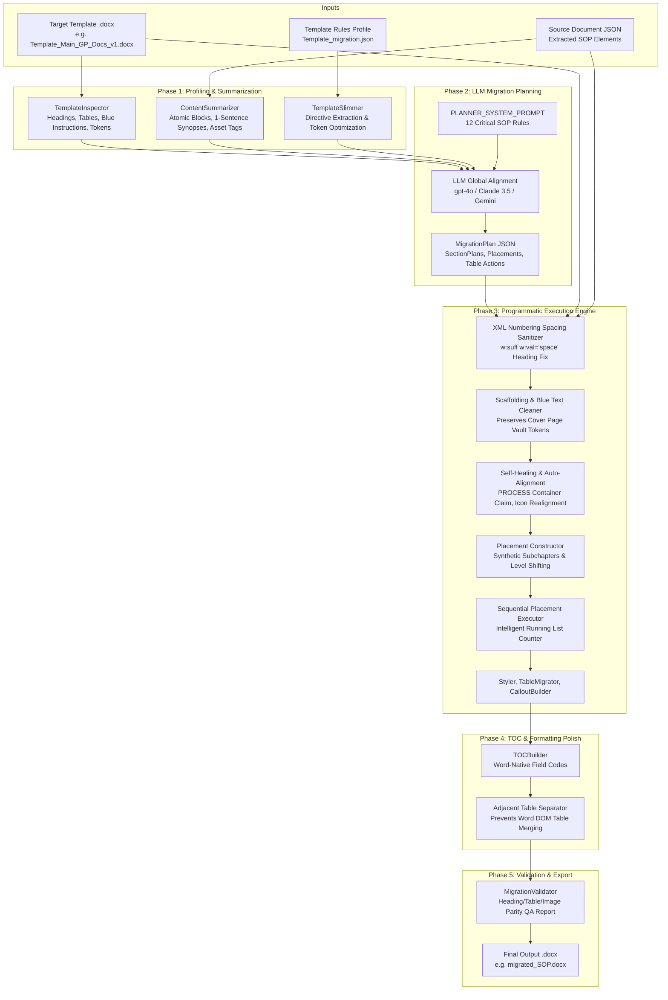

# End-to-End SOP Content-to-Template Migration Workflow

This document provides a comprehensive technical breakdown of the SOP Content-to-Template DOCX Migration Engine. It covers the end-to-end architecture, Phase 1 through Phase 5 pipeline stages, the full prompts used for LLM global alignment, programmatic self-healing routines, OpenXML styling rules, list numbering state mechanics, and frontend review integration.

---

## 1. Architectural Philosophy & Overview

Migrating complex Standard Operating Procedures (SOPs), Work Instructions (WIs), Directives, and Guidance documents into corporate Microsoft Word (`.docx`) templates cannot rely on pure LLM text generation. LLMs cannot reliably preserve binary embedded objects (vector icons, multi-image flowcharts, callout borders), cannot guarantee strict reading order across 50+ pages, and cannot manipulate raw OpenXML package structures (`numbering.xml`, `styles.xml`, `document.xml`).

Our system uses a **hybrid architecture**:
1. **LLM as the Global Semantic Planner**: The LLM analyzes the high-level outline and atomic blocks of the source SOP alongside the target template rules. It outputs a strictly typed JSON `MigrationPlan`.
2. **Deterministic Programmatic Execution Engine**: A high-performance Python engine (`DocxMigrator`) ingests the template `.docx` and the extracted source JSON, executing the plan with 100% element parity, strict reading order preservation, and automatic self-healing.



---

## 2. Phase 1: Profiling & Summarization

### 2.1 Template Inspection (`TemplateInspector`)
The template inspector reads the raw `.docx` template and extracts structural metadata:
- **Headings & Hierarchy**: All paragraphs styled with `Heading 1` through `Heading 9`.
- **Blue Instruction Text**: Paragraphs formatted with instructional styles (e.g., `Instructions-1`, `annotation text`, blue font color) that provide author guidance and must be deleted during migration.
- **Placeholder Tables**: Table indexes, row/column dimensions, headers, and purpose classification (e.g., Definitions table, Roles & Responsibilities RACI matrix, Document History table).
- **System Vault Tokens**: Detection of `${vault:...}` placeholders on cover pages (e.g. Scope, Impacted Divisions). These are flagged as `is_vault_token_table=True` so they are strictly protected from modification or deletion.

### 2.2 Template Slimming (`TemplateSlimmer`)
When an enriched template migration schema (such as `Template_Main_GP_Docs_v1_migration.json`) exists, `TemplateSlimmer` extracts authoritative directives and strips redundant metadata, creating a lightweight `SlimTemplateProfile`. This profile contains:
- **Global Directives**: Mandatory formatting rules (font families, prohibition against creating top-level chapters, requirement to delete blue text).
- **Section Directives**: Section-level requirements (e.g., `PROCESS` requiring "How"-style instructions for SOPs, "What"-style for Directives; `DEFINITIONS` requiring alphabetical ordering; `ROLES & RESPONSIBILITIES` requiring Table A / Table B usage).

### 2.3 Atomic Block Summarization (`ContentSummarizer`)
Rather than sending every single extracted paragraph and list item to the LLM (which wastes context and causes hallucinations), `ContentSummarizer` groups each section into **Atomic Blocks**:
1. **Grouping**: An atomic block is formed whenever a subsection heading (`Heading 2`–`Heading 5`) is encountered, or at the start of a section. Subsequent paragraphs, lists, tables, and images are bound to that block.
2. **Heading Normalization**: Leading numbering prefixes (e.g., `6.1 `, `6.5.1 `, `1. `, `6 `) are stripped using regex so the LLM evaluates the pure semantic meaning of the title.
3. **Deterministic Synopsis**: The first substantive narrative sentence of the block is extracted to provide a concise 1-sentence summary.
4. **Structural Asset Tags**: Asset tags are appended to the synopsis to inform the LLM of physical content requirements without dumping raw data:
   - `[TABLE x]` (table with row/col count)
   - `[IMAGE x]` (flowcharts, diagrams)
   - `[ORDERED_LIST]` / `[UNORDERED_LIST]`
   - `[INLINE_ICON]` (embedded vector/raster icons)

---

## 3. Phase 2: LLM Migration Planning

### 3.1 The Global Planner Prompt
The LLM acts as an expert SOP migration architect. Below is the complete system prompt configured in `app/services/llm/prompts/migration_planner.py`:

```text
You are a document migration planning engine. You receive:

1. TEMPLATE_INSTRUCTIONS_AND_RULES (if present): Authoritative rules, authoring guidance,
   directive types (formatting, prohibitions, requirements, icon usage), and section descriptions
   extracted from the target template.

2. TEMPLATE_PROFILE: The structure of the target .docx template — its headings,
   blue instruction text, placeholder tables, and formatting cues.

3. CONTENT_SUMMARY: Extracted document content — section titles, element counts,
   and atomic 'blocks' (subsections with 1-sentence synopses, asset tags, and element indices).

Produce a MigrationPlan that tells a programmatic engine exactly how to
populate the template with the extracted content.

CRITICAL RULES:
1. SECTION & BLOCK MAPPING: Map each content section or atomic block to the best-matching
   template section. Use heading text, section numbers, semantic purpose, and especially the
   directives in TEMPLATE_INSTRUCTIONS_AND_RULES (e.g. "What"-style vs "How"-style, flowchart
   rules, infographic callouts).

   SUBSECTIONS STAY IN PARENT SECTION: Subsections (e.g. 6.1, 6.2, 7.1, etc.)
   must NEVER be created as separate SectionPlans. All subsections belong to
   their respective parent section and must be represented as ElementPlacement
   with action='insert_heading' (heading_level=2 or 3) within the parent section's
   elements array.

   INSTRUCTION & DIRECTIVE-DRIVEN MAPPING:
   - For every target template section, evaluate its authoring instructions in
     TEMPLATE_INSTRUCTIONS_AND_RULES (e.g. what the section describes, what style it expects,
     whether it asks for "What" vs "How", requirements, or prohibitions).
   - CORE SUBSTANTIVE / BODY SECTIONS: Most templates define one or more primary sections
     intended to hold the core subject matter, workflows, operational procedures, technical
     specifications, or guidance (often indicated by directives like "Describe the process/standard",
     "Add sub-headings as necessary", "How-style", or flowchart instructions).
     * NEVER leave the template's primary substantive/body sections as empty placeholders
       (has_source_content=false) if the source document contains matching substantive chapters!
     * Map all relevant source chapters and atomic blocks that describe the core process or
       substantive topic into that template section by adding their titles to source_sections_mapped.
     * If the source document divides its core subject matter across multiple chapters, map them
       together into the corresponding template body section. They will become properly nested
       subchapters under that section.
     * Do NOT create unmapped SectionPlans (is_unmapped_source=true) for substantive chapters
       when a matching body/procedure section exists in the target template.

2. UNMAPPED SOURCE SECTIONS: Only if a content section has NO matching semantic home or
   directive alignment anywhere in the template, set is_unmapped_source=true and specify
   insertion_after_section (the template section heading after which this section should be inserted).
   Place domain-specific content before closing sections (Associated Documents, References,
   Document History). NEVER DROP content. Do NOT create unmapped section plans for subsections,
   list items, or substantive chapters that belong within a template's body section.

3. UNMAPPED TEMPLATE SECTIONS: If a template section has no matching content,
   set has_source_content=false and choose a fallback_action:
   - "insert_none" -> insert "(None)" text
   - "insert_na" -> insert "N/A" text
   - "delete_section" -> remove the section entirely (only for optional sections)

4. ELEMENT ACTIONS: For each content element, assign exactly one action:
   - "insert_heading" -> heading with native Word style
   - "insert_paragraph" -> normal paragraph
   - "insert_list" -> bulleted/numbered list
   - "insert_table" -> build new Word table from cell data
   - "insert_image" -> embed image file at this position
   - "insert_callout" -> styled callout box (specify callout_type + colors)
   - "populate_placeholder" -> fill existing template placeholder table
   - "skip" -> do not include (e.g., extraction artifacts, duplicate headings)

5. CALLOUT DETECTION: Tables with 1 row and 2-4 columns that appear near
   instructional/educational text about "Executive Summary", "Explanation",
   "Attention", or "Key Takeaway" should be rendered as callout boxes, not
   plain tables. Specify callout_type and colors.

6. ICONS: Set embed_icons_inline=true for elements that have inline icons.
   Icons inside table cells are handled automatically — no action needed.

7. PLACEMENT ORDER: Assign sequential placement_order values (0, 1, 2, ...)
   within each section to preserve reading order.

8. BLUE INSTRUCTIONS: Identify template paragraph indices containing blue
   instruction text and list them in template_paragraph_indices_to_delete.

9. PLACEHOLDER TABLES: For each template table, determine whether to
   "populate" it (map source data) or "delete" it (unused).
   CRITICAL: Tables with is_vault_token_table=true or containing ${vault:...}
   (such as Scope or Impacted Division(s) on the cover page) are system tokens
   and must NEVER be populated with body content or Document History, and must
   never be deleted. Document History (Version / Description of Changes) must
   ONLY be mapped to the template's Document History table (is_document_history_table=true,
   typically the table under DOCUMENT HISTORY with columns Version, Description of Changes, Author).

10. COVER PAGE: The cover page / preamble (Section 0) has been excluded.
    Do NOT plan any first-page content. Set skip_cover_page=true. Cover page
    vault token tables must remain untouched.

11. TYPOGRAPHY: Extract the template's font family and size from style
    inspection. Default to Arial 10pt if unclear.

12. CONFIDENCE: Set overall_confidence (0.0-1.0) and add specific warnings
    for any uncertain mappings.

Output valid JSON matching the MigrationPlan schema exactly.
```

### 3.2 Dynamic Context Assembly (`SectionAligner`)
The user message passed to the LLM is assembled using the explicit `PLANNER_USER_PROMPT_TEMPLATE` in `app/services/llm/prompts/migration_planner.py`. It defines three named dynamic placeholders:

```python
PLANNER_USER_PROMPT_TEMPLATE = """You are tasked with generating a comprehensive MigrationPlan to populate a target document template with extracted source content.

Analyze the dynamic inputs below and follow all rules in the system instructions:

### 1. TARGET TEMPLATE INSTRUCTIONS & RULES:
{template_instructions_and_rules}

### 2. TARGET TEMPLATE PROFILE:
{template_profile}

### 3. SOURCE CONTENT SUMMARY:
{sop_content_summary}

Generate the final MigrationPlan adhering strictly to the JSON schema."""
```

At runtime, `SectionAligner` populates these named placeholders dynamically:
```text
### 1. TARGET TEMPLATE INSTRUCTIONS & RULES:

{
  "global_instructions": [
    "This template is mandatory for Directives, SOPs, Work Instruction (WI)...",
    "Do NOT: Add new chapters (subchapters are allowed)",
    "Change the font - Arial is the official font to be used"
  ],
  "section_rules": {
    "6": {
      "name": "PROCESS",
      "directives": ["Description of process, system or standard", "Add sub-headings as necessary"]
    }
  }
}

TEMPLATE_PROFILE:
{
  "headings": [
    {"index": 24, "text": "PURPOSE", "level": 1},
    {"index": 27, "text": "APPLICABILITY", "level": 1},
    {"index": 35, "text": "DEFINITIONS & ABBREVIATIONS", "level": 1},
    {"index": 46, "text": "IMPLEMENTATION AND/OR PRE-REQUISITES", "level": 1},
    {"index": 60, "text": "ROLES & RESPONSIBILITIES", "level": 1},
    {"index": 83, "text": "PROCESS", "level": 1},
    {"index": 115, "text": "ASSOCIATED DOCUMENTS", "level": 1},
    {"index": 121, "text": "REFERENCES", "level": 1},
    {"index": 137, "text": "DOCUMENT HISTORY", "level": 1}
  ],
  "tables": [
    {"index": 16, "is_document_history_table": true, "headers": ["Version", "Description of Changes"]}
  ]
}

CONTENT_SUMMARY:
{
  "document_title": "BI-VQD-24416-G",
  "sections": [
    {
      "title": "1 PURPOSE",
      "blocks": [{"block_id": "1_block_0", "heading_text": "PURPOSE", "synopsis": "This Guidance outlines writing principles... [ORDERED_LIST]"}]
    },
    {
      "title": "6 PRINCIPLES FOR DOCUMENT WRITING",
      "blocks": [
        {"block_id": "6_block_0", "heading_text": "Principles of Simplified Writing", "synopsis": "To make GP Docs more accessible... [ORDERED_LIST]"},
        {"block_id": "6_block_1", "heading_text": "LANGUAGE AND WORDING", "synopsis": "Prefer confirm or verify over ensure... [UNORDERED_LIST]"}
      ]
    },
    {
      "title": "7 GUIDANCE FOR SPECIFIC DOCUMENT CHAPTERS",
      "blocks": [
        {"block_id": "7_block_0", "heading_text": "ARTICULATE THE PURPOSE", "synopsis": "Guidance on drafting section 1..."},
        {"block_id": "7_block_1", "heading_text": "DETERMINE THE APPLICABILITY", "synopsis": "Guidance on drafting section 2..."}
      ]
    }
  ]
}
```

### 3.3 Target Output Schema (`MigrationPlan`)
The response adheres strictly to Pydantic models in `app/services/migration/schemas.py`:
- `MigrationPlan`: Contains `section_plans`, `placeholder_tables`, `callout_styles`, `template_paragraph_indices_to_delete`, `tables_to_delete`, `font_family`, font sizes, and `overall_confidence`.
- `SectionPlan`:
  - `template_section_heading`: e.g. `"PROCESS"`
  - `source_sections_mapped`: e.g. `["6 PRINCIPLES FOR DOCUMENT WRITING", "7 GUIDANCE FOR SPECIFIC DOCUMENT CHAPTERS"]`
  - `source_blocks_mapped`: e.g. `["6_block_0", "6_block_1", "7_block_0", "7_block_1"]`
  - `has_source_content`: `True`
  - `is_unmapped_source`: `False`
  - `elements`: Array of explicit `ElementPlacement` rules.

---

## 4. Phase 3: Programmatic Execution Engine

Phase 3 is where the document is physically constructed from the template. It contains multiple layers of validation, OpenXML manipulation, and self-healing.

### 4.1 Step 0: OpenXML Numbering Spacing Sanitization
**The Problem**: In Word templates (specifically `Template_Main_GP_Docs_v1.docx`), `word/numbering.xml` defines multilevel lists for headings. For `abstractNumId="29"`, the level definition (`<w:lvl>`) specifies `<w:lvlText w:val="%1"/>` (for Level 0) and `<w:lvlText w:val="%1.%2"/>` (for Level 1), but **omits `<w:suff>`**. In Word's layout engine, omitting `<w:suff>` causes the number to concatenate directly with the text with zero space, resulting in glued headings like:
- `1PURPOSE`
- `2APPLICABILITY`
- `6PROCESS`
- `6.1PRINCIPLES FOR DOCUMENT WRITING`

**The Solution**: Method `_sanitize_template_numbering_spacing(doc)` in `DocxMigrator` scans all 45 heading levels in `doc.part.numbering_part._element` and ensures that any level with `%` in its `lvlText` has `<w:suff w:val="space"/>`. Word then renders:
- `1 PURPOSE`
- `2 APPLICABILITY`
- `6 PROCESS`
- `6.1 PRINCIPLES FOR DOCUMENT WRITING`

### 4.2 Step 1: Scaffolding & Instruction Cleaning (`InstructionCleaner`)
- Scans `doc.paragraphs` for paragraphs whose text matches blue authoring instructions or whose formatting matches instructional styles (`Instructions-1`, red/blue text).
- Deletes matching paragraphs from the document body.
- Scans template tables: Unused placeholder tables are deleted, while cover page vault token tables (`${vault:...}`) and the Document History table are strictly preserved.

### 4.3 Step 2: Deterministic Self-Healing & Body Container Auto-Claim
If an LLM run leaves a template's primary substantive/body section empty and marks core substantive chapters as `unmapped_source=True`, `DocxMigrator._align_unmapped_template_sections()` steps in defensively:
1. Detects that the template's substantive body section (identified by procedural keywords or non-metadata status) has `has_source_content=False` or `source_sections_mapped=[]`.
2. Inspects `extracted.sections` for substantive body chapters that are not mapped to auxiliary/metadata sections (Purpose, Scope, Applicability, Definitions, Responsibilities, Associated Docs, References, Document History).
3. Automatically claims the unmapped substantive body chapters into that template section.
4. Sets `has_source_content=True` on the template section and purges the duplicate unmapped section plans so they are not appended as rogue top-level chapters outside the template's designated body section.

### 4.4 Step 3: Complete Placement Generation & Hierarchy Shifting
`_build_complete_placements()` schedules every single element of the mapped sections in strict reading order:
- **Synthetic Subchapters**: When `norm_src_title != norm_template_title` (e.g. `6 PRINCIPLES FOR DOCUMENT WRITING` under `PROCESS`), a synthetic `Heading 2` placement is injected at the beginning of the section:
  - `6.1 PRINCIPLES FOR DOCUMENT WRITING`
  - `6.2 GUIDANCE FOR SPECIFIC DOCUMENT CHAPTERS`
- **Relative Level Shifting**: Headings inside that chapter are shifted down by 1 level (`min(6, elem.level + 1)`):
  - Original Level 2 (`6.1 LANGUAGE AND WORDING`) becomes **Heading 3** (`6.1.1 LANGUAGE AND WORDING`).
  - Original Level 3 (`6.5.1 Strategic use of symbols`) becomes **Heading 4** (`6.1.5.1 Strategic use of symbols`).
  - Original Level 4 (`Principles of Simplified Writing`) becomes **Heading 5**.

### 4.5 Step 4: Sequential Execution & Intelligent List Tracking (`_execute_placements`)
**The Problem with Lists**: In technical documents, lists frequently have explanatory paragraphs between items. For example, under "Principles of Simplified Writing":
- Item: `1. Active Voice is Key:`
- Paragraph: `Always pair specific role names with active verbs...`
- Item: `1. Brevity Matters:`
- Paragraph: `Write short, straightforward sentences...`
- Item: `1. Global Language:`
- Paragraph: `Avoid idioms or jargon.`
- Item: `1. Stay on Topic:`
- Paragraph: `Keep focused on the central theme.`

In the extracted JSON, each item is stored as a single-item `list` (`len(items) == 1`). If each call to `insert_list()` starts from 1, all 4 items render as `1.`.

**The Solution**: `_execute_placements()` tracks a running counter:
1. `running_ordered_counter = 1` and `paras_since_list = 0`.
2. When a `heading` or structural block (table, image) occurs: `running_ordered_counter = 1`, `paras_since_list = 0`.
3. When a `paragraph` occurs: `paras_since_list += 1`. If `paras_since_list > 1`, `running_ordered_counter = 1`.
4. When an `insert_list` occurs:
   - If unordered (bullets `•`): resets counter to 1.
   - If ordered and `len(items) > 1`: starts from item's explicit number (or 1) and advances counter by `len(items)`.
   - If ordered and `len(items) == 1`:
     - If `running_ordered_counter > 1` and `paras_since_list <= 1`: `start_index = running_ordered_counter`, and counter advances by 1.
     - Otherwise: `start_index = 1`, counter becomes 2.
5. In `DocxStyler.insert_list()`, if `is_ordered and text.endswith(":")`:
   The label (`2.\t`) and title (`Brevity Matters:`) are formatted in **bold**, making the list header stand out clearly from the subsequent narrative body.

---

## 5. Phase 4: TOC Generation & Formatting Polish

### 5.1 Word-Native Table of Contents (`TOCBuilder`)
The TOC is inserted as a dynamic Word field code rather than static text:
```xml
<w:p>
  <w:r><w:fldChar w:fldCharType="begin"/></w:r>
  <w:r><w:instrText xml:space="preserve"> TOC \o "1-3" \h \z \u </w:instrText></w:r>
  <w:r><w:fldChar w:fldCharType="separate"/></w:r>
  <w:r><w:t>Right-click and select 'Update Field' to refresh TOC.</w:t></w:r>
  <w:r><w:fldChar w:fldCharType="end"/></w:r>
</w:p>
```
When opened in Microsoft Word, Word evaluates the document headings and displays the hierarchical TOC with page numbers.

### 5.2 Adjacent Table Separation (`_separate_adjacent_tables`)
In OpenXML, if two `<w:tbl>` elements are directly adjacent in the XML DOM with no intervening paragraph, Microsoft Word automatically merges them into a single table. `_separate_adjacent_tables()` scans the body XML and injects an empty paragraph (`space_before=Pt(6.0)`, `space_after=Pt(6.0)`) between any contiguous tables.

---

## 6. Phase 5: Automated Validation & QA Report

The `MigrationValidator` compares the output `.docx` against the source `DocxMigrationOutput` and the `MigrationPlan`:
- **Heading Parity**: Checks that all planned headings are present and that heading levels match.
- **Table Parity**: Verifies that every source table was either inserted as a new table or populated into a template placeholder.
- **Image Parity**: Verifies that all diagrams and flowcharts were embedded.
- **List Count**: Compares total list items to ensure no items were dropped.
- **Status Classification**: Assigns `pass` (confidence >= 0.90, no drops), `pass_with_warnings`, or `fail`.

The QA report is saved alongside the document as `qa_<document_uid>.json`.

---

## 7. Frontend Integration & Review Mode

### 7.1 REST API (`app/api/migration.py`)
- `POST /documents/migrate`: Accepts `document_uid` and `template_id` (optional). If `template_id` is omitted or passed as `"default"`, the server automatically selects the registered template record (`Template_Main_GP_Docs_v1.docx`).
- Returns the complete `MigrationResult` including `output_path`, `plan`, and `qa_report`.

### 7.2 UI Review Mode (`ReviewPage.tsx` & `MigrationReviewMode.tsx`)
- **Template Selector**: Allows switching between uploaded templates.
- **Side-by-Side Comparison**: Displays the extracted source SOP structure alongside the migrated template structure.
- **Action Footer**: Triggers one-click AI migration with defensive type sanitization to prevent accidental object-to-string coercion.

---

## 8. Summary of Solved Issues & Numbering Reference

| Component | Previous Behavior | Corrected Behavior |
| :--- | :--- | :--- |
| **Heading Number Spacing** | Word rendered `1PURPOSE`, `2APPLICABILITY` because `<w:suff>` was omitted in `abstractNum 29`. | Injected `<w:suff w:val="space"/>` across all 45 heading levels in `numbering.xml`. Word renders `1 PURPOSE`, `2 APPLICABILITY`. |
| **Body Container Alignment** | Primary body sections were left as empty placeholders when source document used domain-specific chapter titles (e.g. principles/guidance chapters). | Prompt instructs LLM to inspect section directives and route substantive chapters into the template's designated body section. Deterministic self-healing auto-claims unmapped substantive chapters if left empty. |
| **Subheading Hierarchy** | Subsections of Section 6 (`6.1 LANGUAGE AND WORDING`) collided with top-level numbering. | Headings under subchapters are shifted down by +1 level (`Heading 2` becomes `Heading 3`: `6.1.1 LANGUAGE AND WORDING`). |
| **Sequential List Numbering** | Principles of Simplified Writing items rendered as `1.`, `1.`, `1.`, `1.` due to alternating single-item lists. | Running counter tracks sequence across interleaved paragraphs. Items render as `1.`, `2.`, `3.`, `4.`. |
| **Colon List Item Headers** | List titles had uniform weight with body paragraphs. | If `is_ordered and text.endswith(":")`, label and title are styled in bold (`1. Active Voice is Key:`). |
| **Vault System Tokens** | Cover page vault token tables were vulnerable to deletion or overwriting. | Flagged as `is_vault_token_table=True` and protected from cleaning or mapping. |
