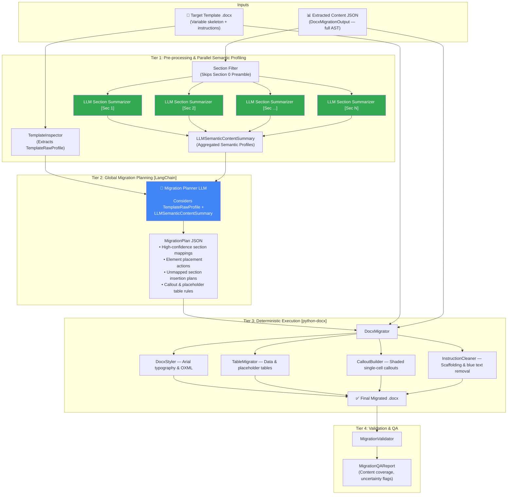

# Alternative Implementation Plan: LLM-Driven Hierarchical Section Summarization & Migration Planning

## 1. Executive Summary & Architectural Motivation

This alternative plan establishes a **two-tier LLM architecture** for document migration. Rather than relying on programmatic text truncation (first 120 characters) to summarize extracted sections, this approach uses **dedicated, parallel LLM workers to generate rich semantic profiles of each extracted section** before invoking the global Migration Planner.

```
┌─────────────────────────────────────────────────────────────────────────────┐
│                             APPROACH COMPARISON                             │
├──────────────────────────────────────┬──────────────────────────────────────┤
│ PRIMARY APPROACH                     │ ALTERNATIVE APPROACH                 │
│ (Programmatic Truncation)            │ (Two-Tier LLM Semantic Profiling)    │
├──────────────────────────────────────┼──────────────────────────────────────┤
│ • Fast, 0 extra LLM calls            │ • 1 parallel LLM call per section    │
│ • Minimal token usage                │ • Deeper semantic comprehension      │
│ • Best when section headings and     │ • Excels when source headings differ │
│   structures match template closely  │   vastly from template chapter names │
│ • Potential risk: 120-character      │ • Classifies nuanced elements (e.g., │
│   preview may miss buried context    │   distinguishes policy rules from    │
│   in lengthy paragraphs or tables    │   guidance tips, callouts vs tables) │
└──────────────────────────────────────┴──────────────────────────────────────┘
```

---

## 2. End-to-End Pipeline Architecture



---

## 3. Tier 1: LLM-Based Section Semantic Profiler

### 3.1 What Each Section Summarizer Does
For each section (e.g. `6 PRINCIPLES FOR DOCUMENT WRITING`), a dedicated LLM call receives the **complete section text, table headers/cells, lists, image captions, and icon metadata**. 

The LLM is prompted to extract a structured `LLMSectionSemanticProfile`:
1. **Semantic Purpose**: What does this section accomplish? What is its core regulatory/operational objective?
2. **Taxonomy Classification**: Which standard SOP chapter does this functionally belong to (e.g., `Purpose`, `Scope/Applicability`, `Responsibilities/RACI`, `Procedural Steps`, `Technical Guidelines`, `Glossary`, `References`, `Unclassified Domain Specific`)?
3. **Element Semantic Annotations**: An element-by-element semantic descriptor that explicitly tags the functional intent of tables (e.g. "Table 45 is a 1x4 visual callout box for Executive Summary") and images (e.g. "Image 56 is an approval flowchart diagram").
4. **Key Topics & Keywords**: Domain keywords to assist fuzzy matching with the template.

### 3.2 Schema Definition

```python
class ElementSemanticDescriptor(BaseModel):
    """Semantic role of an element identified by the section summarizer LLM."""
    element_index: int
    element_type: str                  # "paragraph", "table", "image", "list", "heading"
    semantic_role: str                 # "policy_statement", "callout_box", "flowchart_figure",
                                       # "raci_matrix", "instruction_step", "glossary_entry"
    summary: str                       # 1-sentence synopsis of what this element contains
    callout_candidate_type: str | None # "executive_summary", "explanation", "attention", "key_takeaway"
    has_visual_assets: bool = False    # Contains icons or image references

class LLMSectionSemanticProfile(BaseModel):
    """Rich semantic summary of a single extracted section."""
    section_number: str | None
    source_title: str
    page_range: str                    # "pages 6-11"
    semantic_purpose: str              # 2-3 sentence overview of section's functional intent
    taxonomy_category: str             # Standard SOP category
    key_topics: list[str]              # ["Simplified writing", "Readability scores", "AI in GxP", "Infographics"]
    element_count: int
    element_descriptors: list[ElementSemanticDescriptor]
    subsections_detected: list[str]    # ["6.1 LANGUAGE AND WORDING", "6.2 ACCESSIBILITY", ...]

class LLMSemanticContentSummary(BaseModel):
    """Collection of all section semantic profiles passed to Migration Planner."""
    document_id: str
    document_title: str
    document_type: str | None
    total_sections: int
    sections: list[LLMSectionSemanticProfile]
```

### 3.3 Prompt Design: Section Summarizer

**System Prompt** (`app/services/llm/prompts/section_semantic_summarizer.py`):
```
You are a pharmaceutical and enterprise SOP document analysis specialist.
Analyze the following extracted document section in detail.

Your task:
1. Provide a concise 2-sentence summary of the section's true purpose and operational intent.
2. Classify the section into a standard SOP taxonomy category.
3. Identify every element (paragraphs, lists, tables, images) and classify its functional role.
4. If an element is a 1x4 or 1x2 table describing writing tips/callouts (Executive Summary, Explanation, Attention, Key Takeaway), explicitly flag its callout_candidate_type.
5. Identify any embedded workflow flowcharts, RACI matrices, or glossary tables.

Output valid JSON matching the LLMSectionSemanticProfile schema.
```

**Human Prompt**: Serialized JSON of the single `MigrationSection` containing its full elements.

### 3.4 Parallel Execution with `asyncio.gather`

Because each section is independent, all section summaries run concurrently:

```python
class LLMSectionSummarizer:
    """Runs parallel LLM summarization on each extracted section."""

    def __init__(self, chain_factory: ChainFactory):
        self.chain_factory = chain_factory

    async def summarize_document_sections(
        self,
        extracted: DocxMigrationOutput,
        skip_preamble: bool = True,
    ) -> LLMSemanticContentSummary:
        model = self.chain_factory.create_structured_model(LLMSectionSemanticProfile)
        
        tasks = []
        for sec in extracted.sections:
            if skip_preamble and sec.title.strip().startswith("0 "):
                continue
            tasks.append(self._summarize_single_section(model, sec))

        # Parallel execution across all sections
        profiles: list[LLMSectionSemanticProfile] = await asyncio.gather(*tasks)

        return LLMSemanticContentSummary(
            document_id=extracted.document_id,
            document_title=extracted.metadata.title or extracted.metadata.document_name or "",
            document_type=extracted.metadata.document_type,
            total_sections=len(profiles),
            sections=profiles,
        )

    async def _summarize_single_section(self, model, section: MigrationSection) -> LLMSectionSemanticProfile:
        system_msg = SystemMessage(content=SECTION_SUMMARIZER_SYSTEM_PROMPT)
        human_msg = HumanMessage(content=section.model_dump_json(indent=2))
        return await model.ainvoke([system_msg, human_msg])
```

---

## 4. Tier 2: Migration Planner with Semantic Profiles

### 4.1 How the Migration Planner Uses Semantic Profiles
The global Migration Planner receives:
1. `TemplateRawProfile`: Raw template skeleton (paragraphs, blue instructions, placeholder tables, styles).
2. `LLMSemanticContentSummary`: The rich semantic profiles from Tier 1.

Because the planner now has access to `semantic_purpose`, `taxonomy_category`, and `element_descriptors`, it makes significantly more intelligent decisions:

| Scenario | Heuristic/Truncation Approach | LLM Semantic Profile Approach |
|---|---|---|
| **Renamed Section** (e.g. Source: *"6 PRINCIPLES FOR DOCUMENT WRITING"*, Template: *"6 PROCESS"*) | Relies on heading numbers matching ("6" → "6"). If numbering differs, might fail to match. | Reads `semantic_purpose` and `taxonomy_category` → recognizes it describes procedural execution rules → maps with high confidence. |
| **Missing / Unmatched Section** (e.g. Source has *"6.4 USING AI IN CONTENT CREATION"*, template has no AI chapter) | Might mark as unmapped without context. | Recognizes it as a specialized domain subsection under Process → schedules it as a nested subchapter or logical addition before closing sections. |
| **Callout Identification** (1x4 table with icon) | Heuristic checks dimensions (`rows=1, cols=4`). | Reads `callout_candidate_type: "executive_summary"` from element descriptor → sets exact background fill `#D9E1F2` and left border `#2F5597`. |
| **RACI / Roles Table** (Table A vs Table B) | Heuristic checks column count. | Reads `semantic_role: "raci_matrix"` → maps to template Table B and marks Table A for deletion. |

### 4.2 Handling Unmapped Sections
If the source document contains a section that has no counterpart in the target template:
1. The Migration Planner checks `taxonomy_category`.
2. If it is domain-specific guidance/procedure content, the planner designates a **contextual insertion position**:
   - Inserts the section after Chapter 6 (*PROCESS*) and before Chapter 7/8 (*ASSOCIATED DOCUMENTS / REFERENCES*).
   - Generates a new Word heading using `Heading 1` / `Heading 2` style with Arial font.
   - Preserves all original sub-elements (paragraphs, tables, images) in exact reading order.
3. The QA report logs an informational notice explaining where the unmapped section was placed.

---

## 5. Tier 3 & Tier 4: Execution & QA Validation

The execution engine (`DocxMigrator`, `DocxStyler`, `TableMigrator`, `CalloutBuilder`, `InstructionCleaner`, `MigrationValidator`) remains **100% identical and deterministic**. It reads the resulting `MigrationPlan` and builds the `.docx` file using `python-docx` and low-level OXML.

No changes are needed to the execution layer. The only difference is that the `MigrationPlan` was informed by Tier 1's semantic reasoning, resulting in higher mapping accuracy.

---

## 6. Token Economics & Latency Analysis

### 6.1 Token Consumption (Example: 15-page SOP, 10 sections)
- **Tier 1 (Section Summarization)**:
  - 10 sections × ~800–1,500 input tokens = ~12,000 input tokens
  - 10 sections × ~250 output tokens = ~2,500 output tokens
- **Tier 2 (Migration Planning)**:
  - Input: `TemplateRawProfile` (~4,000 tokens) + `LLMSemanticContentSummary` (~2,500 tokens) = ~6,500 input tokens
  - Output: `MigrationPlan` JSON = ~2,500 output tokens
- **Total Cost**: With fast models (e.g. Gemini 2.5 Flash / GPT-4o-mini), total cost is **under $0.01 per document**.

### 6.2 Latency
- Thanks to `asyncio.gather`, all 10 section summarizations execute concurrently in **~1.5–2.5 seconds**.
- The global Migration Planner takes **~2.0–3.5 seconds**.
- Total LLM latency: **~4.0–6.0 seconds**.

---

## 7. Configuration & Seamless Toggling

We will design the codebase so you can switch between the **Primary (Heuristic/Truncated)** and **Alternative (LLM Section Summarizer)** approaches via a single configuration flag in `.env`:

```python
# app/config/settings.py

class Settings(BaseSettings):
    # ...
    # Toggle between Primary and Alternative approaches:
    use_llm_section_summarizer: bool = False  # False = Primary (Fast/Truncated), True = Alternative (Two-Tier LLM)
    llm_summarizer_model: str = "gemini/gemini-2.5-flash"  # Fast model for Tier 1
    llm_planner_model: str = "gemini/gemini-2.5-flash"     # Model for Tier 2
```

In `SectionAligner`:
```python
if self.settings.use_llm_section_summarizer:
    # Alternative Approach: Tier 1 LLM Summarizer
    summary = await self.llm_summarizer.summarize_document_sections(extracted)
else:
    # Primary Approach: Programmatic ContentSummarizer
    summary = self.content_summarizer.summarize(extracted)

plan = await self.planner.create_plan(template_profile, summary)
```

---

## 8. Implementation Deliverables for Alternative Plan

When activating this plan, the following files will be added:

1. **`app/services/llm/prompts/section_semantic_summarizer.py`**: System prompt and template for section-level semantic extraction.
2. **`app/services/migration/section_semantic_summarizer.py`**: Parallel `asyncio.gather` runner implementing `LLMSectionSummarizer`.
3. **`app/services/migration/schemas.py`**: Added `LLMSectionSemanticProfile` and `LLMSemanticContentSummary` Pydantic models.
4. **`tests/test_section_semantic_summarizer.py`**: Unit tests verifying parallel execution, error handling, and structured JSON output validation.
