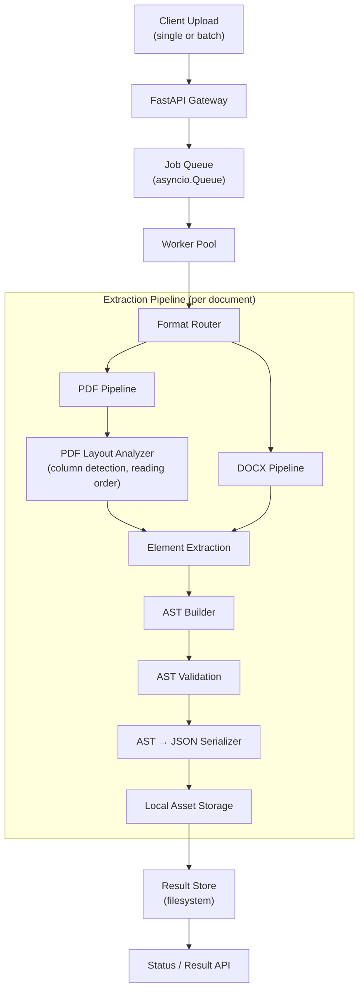
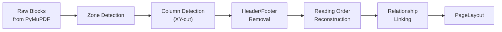
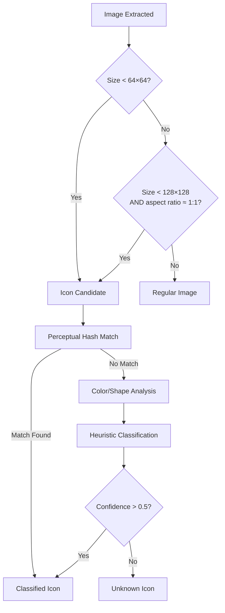
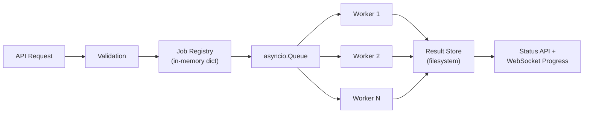

# Document Extraction System — Comprehensive Improvement Plan

Redesign and upgrade the SOP Migration extraction pipeline to preserve full document semantics, hierarchy, structure, and reading order. The extracted output must serve as a faithful intermediate representation suitable for lossless migration into new document templates.

---

## User Review Required

> [!IMPORTANT]
> **AST-First Architecture Shift** — This plan proposes replacing the current chunk-centric output (`DocumentOutput → Chunk[]`) with a full Abstract Syntax Tree (AST) representation. The existing chunking layer (hierarchical + semantic) will be retained but repositioned as an _optional consumer_ of the AST, not the primary output. This is a significant architectural change that affects the JSON export schema and all downstream consumers.

> [!WARNING]
> **Breaking API Changes** — The `/documents/{id}/json` response schema will change to output the new AST-based format instead of the current chunk array. A versioned migration path (`/v1/` → `/v2/`) is recommended to avoid disrupting any existing integrations.

> [!IMPORTANT]
> **Batch Upload Endpoint** — This plan introduces `POST /documents/batch-upload` supporting 10+ concurrent documents with background processing, progress tracking, and result retrieval. This requires adding a job queue and in-memory task registry.

---

## Resolved Decisions

| Decision | Resolution |
|---|---|
| **Scanned PDF Support** | **Excluded.** The system targets digital PDFs only. No OCR integration. Pytesseract remains in `requirements.txt` but unused. |
| **Multi-column PDF Priority** | **Phase 1 priority.** Column detection via XY-cut is included in the initial PDF Layout Analyzer delivery alongside the AST. |
| **Asset Storage** | **Local filesystem.** Images and icons stored under `data/extracted_images/` and `data/extracted_icons/` with per-document subdirectories. |

---

## Open Questions

> [!IMPORTANT]
> **Q1: Icon Dictionary Source** — The current [icons.py](file:///c:/Users/Bhavya/Desktop/Content%20Extraction/app/services/extraction/icons.py) has an empty `KNOWN_ICONS` dictionary. Should the icon library be loaded from a JSON/YAML config file, a database, or built from reference images at startup? This affects the icon classification strategy.

---

## 1. High-Level Architecture



### Component Roles

| Component | Responsibility |
|---|---|
| **FastAPI Gateway** | Receives uploads, validates files, enqueues jobs |
| **Job Queue** | Decouples upload from processing; enables parallelism |
| **Worker Pool** | Processes documents concurrently (configurable concurrency) |
| **Format Router** | Selects PDF or DOCX pipeline via [ParserFactory](file:///c:/Users/Bhavya/Desktop/Content%20Extraction/app/services/parser/parser_factory.py) |
| **PDF Layout Analyzer** | NEW — column detection, reading order, spatial relationship analysis |
| **Element Extraction** | Enhanced extractors for all content types including highlighted text |
| **AST Builder** | NEW — replaces [TreeBuilder](file:///c:/Users/Bhavya/Desktop/Content%20Extraction/app/services/hierarchy/tree_builder.py) with full AST construction |
| **AST Validation** | NEW — structural integrity checks on the AST |
| **JSON Serializer** | Enhanced [JSONExporter](file:///c:/Users/Bhavya/Desktop/Content%20Extraction/app/services/export/json_export.py) for AST-based output |
| **Local Asset Storage** | Images, icons persisted to local filesystem with per-document subdirectories |
| **Result Store** | Job status + extracted JSON persisted to `data/output/` for retrieval |

---

## 2. Abstract Syntax Tree (AST) Design

### 2.1 Why an AST

The current system converts documents into a flat `SectionNode` tree where elements are simple lists attached to headings. This loses critical structural relationships:

- Lists lose nesting depth (all items are flat `LIST_ITEM` / `NUMBERED_STEP`)
- Table cells are `list[str]` — no support for embedded images/icons or merged cells
- Images lack spatial context relative to their parent section
- No distinction between ordered and unordered lists
- No representation of inline formatting, highlighted text, or cross-references

An AST solves these problems by making every structural element a typed node with explicit parent-child relationships and positional metadata.

### 2.2 Node Type Hierarchy

```mermaid
classDiagram
    class ASTNode {
        +str node_id
        +str node_type
        +int sequence
        +SourceLocation source_location
        +float confidence
        +dict metadata
    }

    class DocumentNode {
        +DocumentMetadata doc_metadata
        +list~ASTNode~ children
    }

    class SectionNode {
        +HeadingNode heading
        +int level
        +list~ASTNode~ children
    }

    class HeadingNode {
        +str text
        +int level
        +str numbering
    }

    class ParagraphNode {
        +str text
        +list~HighlightSpan~ highlights
        +list~InlineNode~ inline_elements
    }

    class HighlightNode {
        +str text
        +str highlight_color
        +str color_hex
        +int start_offset
        +int end_offset
    }

    class ListNode {
        +str list_type
        +int nesting_depth
        +list~ListItemNode~ items
    }

    class ListItemNode {
        +str text
        +int index
        +list~ASTNode~ children
    }

    class TableNode {
        +int row_count
        +int col_count
        +int grid_cols
        +list~TableRowNode~ rows
        +str caption
        +bool has_header_row
    }

    class TableRowNode {
        +int row_index
        +bool is_header
        +list~TableCellNode~ cells
    }

    class TableCellNode {
        +int row_index
        +int col_index
        +int row_span
        +int col_span
        +bool is_merge_origin
        +str merge_origin_ref
        +list~ASTNode~ content
    }

    class ImageNode {
        +str asset_path
        +str alt_text
        +int width
        +int height
        +str caption
        +str image_hash
    }

    class IconNode {
        +str asset_path
        +str icon_type
        +str semantic_meaning
        +str classification_method
        +str icon_category
    }

    class CaptionNode {
        +str text
        +str caption_label
        +str referenced_node_id
    }

    ASTNode <|-- DocumentNode
    ASTNode <|-- SectionNode
    ASTNode <|-- HeadingNode
    ASTNode <|-- ParagraphNode
    ASTNode <|-- HighlightNode
    ASTNode <|-- ListNode
    ASTNode <|-- ListItemNode
    ASTNode <|-- TableNode
    ASTNode <|-- TableRowNode
    ASTNode <|-- TableCellNode
    ASTNode <|-- ImageNode
    ASTNode <|-- IconNode
    ASTNode <|-- CaptionNode
```



### 2.3 Node Types — Detailed Specification

| Node Type | Parent Allowed | Children Allowed | Key Fields |
|---|---|---|---|
| `DocumentNode` | None (root) | `SectionNode`, `ParagraphNode`, `ListNode`, `TableNode`, `ImageNode` | `doc_metadata` |
| `SectionNode` | `DocumentNode`, `SectionNode` | All non-document nodes | `heading`, `level` |
| `HeadingNode` | `SectionNode` | None (leaf) | `text`, `level`, `numbering` |
| `ParagraphNode` | `SectionNode`, `DocumentNode`, `TableCellNode`, `ListItemNode` | `HighlightNode`, `InlineNode` (future) | `text`, `highlights` |
| `HighlightNode` | `ParagraphNode` | None (leaf) | `text`, `highlight_color`, `color_hex`, `start_offset`, `end_offset` |
| `ListNode` | `SectionNode`, `DocumentNode`, `ListItemNode`, `TableCellNode` | `ListItemNode` | `list_type` ("ordered" / "unordered"), `nesting_depth` |
| `ListItemNode` | `ListNode` | `ParagraphNode`, `ListNode` (nested), `ImageNode` | `text`, `index` |
| `TableNode` | `SectionNode`, `DocumentNode` | `TableRowNode` | `row_count`, `col_count`, `grid_cols`, `caption`, `has_header_row` |
| `TableRowNode` | `TableNode` | `TableCellNode` | `row_index`, `is_header` |
| `TableCellNode` | `TableRowNode` | `ParagraphNode`, `ImageNode`, `IconNode`, `ListNode` | `row_span`, `col_span`, `is_merge_origin`, `merge_origin_ref` |
| `ImageNode` | `SectionNode`, `DocumentNode`, `TableCellNode`, `ListItemNode` | `CaptionNode` | `asset_path`, `width`, `height` |
| `IconNode` | `SectionNode`, `DocumentNode`, `TableCellNode` | None (leaf) | `icon_type`, `semantic_meaning`, `classification_method` |
| `CaptionNode` | `ImageNode`, `TableNode` | None (leaf) | `text`, `caption_label`, `referenced_node_id` |

### 2.4 Source Location Metadata

Every node carries a `SourceLocation` that records precisely where it was extracted from:

```python
class SourceLocation(BaseModel):
    """Tracks the exact origin of an extracted element."""
    page: int = 0
    bbox: Optional[BoundingBox] = None    # PDF spatial coordinates
    paragraph_index: Optional[int] = None  # DOCX paragraph ordinal
    xml_path: Optional[str] = None         # DOCX XML path for traceability
```

### 2.5 Pydantic Model Structure

All AST nodes will be defined as Pydantic `BaseModel` subclasses in a new file:

#### [NEW] `app/schemas/ast_nodes.py`

```python
class ASTNode(BaseModel):
    node_id: str = Field(default_factory=lambda: str(uuid.uuid4()))
    node_type: str
    sequence: int = 0
    source_location: Optional[SourceLocation] = None
    confidence: float = 1.0
    metadata: dict[str, Any] = Field(default_factory=dict)

class DocumentNode(ASTNode):
    node_type: str = "document"
    doc_metadata: DocumentMetadata = Field(default_factory=DocumentMetadata)
    children: list[ASTNode] = Field(default_factory=list)

class SectionNode(ASTNode):
    node_type: str = "section"
    heading: Optional["HeadingNode"] = None
    level: int = 0
    children: list[ASTNode] = Field(default_factory=list)

class HeadingNode(ASTNode):
    node_type: str = "heading"
    text: str = ""
    level: int = 1
    numbering: Optional[str] = None  # e.g., "1.2.3"

class ParagraphNode(ASTNode):
    node_type: str = "paragraph"
    text: str = ""
    highlights: list["HighlightSpan"] = Field(default_factory=list)

class HighlightSpan(BaseModel):
    """A highlighted range within a paragraph's text."""
    text: str = ""
    highlight_color: str = ""       # Named color: "yellow", "green", "cyan", etc.
    color_hex: str = ""             # Hex value: "#FFFF00", "#00FF00", etc.
    start_offset: int = 0           # Character offset within parent paragraph text
    end_offset: int = 0             # Character offset (exclusive) within parent text

class HighlightNode(ASTNode):
    """Standalone highlighted text block (when entire block is highlighted)."""
    node_type: str = "highlight"
    text: str = ""
    highlight_color: str = ""
    color_hex: str = ""

class ListNode(ASTNode):
    node_type: str = "list"
    list_type: str = "unordered"  # "ordered" | "unordered"
    nesting_depth: int = 0
    items: list["ListItemNode"] = Field(default_factory=list)

class ListItemNode(ASTNode):
    node_type: str = "list_item"
    text: str = ""
    index: Optional[int] = None  # 1-based for ordered lists
    children: list[ASTNode] = Field(default_factory=list)  # nested lists, images

class TableNode(ASTNode):
    node_type: str = "table"
    row_count: int = 0
    col_count: int = 0
    grid_cols: int = 0          # Total grid columns (before merges)
    rows: list["TableRowNode"] = Field(default_factory=list)
    caption: Optional[str] = None
    has_header_row: bool = False

class TableRowNode(ASTNode):
    node_type: str = "table_row"
    row_index: int = 0
    is_header: bool = False
    cells: list["TableCellNode"] = Field(default_factory=list)

class TableCellNode(ASTNode):
    node_type: str = "table_cell"
    row_index: int = 0
    col_index: int = 0
    row_span: int = 1
    col_span: int = 1
    is_merge_origin: bool = True   # True if this is the origin cell of a merge
    merge_origin_ref: Optional[str] = None  # node_id of the origin cell (for continuation cells)
    content: list[ASTNode] = Field(default_factory=list)  # paragraphs, images, icons

class ImageNode(ASTNode):
    node_type: str = "image"
    asset_path: str = ""
    alt_text: str = ""
    width: int = 0
    height: int = 0
    caption: Optional[str] = None
    image_hash: str = ""

class IconNode(ASTNode):
    node_type: str = "icon"
    asset_path: str = ""
    icon_type: str = "unknown"       # "raster" | "vector" | "font" | "emoji" | "symbol"
    semantic_meaning: str = ""        # "warning" | "ppe_required" | "prohibited" | etc.
    classification_method: str = ""   # "perceptual_hash" | "size_heuristic" | "ocr" | "manual"
    icon_category: str = ""           # "safety" | "status" | "action" | "informational"

class CaptionNode(ASTNode):
    node_type: str = "caption"
    text: str = ""
    caption_label: Optional[str] = None  # "Figure 1", "Table 2"
    referenced_node_id: Optional[str] = None
```

---

## 3. Document Structure and Semantic Extraction

### 3.1 Heading and Section Detection

#### Current State

The existing [PDFParser._classify_block](file:///c:/Users/Bhavya/Desktop/Content%20Extraction/app/services/parser/pdf_parser.py#L244-L329) uses four rules in priority order: font-size threshold, numbered heading pattern, label heading (ends with `:`), and short bold title. The [DocxParser](file:///c:/Users/Bhavya/Desktop/Content%20Extraction/app/services/parser/docx_parser.py#L130-L168) relies on Word style names.

#### Proposed Improvements

**Rule Enhancement for PDFs (modify [pdf_parser.py](file:///c:/Users/Bhavya/Desktop/Content%20Extraction/app/services/parser/pdf_parser.py))**

| Rule | Current | Proposed |
|---|---|---|
| Font-size threshold | Fixed `13.0` | Adaptive — compute page-level font-size histogram, treat top-N percentile as heading candidates |
| Numbered heading | Single regex | Multi-pattern: `1.`, `1.2`, `1.2.3`, `A.`, `I.`, `(a)`, `(1)` — map to level by depth |
| ALL-CAPS detection | Not implemented | Add Rule 2b: ALL-CAPS text ≤ 8 words with no sentence punctuation → heading level 3 |
| Underline detection | Not implemented | PyMuPDF can expose underline via `flags` bit — use as heading signal |
| Vertical spacing | Not used | Compute inter-block gap; abnormally large gap before a bold block reinforces heading classification |
| Confidence scoring | Not tracked | Each rule emits a `confidence` (0.0–1.0) stored in the AST node |

**DOCX Style Fallback (modify [docx_parser.py](file:///c:/Users/Bhavya/Desktop/Content%20Extraction/app/services/parser/docx_parser.py))**

When a DOCX paragraph uses `Normal` style but has formatting that suggests a heading:
1. Check `paragraph.runs` for bold + font-size > document average
2. Apply the same numbered heading regex used in PDF
3. Check outline level from `paragraph.paragraph_format.outline_level`
4. Inspect `w:pPr/w:outlineLvl` in the underlying XML

### 3.2 List and Nested List Detection

#### Current Gaps

- The current [DocxParser](file:///c:/Users/Bhavya/Desktop/Content%20Extraction/app/services/parser/docx_parser.py#L150-L160) classifies list items but does not group them into a `ListNode` or detect nesting
- The PDF parser has no list detection — list items become paragraphs
- Ordered vs. unordered is only detected in DOCX via style names

#### Proposed Strategy

**PDF List Detection (new class: `ListDetector`)**

```
Ordered list patterns:
  ^\d+[.)]\s          →  "1. " / "1) "
  ^[a-z][.)]\s        →  "a. " / "a) "
  ^[ivxlc]+[.)]\s     →  "i. " / "iv) "  (Roman numerals)
  ^[A-Z][.)]\s        →  "A. " / "A) "

Unordered list patterns:
  ^[•●○◦▪▸‣►]\s      →  Bullet characters
  ^[-–—]\s            →  Dash lists
  ^[✓✗☐☑]\s           →  Checkbox lists

Nesting detection:
  - Track x0 (left indent) of consecutive list items
  - Group items with same indent as siblings
  - Deeper indent → child ListNode
  - Shallower indent → pop back up the list stack
```

**DOCX List Detection (enhance [DocxParser](file:///c:/Users/Bhavya/Desktop/Content%20Extraction/app/services/parser/docx_parser.py))**

```
- Read `paragraph.paragraph_format.left_indent` for nesting depth
- Access `w:numPr/w:ilvl` in XML for explicit indent level
- Access `w:numPr/w:numId` to group items into the same list
- Map `w:numFmt` values to ordered/unordered type
```

**AST Construction**

Consecutive list items at the same nesting level are grouped under a single `ListNode`. When the indent level increases, a child `ListNode` is created inside the parent `ListItemNode.children`:

```
ListNode (ordered, depth=0)
├── ListItemNode (index=1, text="First item")
├── ListItemNode (index=2, text="Second item")
│   └── ListNode (unordered, depth=1)
│       ├── ListItemNode (text="Sub-bullet A")
│       └── ListItemNode (text="Sub-bullet B")
└── ListItemNode (index=3, text="Third item")
```

### 3.3 Section Association

Every non-heading content block must be assigned to the correct section in the AST. The algorithm (enhanced from [TreeBuilder.build](file:///c:/Users/Bhavya/Desktop/Content%20Extraction/app/services/hierarchy/tree_builder.py#L29-L95)):

1. Maintain a section stack initialized with `DocumentNode` at depth 0
2. For each element in reading order:
   - **Heading** → pop stack to find parent with strictly lower level → create `SectionNode` → push onto stack
   - **Paragraph** → append `ParagraphNode` to current section (including any highlight spans)
   - **List item** → accumulate into current `ListNode` or create new one
   - **Table** → append `TableNode` to current section
   - **Image** → append `ImageNode` to current section
   - **Caption** → attach as `CaptionNode` to preceding `ImageNode` or `TableNode`
3. The stack guarantees correct parent-child nesting at all times

### 3.4 Highlighted Text Detection

#### Why Highlights Matter

Highlighted text in SOPs often indicates critical information — warnings, recently changed content, key terms, or review comments. Preserving the highlight color and position is essential for accurate migration.

#### PDF Highlight Detection

PyMuPDF exposes highlight information through two mechanisms:

**A. Span-level background color (text highlighting via rendering)**

```python
def _extract_highlights_from_spans(self, block: dict) -> list[HighlightSpan]:
    """Detect highlighted text from span color attributes."""
    highlights = []
    for line in block.get("lines", []):
        for span in line.get("spans", []):
            # PyMuPDF 'color' field gives text color (foreground).
            # Background highlight is detected via the bkcolor (back color)
            # attribute on the span, available when text is rendered
            # with a highlight/shading.
            bk_color = span.get("bkcolor")  # Background color as (r, g, b) tuple
            if bk_color and bk_color != (1.0, 1.0, 1.0):  # Not white
                highlights.append(HighlightSpan(
                    text=span.get("text", ""),
                    highlight_color=self._rgb_to_name(bk_color),
                    color_hex=self._rgb_to_hex(bk_color),
                ))
    return highlights
```

**B. Page-level highlight annotations**

PDF highlight annotations (`/Subtype /Highlight`) are separate from the text stream. They store a QuadPoints array defining the highlighted region:

```python
def _extract_highlight_annotations(self, page: fitz.Page) -> list[dict]:
    """Extract highlight annotations overlaid on text."""
    highlights = []
    for annot in page.annots() or []:
        if annot.type[0] == fitz.PDF_ANNOT_HIGHLIGHT:
            rect = annot.rect
            color = annot.colors.get("stroke", (1, 1, 0))  # Default yellow
            # Find the text underneath this highlight rect
            highlighted_text = page.get_text("text", clip=rect).strip()
            highlights.append({
                "text": highlighted_text,
                "color": color,
                "bbox": rect,
            })
    return highlights
```

**C. Color name mapping:**

```python
HIGHLIGHT_COLOR_MAP = {
    (1.0, 1.0, 0.0): ("yellow", "#FFFF00"),
    (0.0, 1.0, 0.0): ("green", "#00FF00"),
    (0.0, 1.0, 1.0): ("cyan", "#00FFFF"),
    (1.0, 0.0, 1.0): ("magenta", "#FF00FF"),
    (1.0, 0.0, 0.0): ("red", "#FF0000"),
    (0.0, 0.0, 1.0): ("blue", "#0000FF"),
}

def _rgb_to_name(self, rgb: tuple) -> str:
    """Map an RGB tuple to the closest named highlight color."""
    # Find the nearest color in HIGHLIGHT_COLOR_MAP by Euclidean distance
    min_dist = float("inf")
    name = "custom"
    for ref_rgb, (ref_name, _) in self.HIGHLIGHT_COLOR_MAP.items():
        dist = sum((a - b) ** 2 for a, b in zip(rgb, ref_rgb))
        if dist < min_dist:
            min_dist = dist
            name = ref_name
    return name
```

#### DOCX Highlight Detection

python-docx exposes highlight via `run.font.highlight_color` and the underlying XML `w:highlight`:

```python
def _extract_paragraph_with_highlights(self, paragraph) -> ParagraphNode:
    """Extract paragraph text with highlight span metadata."""
    full_text = ""
    highlights = []

    for run in paragraph.runs:
        run_text = run.text
        start_offset = len(full_text)

        # Check for highlight
        highlight_color = run.font.highlight_color  # e.g., WD_COLOR.YELLOW
        if highlight_color is not None:
            # Map WD_COLOR_INDEX to color name and hex
            color_name, color_hex = self._wd_color_to_name(highlight_color)
            highlights.append(HighlightSpan(
                text=run_text,
                highlight_color=color_name,
                color_hex=color_hex,
                start_offset=start_offset,
                end_offset=start_offset + len(run_text),
            ))

        # Also check for manual shading (w:shd) as an alternative highlight
        shd = run._element.find(qn('w:rPr/w:shd'))
        if shd is not None:
            fill = shd.get(qn('w:fill'))  # e.g., "FFFF00"
            if fill and fill != "auto":
                color_name = self._hex_to_name(f"#{fill}")
                highlights.append(HighlightSpan(
                    text=run_text,
                    highlight_color=color_name,
                    color_hex=f"#{fill}",
                    start_offset=start_offset,
                    end_offset=start_offset + len(run_text),
                ))

        full_text += run_text

    return ParagraphNode(
        text=full_text.strip(),
        highlights=highlights,
    )
```

**DOCX highlight color mapping (WD_COLOR_INDEX):**

```python
WD_HIGHLIGHT_MAP = {
    1:  ("black", "#000000"),
    2:  ("blue", "#0000FF"),
    3:  ("cyan", "#00FFFF"),
    4:  ("green", "#00FF00"),
    5:  ("magenta", "#FF00FF"),
    6:  ("red", "#FF0000"),
    7:  ("yellow", "#FFFF00"),
    8:  ("white", "#FFFFFF"),
    9:  ("dark_blue", "#000080"),
    10: ("dark_cyan", "#008080"),
    11: ("dark_green", "#008000"),
    12: ("dark_magenta", "#800080"),
    13: ("dark_red", "#800000"),
    14: ("dark_yellow", "#808000"),
    15: ("dark_gray", "#808080"),
    16: ("light_gray", "#C0C0C0"),
}
```

#### AST Representation

Highlights are represented as `HighlightSpan` lists inside `ParagraphNode`, preserving exact character offsets:

```json
{
  "node_type": "paragraph",
  "text": "All personnel must wear safety goggles at all times in the laboratory.",
  "highlights": [
    {
      "text": "must wear safety goggles",
      "highlight_color": "yellow",
      "color_hex": "#FFFF00",
      "start_offset": 14,
      "end_offset": 38
    }
  ]
}
```

When an entire paragraph/block is highlighted, a standalone `HighlightNode` is used instead.

---

## 4. PDF Layout Analysis

### 4.1 Current Limitations

The current [PDFParser](file:///c:/Users/Bhavya/Desktop/Content%20Extraction/app/services/parser/pdf_parser.py) reads blocks in the order returned by `page.get_text("dict")`, which is PyMuPDF's internal content-stream order. This fails for:
- Multi-column layouts (reads across columns instead of down)
- Floating sidebars and callout boxes
- Headers/footers mixed into body content
- Tables that overlap text blocks

### 4.2 Layout Analyzer Design

> [!IMPORTANT]
> Multi-column detection is a **Phase 1 priority**. It will be delivered alongside the AST schema as part of the initial `PDFLayoutAnalyzer` implementation.

#### [NEW] `app/services/layout/pdf_layout_analyzer.py`

```python
class PDFLayoutAnalyzer:
    """Analyzes PDF page layout to determine correct reading order
    and spatial relationships between elements.
    
    Phase 1 priority: column detection and reading order are critical
    for SOPs that use two-column procedure layouts."""

    def analyze_page(self, page: fitz.Page) -> PageLayout:
        """Returns a PageLayout with ordered regions and relationships."""
        ...
```

#### Analysis Pipeline



**Step 1: Zone Detection**
- Cluster text blocks by their bounding boxes using DBSCAN or recursive XY-cut
- Identify distinct content zones (columns, sidebars, captions, headers, footers)
- A zone is a connected region of blocks separated by significant whitespace

**Step 2: Column Detection (Phase 1 Priority)**
- Compute vertical projection profile: histogram of x-coordinates across all text blocks
- Valleys in the profile indicate column separators
- Validate by checking that blocks in each candidate column have consistent x-ranges
- Algorithm: recursive XY-cut (Breuel 2002) — split page alternating horizontal and vertical cuts at maximum whitespace gaps

```python
def detect_columns(blocks: list[Block], page_width: float) -> list[Column]:
    """XY-cut based column detection.
    
    1. Build a horizontal projection profile (histogram of block x-ranges)
    2. Find gaps > threshold (default: 15% of page width) → column boundaries
    3. Validate: each candidate column must contain ≥ 3 blocks
    4. Recursively split within each column for sub-column detection
    """
    x_coords = [(b.bbox.x0, b.bbox.x1) for b in blocks]
    # Build horizontal projection profile
    # Find gaps > threshold → column boundaries
    # Recursively split within each column
```

**Step 3: Header/Footer Removal**
- Identify blocks in the top/bottom N% of the page (configurable, default 8%)
- Cross-validate across pages: if the same text appears at the same position on ≥ 3 pages, classify as header/footer
- Extract but exclude from main reading order; store separately in AST metadata

**Step 4: Reading Order Reconstruction**
- Within each column: sort blocks top-to-bottom by `y0`
- Between columns: process left column first, then right (for LTR documents)
- Handle full-width elements (spanning all columns): insert at the y-position they occupy

**Step 5: Relationship Linking**
- For each image block, find the nearest text block within a configurable proximity radius (default 50pt)
- Caption detection: text block directly below/above an image with caption-pattern text
- Table-caption linking: text block directly above/below a table region

#### Recommended Libraries

| Library | Purpose | Why |
|---|---|---|
| **PyMuPDF (fitz)** | Primary PDF parsing, block extraction | Already in use; fast, reliable |
| **pdfplumber** | Table boundary detection | Already in use; superior table detection |
| **scikit-learn DBSCAN** | Spatial clustering for zone detection | Already a dependency (scikit-learn) |
| **NumPy** | Projection profiles, coordinate math | Dependency of scikit-learn |

### 4.3 PageLayout Output Schema

#### [NEW] `app/schemas/layout.py`

```python
class ContentRegion(BaseModel):
    """A detected region on a PDF page."""
    region_id: str
    region_type: str  # "column" | "header" | "footer" | "sidebar" | "figure" | "table"
    bbox: BoundingBox
    blocks: list[ExtractedElement]

class PageLayout(BaseModel):
    """Analyzed layout of a single PDF page."""
    page_number: int
    width: float
    height: float
    columns: int  # detected column count
    regions: list[ContentRegion]
    reading_order: list[str]  # ordered list of region_ids
    headers: list[ExtractedElement]
    footers: list[ExtractedElement]
```

---

## 5. DOCX Extraction Strategy

### 5.1 Current Gaps in [DocxParser](file:///c:/Users/Bhavya/Desktop/Content%20Extraction/app/services/parser/docx_parser.py)

| Gap | Impact |
|---|---|
| All content modeled as single page | Loses page-break semantics |
| Tables extracted as `list[list[str]]` | Loses merged cells, embedded images, formatting |
| Images extracted from `doc.part.rels` globally | Loses position relative to paragraphs |
| No list grouping or nesting | Individual items disconnected |
| No header/footer extraction | Content lost |
| No inline image detection | Images inside paragraphs missed |
| No highlight detection | Highlighted text treated as plain text |

### 5.2 Proposed Improvements

#### [MODIFY] [docx_parser.py](file:///c:/Users/Bhavya/Desktop/Content%20Extraction/app/services/parser/docx_parser.py)

**A. Unified Body Iterator**

Replace the separate `doc.paragraphs` + `doc.tables` loops with a single walk over the document body XML:

```python
from docx.oxml.ns import qn

def _iterate_body(self, doc: DocxDocument):
    """Walk the document body in reading order, yielding paragraphs and tables
    in their actual sequence (the current approach processes all paragraphs
    first, then all tables, losing interleaving)."""
    body = doc.element.body
    for child in body:
        if child.tag == qn('w:p'):
            yield ('paragraph', child)
        elif child.tag == qn('w:tbl'):
            yield ('table', child)
        elif child.tag == qn('w:sectPr'):
            yield ('section_break', child)
```

**B. Inline Image Extraction**

Detect images inside paragraph runs by checking for `w:drawing` or `w:pict` elements within each `w:r` (run):

```python
def _extract_inline_images(self, paragraph) -> list[ImageNode]:
    """Find images embedded inline within a paragraph's runs."""
    images = []
    for run in paragraph.runs:
        drawing_elements = run._element.findall(qn('w:drawing'))
        for drawing in drawing_elements:
            # Extract blip relationship ID → image part
            ...
    return images
```

**C. Enhanced Table Extraction with Merged Cell Support**

Access the `python-docx` table's underlying XML to detect:
- Merged cells via `w:gridSpan` (column span) and `w:vMerge` (row span)
- Rich cell content: iterate cell paragraphs (not just `cell.text`)
- Embedded images inside cells
- Cell shading/background color and highlight detection

```python
def _extract_table_cell(self, cell) -> TableCellNode:
    """Extract full cell content including paragraphs, images, and formatting."""
    content = []
    for paragraph in cell.paragraphs:
        content.append(self._extract_paragraph_with_highlights(paragraph))
        content.extend(self._extract_inline_images(paragraph))
    return TableCellNode(
        row_span=self._get_row_span(cell),
        col_span=self._get_col_span(cell),
        content=content,
    )
```

**D. Header/Footer Extraction**

```python
for section in doc.sections:
    header = section.header
    footer = section.footer
    if header and not header.is_linked_to_previous:
        # Extract header paragraphs
    if footer and not footer.is_linked_to_previous:
        # Extract footer paragraphs
```

**E. List Grouping via Numbering XML**

```python
def _get_list_properties(self, paragraph) -> Optional[tuple[int, int, str]]:
    """Returns (numId, ilvl, numFmt) or None if paragraph is not a list item."""
    numPr = paragraph._element.find(qn('w:pPr/w:numPr'))
    if numPr is None:
        return None
    numId = numPr.find(qn('w:numId')).get(qn('w:val'))
    ilvl = numPr.find(qn('w:ilvl')).get(qn('w:val'))
    # Look up numFmt from numbering.xml
    return (int(numId), int(ilvl), numFmt)
```

**F. Highlighted Text Extraction**

See Section 3.4 for full implementation details. Highlights are detected from `run.font.highlight_color` and `w:rPr/w:shd` XML elements.

---

## 6. Image Extraction and Caption Detection

### 6.1 Image Extraction Strategy

#### PDF Images (enhance [PDFParser._extract_images](file:///c:/Users/Bhavya/Desktop/Content%20Extraction/app/services/parser/pdf_parser.py#L188-L229))

| Improvement | Description |
|---|---|
| **Bounding box capture** | Use `page.get_image_rects(xref)` to get the exact on-page position of each image |
| **Deduplication** | Track image hashes across pages; skip duplicate decorative elements |
| **Size filtering** | Ignore images smaller than a configurable threshold (e.g., < 20×20 px) — these are likely bullets, separators, or decorative elements |
| **Format normalization** | Convert all images to PNG for consistency; retain original format in metadata |
| **Section association** | After layout analysis, determine which section/column the image belongs to based on its bbox |

#### DOCX Images (enhance [DocxParser._extract_images](file:///c:/Users/Bhavya/Desktop/Content%20Extraction/app/services/parser/docx_parser.py#L199-L241))

| Improvement | Description |
|---|---|
| **Positional extraction** | Walk paragraphs in order; extract images inline where they appear, not as a disconnected batch |
| **Alt-text capture** | Read `wp:docPr` `descr` attribute for alt-text |
| **Size capture** | Read `wp:extent` for image dimensions in EMUs (English Metric Units) |
| **Relationship to paragraph** | Each image is recorded with its paragraph index for correct AST placement |

### 6.2 Caption Detection

#### Enhanced [CaptionExtractor](file:///c:/Users/Bhavya/Desktop/Content%20Extraction/app/services/extraction/captions.py)

**Extended caption patterns:**

```python
CAPTION_PATTERNS = [
    re.compile(r"^(Figure|Fig\.?|Image|Img\.?|Photo|Illustration)\s*\d+", re.IGNORECASE),
    re.compile(r"^(Table|Tbl\.?)\s*\d+", re.IGNORECASE),
    re.compile(r"^(Diagram|Chart|Graph|Map|Exhibit)\s*\d+", re.IGNORECASE),
    re.compile(r"^(Source|Note|Reference):", re.IGNORECASE),  # post-image attribution
]
```

**Improved proximity rules:**

| Rule | Description | Priority |
|---|---|---|
| **Immediately after** | Next element in reading order is a caption-patterned paragraph | Highest |
| **Immediately before** | Previous element in reading order is a caption-patterned paragraph | High |
| **Spatial proximity (PDF)** | Text block within 30pt below image, horizontally centered on image | Medium |
| **Style-based (DOCX)** | Paragraph with style name "Caption" or "Figure Caption" | Highest |
| **Orphan check** | If neither pre nor post caption found, leave `caption: null` rather than guessing | Default |

**Multi-image handling:**

When multiple images appear consecutively:
1. Check for a shared caption (e.g., "Figures 3a and 3b: ...") — attach to all
2. If individual captions follow each image, match them 1:1 in reading order
3. If only one caption follows N images, attach it only to the last image and log a warning

---

## 7. Table Extraction Strategy

### 7.1 Current State

- [TableExtractor](file:///c:/Users/Bhavya/Desktop/Content%20Extraction/app/services/extraction/tables.py) uses `pdfplumber.find_tables()` for PDFs
- [DocxParser._extract_table](file:///c:/Users/Bhavya/Desktop/Content%20Extraction/app/services/parser/docx_parser.py#L172-L195) produces `headers: list[str]`, `rows: list[list[str]]`
- No merged cell detection, no embedded content, no formatting metadata

### 7.2 Enhanced Table Representation

#### AST TableNode Structure

```
TableNode
├── caption: "Table 1: Safety Equipment Requirements"
├── has_header_row: true
├── rows:
│   ├── TableRowNode (row_index=0, is_header=true)
│   │   ├── TableCellNode (col=0, text="Equipment")
│   │   ├── TableCellNode (col=1, text="Required")
│   │   └── TableCellNode (col=2, text="Status")
│   ├── TableRowNode (row_index=1)
│   │   ├── TableCellNode (col=0, text="Safety Goggles")
│   │   ├── TableCellNode (col=1, content=[IconNode(meaning="mandatory")])
│   │   └── TableCellNode (col=2, row_span=2, col_span=1, is_merge_origin=true, text="Active")
│   └── TableRowNode (row_index=2)
│       ├── TableCellNode (col=0, text="Hard Hat")
│       ├── TableCellNode (col=1, content=[IconNode(meaning="mandatory")])
│       └── TableCellNode (col=2, is_merge_origin=false, merge_origin_ref="tc-006")
```

### 7.3 PDF Table Extraction Improvements

#### [MODIFY] [tables.py](file:///c:/Users/Bhavya/Desktop/Content%20Extraction/app/services/extraction/tables.py)

1. **Use pdfplumber's cell-level data**: Access `table.cells` for individual cell bounding boxes
2. **Detect merged cells**: Compare cell bounding boxes — cells that span multiple grid positions are merged
3. **Extract cell content**: For each cell bbox, find all text blocks and image blocks that fall within it
4. **Detect header rows**: First row is header if it has different formatting (bold, background color, or font size) compared to data rows
5. **Preserve content order within cells**: Sort blocks by y0 then x0 within each cell

```python
def _extract_cell_content(self, page, cell_bbox) -> list[ASTNode]:
    """Extract all content within a single table cell's bounding box."""
    content = []
    # Find text blocks within cell bbox
    words = page.extract_words()
    cell_words = [w for w in words if self._bbox_contains(cell_bbox, w)]
    if cell_words:
        content.append(ParagraphNode(text=" ".join(w["text"] for w in cell_words)))

    # Find images within cell bbox
    for img in page.images:
        if self._bbox_contains(cell_bbox, img):
            content.append(ImageNode(...))

    return content
```

### 7.4 DOCX Table Extraction Improvements

Access the full cell content model instead of `cell.text`:

```python
for paragraph in cell.paragraphs:
    # Check for inline images
    # Check for list items
    # Preserve paragraph styles and formatting
    # Detect highlights within cell text
```

Detect merged cells:
```python
def _get_col_span(self, cell) -> int:
    tc = cell._element
    gridSpan = tc.find(qn('w:tcPr/w:gridSpan'))
    return int(gridSpan.get(qn('w:val'))) if gridSpan is not None else 1

def _get_row_span(self, cell) -> int:
    tc = cell._element
    vMerge = tc.find(qn('w:tcPr/w:vMerge'))
    if vMerge is None:
        return 1
    val = vMerge.get(qn('w:val'), 'continue')
    return -1 if val == 'continue' else 1  # -1 = continuation of merge
```

### 7.5 Merged Cell Grid Reconstruction Algorithm

Merged cells are one of the most complex table extraction challenges. The system must correctly handle both column spans (horizontal merges) and row spans (vertical merges), and reconstruct the full logical grid so that every piece of data maps back to the correct cell position.

#### Concrete Example: Vehicle Categorization Table

Consider a table that classifies vehicles:

```
┌───────────────────────────────────────────────┐
│              Vehicle Types                    │
├───────────────────────┬───────────────────────┤
│      2 Wheelers       │      4 Wheelers       │
├───────────┬───────────┼───────────┬───────────┤
│   Honda   │  Yamaha   │  Toyota   │   BMW     │
├───────────┼───────────┼───────────┼───────────┤
│  CBR 600  │   R1      │  Camry    │  3 Series │
│  CB 500   │   MT-07   │  Corolla  │  5 Series │
├───────────┼───────────┼───────────┼───────────┤
│  Activa   │   FZ      │  Innova   │  X5       │
└───────────┴───────────┴───────────┴───────────┘
```

This table has:
- **Row 0**: "Vehicle Types" — spans all 4 columns (`col_span=4`)
- **Row 1**: "2 Wheelers" spans columns 0–1 (`col_span=2`), "4 Wheelers" spans columns 2–3 (`col_span=2`)
- **Rows 2–4**: Individual cells, no merges

#### AST Representation of This Table

```json
{
  "node_type": "table",
  "row_count": 5,
  "col_count": 4,
  "grid_cols": 4,
  "has_header_row": true,
  "rows": [
    {
      "row_index": 0,
      "is_header": true,
      "cells": [
        {
          "node_id": "tc-100",
          "row_index": 0, "col_index": 0,
          "row_span": 1, "col_span": 4,
          "is_merge_origin": true,
          "content": [{ "node_type": "paragraph", "text": "Vehicle Types" }]
        }
      ]
    },
    {
      "row_index": 1,
      "is_header": true,
      "cells": [
        {
          "node_id": "tc-101",
          "row_index": 1, "col_index": 0,
          "row_span": 1, "col_span": 2,
          "is_merge_origin": true,
          "content": [{ "node_type": "paragraph", "text": "2 Wheelers" }]
        },
        {
          "node_id": "tc-102",
          "row_index": 1, "col_index": 2,
          "row_span": 1, "col_span": 2,
          "is_merge_origin": true,
          "content": [{ "node_type": "paragraph", "text": "4 Wheelers" }]
        }
      ]
    },
    {
      "row_index": 2,
      "is_header": false,
      "cells": [
        { "col_index": 0, "content": [{ "text": "Honda" }] },
        { "col_index": 1, "content": [{ "text": "Yamaha" }] },
        { "col_index": 2, "content": [{ "text": "Toyota" }] },
        { "col_index": 3, "content": [{ "text": "BMW" }] }
      ]
    }
  ]
}
```

#### Row-Span Example

Now consider a table where rows are merged:

```
┌───────────────┬───────────┬──────────┐
│   Category    │   Brand   │  Model   │
├───────────────┼───────────┼──────────┤
│               │  Honda    │  CBR 600 │
│  2 Wheelers   ├───────────┼──────────┤
│               │  Yamaha   │  R1      │
├───────────────┼───────────┼──────────┤
│               │  Toyota   │  Camry   │
│  4 Wheelers   ├───────────┼──────────┤
│               │  BMW      │  3 Series│
└───────────────┴───────────┴──────────┘
```

Here "2 Wheelers" spans rows 1–2 (`row_span=2`) and "4 Wheelers" spans rows 3–4 (`row_span=2`).

#### Grid Reconstruction Algorithm

The core challenge is converting the raw cell data (which may omit continuation cells) into a normalized grid where every position is accounted for.

```python
class MergedCellGridBuilder:
    """Reconstructs a normalized grid from raw table data with merged cells."""

    def build_grid(self, raw_rows: list[list[RawCell]]) -> list[list[TableCellNode]]:
        """Convert raw rows into a fully normalized grid.
        
        Algorithm:
        1. Determine grid dimensions (max columns across all rows)
        2. Create an occupation map (bool grid tracking which positions are "taken")
        3. Walk through raw cells row by row:
           a. For each cell, find the next unoccupied column position
           b. Place the cell at that position
           c. If col_span > 1 or row_span > 1, mark all spanned positions as occupied
           d. For continuation positions, insert a placeholder cell with
              is_merge_origin=False and merge_origin_ref pointing to the origin
        4. Return the normalized grid
        """
        grid_rows = self._determine_grid_dimensions(raw_rows)
        grid_cols = self._determine_grid_cols(raw_rows)
        
        # Occupation map: True = already claimed by a merge
        occupied: list[list[bool]] = [
            [False] * grid_cols for _ in range(grid_rows)
        ]
        
        # Result grid
        grid: list[list[Optional[TableCellNode]]] = [
            [None] * grid_cols for _ in range(grid_rows)
        ]
        
        for row_idx, raw_row in enumerate(raw_rows):
            col_cursor = 0
            for raw_cell in raw_row:
                # Skip occupied positions (filled by previous merges)
                while col_cursor < grid_cols and occupied[row_idx][col_cursor]:
                    col_cursor += 1
                
                if col_cursor >= grid_cols:
                    break  # Row overflow — log warning
                
                # Place the origin cell
                origin_node = TableCellNode(
                    row_index=row_idx,
                    col_index=col_cursor,
                    row_span=raw_cell.row_span,
                    col_span=raw_cell.col_span,
                    is_merge_origin=True,
                    content=raw_cell.content,
                )
                grid[row_idx][col_cursor] = origin_node
                
                # Mark all spanned positions as occupied
                for dr in range(raw_cell.row_span):
                    for dc in range(raw_cell.col_span):
                        target_r = row_idx + dr
                        target_c = col_cursor + dc
                        if target_r < grid_rows and target_c < grid_cols:
                            occupied[target_r][target_c] = True
                            
                            # Insert continuation cell (not the origin)
                            if dr != 0 or dc != 0:
                                grid[target_r][target_c] = TableCellNode(
                                    row_index=target_r,
                                    col_index=target_c,
                                    row_span=1,
                                    col_span=1,
                                    is_merge_origin=False,
                                    merge_origin_ref=origin_node.node_id,
                                    content=[],  # Empty — content lives in origin
                                )
                
                col_cursor += raw_cell.col_span
        
        return grid
```

#### PDF Merged Cell Detection

pdfplumber reports table cells as `(x0, y0, x1, y1)` tuples. Merged cells are detected by comparing cell bbox sizes against the grid:

```python
def _detect_pdf_merged_cells(self, table) -> list[list[RawCell]]:
    """Detect merged cells in a pdfplumber table by analyzing cell bounding boxes.
    
    1. Build a grid of unique x-coordinates (column edges) and y-coordinates (row edges)
    2. For each cell, determine how many grid columns/rows it spans
    3. A cell whose bbox crosses multiple grid lines has col_span > 1 or row_span > 1
    """
    cells = table.cells  # List of (x0, y0, x1, y1) tuples
    
    # Collect all unique x and y boundaries (sorted, deduplicated)
    x_edges = sorted(set(c[0] for c in cells) | set(c[2] for c in cells))
    y_edges = sorted(set(c[1] for c in cells) | set(c[3] for c in cells))
    
    # Snap tolerance (points) — handles floating-point imprecision
    SNAP = 2.0
    
    def _snap_to_edge(val, edges):
        for e in edges:
            if abs(val - e) < SNAP:
                return e
        return val
    
    normalized_cells = []
    for (x0, y0, x1, y1) in cells:
        x0s = _snap_to_edge(x0, x_edges)
        x1s = _snap_to_edge(x1, x_edges)
        y0s = _snap_to_edge(y0, y_edges)
        y1s = _snap_to_edge(y1, y_edges)
        
        col_start = x_edges.index(x0s)
        col_end = x_edges.index(x1s)
        row_start = y_edges.index(y0s)
        row_end = y_edges.index(y1s)
        
        col_span = col_end - col_start
        row_span = row_end - row_start
        
        normalized_cells.append(RawCell(
            row=row_start,
            col=col_start,
            row_span=max(1, row_span),
            col_span=max(1, col_span),
            bbox=(x0, y0, x1, y1),
        ))
    
    return self._group_cells_into_rows(normalized_cells)
```

#### DOCX Merged Cell Detection

DOCX uses two XML properties for cell merging:

```python
def _detect_docx_merged_cells(self, table) -> list[list[RawCell]]:
    """Detect merged cells in a python-docx table via XML inspection.
    
    Column spans: w:gridSpan in w:tcPr (value = number of grid columns spanned)
    Row spans: w:vMerge in w:tcPr
      - w:vMerge val="restart" → this is the START of a vertical merge (origin)
      - w:vMerge (no val or val="continue") → this cell is a CONTINUATION
      - No w:vMerge → normal cell (row_span = 1)
    
    Algorithm for row spans:
    1. First pass: identify all merge-start cells (vMerge="restart")
    2. Second pass: for each merge-start, count consecutive continuation
       cells in the same column below it
    3. Set row_span on the origin; mark continuations with merge_origin_ref
    """
    rows_data = []
    for row_idx, row in enumerate(table.rows):
        row_cells = []
        for cell in row.cells:
            tc = cell._element
            tcPr = tc.find(qn('w:tcPr'))
            
            # Column span
            col_span = 1
            if tcPr is not None:
                gridSpan = tcPr.find(qn('w:gridSpan'))
                if gridSpan is not None:
                    col_span = int(gridSpan.get(qn('w:val'), '1'))
            
            # Row merge status
            merge_status = "none"  # "none" | "restart" | "continue"
            if tcPr is not None:
                vMerge = tcPr.find(qn('w:vMerge'))
                if vMerge is not None:
                    val = vMerge.get(qn('w:val'), 'continue')
                    merge_status = val if val == 'restart' else 'continue'
            
            row_cells.append(RawCell(
                row=row_idx,
                col_span=col_span,
                merge_status=merge_status,
                content=self._extract_cell_content(cell),
            ))
        rows_data.append(row_cells)
    
    # Resolve row spans by counting continuations
    return self._resolve_row_spans(rows_data)

def _resolve_row_spans(self, rows_data: list[list[RawCell]]) -> list[list[RawCell]]:
    """Walk column-by-column to resolve vMerge chains into row_span values."""
    if not rows_data:
        return rows_data
    
    max_cols = max(sum(c.col_span for c in row) for row in rows_data)
    
    for col_idx in range(max_cols):
        merge_origin_row = None
        for row_idx, row in enumerate(rows_data):
            cell = self._get_cell_at_grid_col(row, col_idx)
            if cell is None:
                continue
            
            if cell.merge_status == "restart":
                merge_origin_row = row_idx
                cell.row_span = 1  # Will be incremented
            elif cell.merge_status == "continue" and merge_origin_row is not None:
                # Increment origin's row_span
                origin_cell = self._get_cell_at_grid_col(
                    rows_data[merge_origin_row], col_idx
                )
                origin_cell.row_span += 1
                cell.is_continuation = True
            else:
                merge_origin_row = None
    
    return rows_data
```

#### Design Rules for Merged Cell Handling

| Rule | Description |
|---|---|
| **Content lives in origin only** | Only the merge origin cell (`is_merge_origin=True`) carries content. Continuation cells have empty content and reference the origin via `merge_origin_ref`. |
| **Grid positions are explicit** | Every `TableCellNode` has `row_index` and `col_index` in grid coordinates (0-based), regardless of merging. |
| **Continuation cells are emitted** | The AST includes placeholder cells for continuation positions so that the grid is always rectangular and every position is accounted for. |
| **`grid_cols` on TableNode** | The total number of grid columns (before any merging) is stored on the `TableNode` so consumers can reconstruct the full grid without scanning all rows. |
| **Deduplication** | python-docx may return the same merged cell object multiple times (once per grid position). The extractor deduplicates by checking if a cell object has already been processed. |

---

## 8. Images and Icons Inside Tables

### 8.1 Detection Strategy

#### PDF Tables

For each table cell bounding box detected by pdfplumber:
1. Query `page.images` and filter to images whose bbox falls within the cell bbox
2. For each image found, extract it and run through the icon classification pipeline
3. Store as `ImageNode` or `IconNode` within the `TableCellNode.content`

#### DOCX Tables

For each cell in the table:
1. Iterate `cell.paragraphs` → `paragraph.runs` → check for `w:drawing` elements
2. Extract the embedded image binary from the relationship
3. Run through icon classification pipeline
4. Store in `TableCellNode.content` at the correct position

### 8.2 Icon Detection and Classification Strategy

#### [MODIFY] [icons.py](file:///c:/Users/Bhavya/Desktop/Content%20Extraction/app/services/extraction/icons.py)

**Multi-Method Classification Pipeline:**



**Icon Type Classification:**

| Icon Type | Detection Method | Examples |
|---|---|---|
| **Raster icon** | Size heuristic (< 128px) + perceptual hash | PNG/JPEG safety symbols, logos |
| **Vector icon** | SVG/EMF detection in DOCX; PDF form XObjects | Scalable symbols |
| **Font-based icon** | Unicode range detection (U+2700–U+27BF Dingbats, U+1F300–U+1F9FF Emoji) | Wingdings, Webdings, Font Awesome |
| **Emoji/symbol** | Unicode codepoint matching | ✓ ✗ ⚠ ℹ ▶ ● |
| **Checkmark/status** | Template matching | ☑ ☐ ✓ ✗ |
| **Logo** | Larger than typical icon but repeated; hash across documents | Company logos |

**Icon Semantic Categories:**

```python
class IconCategory(str, Enum):
    SAFETY = "safety"           # Warning, danger, PPE
    STATUS = "status"           # Checkmark, X, circle indicators
    ACTION = "action"           # Arrows, play, download
    INFORMATIONAL = "informational"  # Info, note, tip
    REGULATORY = "regulatory"   # Mandatory, prohibited
    NAVIGATION = "navigation"   # Menu, back, forward
    BRANDING = "branding"       # Logos, watermarks
    UNKNOWN = "unknown"
```

**Unicode Symbol Detection (new):**

```python
ICON_UNICODE_RANGES = {
    (0x2700, 0x27BF): "dingbats",
    (0x2600, 0x26FF): "miscellaneous_symbols",
    (0x1F300, 0x1F9FF): "emoji",
    (0x2200, 0x22FF): "mathematical_operators",
    (0x2190, 0x21FF): "arrows",
    (0x2500, 0x257F): "box_drawing",
    (0x25A0, 0x25FF): "geometric_shapes",
    (0x2B00, 0x2BFF): "misc_symbols_arrows",
}

def _is_icon_character(self, char: str) -> Optional[str]:
    """Check if a single character is an icon/symbol."""
    cp = ord(char)
    for (start, end), category in self.ICON_UNICODE_RANGES.items():
        if start <= cp <= end:
            return category
    return None
```

**Perceptual Hash Library Enhancement:**

```python
class IconExtractor(BaseExtractor):
    """Multi-method icon detection with configurable reference library."""

    def __init__(self, settings, logger=None):
        super().__init__(settings, logger)
        self._reference_library = self._load_reference_library()

    def _load_reference_library(self) -> dict[str, list[imagehash.ImageHash]]:
        """Load icon reference hashes from config/icon_library.json"""
        library_path = self.settings.project_root / "config" / "icon_library.json"
        if library_path.exists():
            data = json.loads(library_path.read_text())
            return {
                meaning: [imagehash.hex_to_hash(h) for h in hashes]
                for meaning, hashes in data.items()
            }
        return {}
```

---

## 9. Final JSON Output Schema

### 9.1 Schema Design

The output JSON is a direct serialization of the AST with all metadata preserved.

```json
{
  "version": "2.0",
  "document_id": "550e8400-e29b-41d4-a716-446655440000",
  "extraction_timestamp": "2026-07-22T10:21:37Z",
  "extraction_engine_version": "0.2.0",

  "metadata": {
    "title": "Standard Operating Procedure — Chemical Handling",
    "author": "Safety Department",
    "subject": "Chemical safety procedures",
    "creator": "Microsoft Word",
    "creation_date": "2025-01-15T09:00:00Z",
    "modification_date": "2026-06-01T14:30:00Z",
    "page_count": 12,
    "file_type": "pdf",
    "file_size_bytes": 2457600,
    "source_file": "data/uploads/550e8400.pdf"
  },

  "assets": {
    "base_path": "data/extracted_images/550e8400/",
    "images": [
      {
        "asset_id": "img_001",
        "filename": "page1_img0_a3f2c1.png",
        "width": 640,
        "height": 480,
        "hash": "a3f2c1d4e5",
        "size_bytes": 45200
      }
    ],
    "icons": [
      {
        "asset_id": "icon_001",
        "filename": "page3_icon0_b7e2.png",
        "width": 32,
        "height": 32,
        "semantic_meaning": "warning",
        "icon_type": "raster",
        "classification_method": "perceptual_hash",
        "confidence": 0.95
      }
    ]
  },

  "headers": [
    { "page": 1, "text": "ACME Corp — Confidential" }
  ],

  "footers": [
    { "page": 1, "text": "Page 1 of 12 — Rev 3.2" }
  ],

  "ast": {
    "node_id": "root-001",
    "node_type": "document",
    "children": [
      {
        "node_id": "sec-001",
        "node_type": "section",
        "level": 1,
        "sequence": 0,
        "heading": {
          "node_id": "h-001",
          "node_type": "heading",
          "text": "1. Purpose",
          "level": 1,
          "numbering": "1",
          "source_location": {
            "page": 1,
            "bbox": { "x0": 72, "y0": 100, "x1": 300, "y1": 125, "page": 1 }
          },
          "confidence": 0.98
        },
        "children": [
          {
            "node_id": "p-001",
            "node_type": "paragraph",
            "text": "All personnel must wear safety goggles at all times in the laboratory.",
            "highlights": [
              {
                "text": "must wear safety goggles",
                "highlight_color": "yellow",
                "color_hex": "#FFFF00",
                "start_offset": 14,
                "end_offset": 38
              }
            ],
            "sequence": 1,
            "source_location": {
              "page": 1,
              "bbox": { "x0": 72, "y0": 130, "x1": 540, "y1": 165, "page": 1 }
            },
            "confidence": 1.0
          },
          {
            "node_id": "list-001",
            "node_type": "list",
            "list_type": "ordered",
            "nesting_depth": 0,
            "sequence": 2,
            "items": [
              {
                "node_id": "li-001",
                "node_type": "list_item",
                "text": "Identify the chemical substance",
                "index": 1,
                "children": [
                  {
                    "node_id": "list-002",
                    "node_type": "list",
                    "list_type": "unordered",
                    "nesting_depth": 1,
                    "items": [
                      {
                        "node_id": "li-003",
                        "node_type": "list_item",
                        "text": "Check the SDS sheet"
                      },
                      {
                        "node_id": "li-004",
                        "node_type": "list_item",
                        "text": "Verify the container label"
                      }
                    ]
                  }
                ]
              },
              {
                "node_id": "li-002",
                "node_type": "list_item",
                "text": "Don appropriate PPE",
                "index": 2
              }
            ]
          },
          {
            "node_id": "img-001",
            "node_type": "image",
            "asset_path": "data/extracted_images/550e8400/page1_img0_a3f2c1.png",
            "width": 640,
            "height": 480,
            "caption": "Figure 1: PPE requirements for chemical handling",
            "image_hash": "a3f2c1d4e5",
            "sequence": 3,
            "source_location": {
              "page": 1,
              "bbox": { "x0": 72, "y0": 250, "x1": 540, "y1": 500, "page": 1 }
            },
            "confidence": 1.0
          }
        ]
      },
      {
        "node_id": "sec-002",
        "node_type": "section",
        "level": 1,
        "sequence": 4,
        "heading": {
          "node_id": "h-002",
          "node_type": "heading",
          "text": "2. Vehicle Fleet Requirements",
          "level": 1,
          "numbering": "2"
        },
        "children": [
          {
            "node_id": "tbl-001",
            "node_type": "table",
            "row_count": 4,
            "col_count": 4,
            "grid_cols": 4,
            "caption": "Table 1: Vehicle Fleet by Category",
            "has_header_row": true,
            "sequence": 5,
            "rows": [
              {
                "node_id": "tr-001",
                "node_type": "table_row",
                "row_index": 0,
                "is_header": true,
                "cells": [
                  {
                    "node_id": "tc-001",
                    "node_type": "table_cell",
                    "row_index": 0, "col_index": 0,
                    "row_span": 1, "col_span": 4,
                    "is_merge_origin": true,
                    "content": [{ "node_type": "paragraph", "text": "Vehicle Types" }]
                  }
                ]
              },
              {
                "node_id": "tr-002",
                "node_type": "table_row",
                "row_index": 1,
                "is_header": true,
                "cells": [
                  {
                    "node_id": "tc-002",
                    "node_type": "table_cell",
                    "row_index": 1, "col_index": 0,
                    "row_span": 1, "col_span": 2,
                    "is_merge_origin": true,
                    "content": [{ "node_type": "paragraph", "text": "2 Wheelers" }]
                  },
                  {
                    "node_id": "tc-003",
                    "node_type": "table_cell",
                    "row_index": 1, "col_index": 2,
                    "row_span": 1, "col_span": 2,
                    "is_merge_origin": true,
                    "content": [{ "node_type": "paragraph", "text": "4 Wheelers" }]
                  }
                ]
              },
              {
                "node_id": "tr-003",
                "node_type": "table_row",
                "row_index": 2,
                "is_header": false,
                "cells": [
                  {
                    "col_index": 0,
                    "content": [{ "node_type": "paragraph", "text": "Honda" }]
                  },
                  {
                    "col_index": 1,
                    "content": [{ "node_type": "paragraph", "text": "Yamaha" }]
                  },
                  {
                    "col_index": 2,
                    "content": [{ "node_type": "paragraph", "text": "Toyota" }]
                  },
                  {
                    "col_index": 3,
                    "content": [{ "node_type": "paragraph", "text": "BMW" }]
                  }
                ]
              },
              {
                "node_id": "tr-004",
                "node_type": "table_row",
                "row_index": 3,
                "is_header": false,
                "cells": [
                  {
                    "col_index": 0,
                    "content": [{ "node_type": "paragraph", "text": "CBR 600\nCB 500" }]
                  },
                  {
                    "col_index": 1,
                    "content": [{ "node_type": "paragraph", "text": "R1\nMT-07" }]
                  },
                  {
                    "col_index": 2,
                    "content": [{ "node_type": "paragraph", "text": "Camry\nCorolla" }]
                  },
                  {
                    "col_index": 3,
                    "content": [{ "node_type": "paragraph", "text": "3 Series\n5 Series" }]
                  }
                ]
              }
            ]
          }
        ]
      }
    ]
  },

  "extraction_stats": {
    "total_sections": 8,
    "total_paragraphs": 42,
    "total_headings": 8,
    "total_lists": 5,
    "total_list_items": 23,
    "total_tables": 3,
    "total_images": 6,
    "total_icons": 12,
    "total_captions": 7,
    "total_highlights": 3,
    "avg_confidence": 0.94,
    "processing_time_ms": 3420
  }
}
```

### 9.2 Schema Pydantic Model

#### [NEW] `app/schemas/output.py`

```python
class ExtractionStats(BaseModel):
    total_sections: int = 0
    total_paragraphs: int = 0
    total_headings: int = 0
    total_lists: int = 0
    total_list_items: int = 0
    total_tables: int = 0
    total_images: int = 0
    total_icons: int = 0
    total_captions: int = 0
    total_highlights: int = 0
    avg_confidence: float = 0.0
    processing_time_ms: int = 0

class AssetReference(BaseModel):
    asset_id: str
    filename: str
    width: int = 0
    height: int = 0
    hash: str = ""
    size_bytes: int = 0
    semantic_meaning: Optional[str] = None
    icon_type: Optional[str] = None
    classification_method: Optional[str] = None
    confidence: float = 1.0

class AssetManifest(BaseModel):
    base_path: str = ""
    images: list[AssetReference] = Field(default_factory=list)
    icons: list[AssetReference] = Field(default_factory=list)

class DocumentExtractionOutput(BaseModel):
    version: str = "2.0"
    document_id: str
    extraction_timestamp: str
    extraction_engine_version: str = "0.2.0"
    metadata: DocumentMetadata
    assets: AssetManifest = Field(default_factory=AssetManifest)
    headers: list[dict] = Field(default_factory=list)
    footers: list[dict] = Field(default_factory=list)
    ast: DocumentNode
    extraction_stats: ExtractionStats = Field(default_factory=ExtractionStats)
```

---

## 10. FastAPI Backend Design

### 10.1 API Endpoints

| Method | Path | Description |
|---|---|---|
| `POST` | `/v2/documents/upload` | Upload a single document |
| `POST` | `/v2/documents/batch-upload` | Upload up to 20 documents in one request |
| `POST` | `/v2/documents/{id}/extract` | Trigger extraction for a single document |
| `POST` | `/v2/documents/batch-extract` | Trigger extraction for multiple document IDs |
| `GET` | `/v2/jobs/{job_id}` | Get job status and progress |
| `GET` | `/v2/jobs/{job_id}/result` | Get extraction result JSON |
| `GET` | `/v2/documents/{id}` | Get raw parsed document |
| `GET` | `/v2/documents/{id}/ast` | Get the AST representation |
| `GET` | `/v2/documents/{id}/json` | Get the full extraction output JSON |
| `GET` | `/v2/documents/{id}/assets/{asset_id}` | Download an extracted asset |
| `WS` | `/v2/jobs/{job_id}/progress` | WebSocket for real-time progress updates |
| `GET` | `/health` | Health check |

### 10.2 Batch Upload Endpoint

#### [NEW] `app/api/batch.py`

```python
@router.post("/batch-upload", response_model=BatchUploadResponse)
async def batch_upload(
    files: list[UploadFile] = File(...),
    settings: Settings = Depends(get_settings),
):
    """Accept up to 20 documents in a single multipart request.
    
    Returns a job_id for tracking batch processing status.
    Each file is validated individually — partial failures
    are allowed (valid files are accepted, invalid ones rejected).
    """
    if len(files) > settings.max_batch_size:
        raise HTTPException(413, f"Maximum {settings.max_batch_size} files per batch.")

    job_id = str(uuid.uuid4())
    results = []

    for file in files:
        try:
            doc_id = await _save_upload(file, settings)
            results.append(UploadResult(document_id=doc_id, status="accepted"))
        except ValidationError as e:
            results.append(UploadResult(
                document_id=None, status="rejected", error=str(e)
            ))

    # Enqueue extraction job
    await job_queue.enqueue(job_id, [r.document_id for r in results if r.status == "accepted"])

    return BatchUploadResponse(job_id=job_id, results=results)
```

### 10.3 Background Processing Architecture



#### [NEW] `app/services/jobs/job_manager.py`

```python
class JobManager:
    """Manages background extraction jobs with progress tracking."""

    def __init__(self, max_workers: int = 4):
        self._queue: asyncio.Queue = asyncio.Queue()
        self._jobs: dict[str, JobStatus] = {}
        self._workers: list[asyncio.Task] = []
        self._max_workers = max_workers
        self._semaphore = asyncio.Semaphore(max_workers)
        self._progress_subscribers: dict[str, list[asyncio.Queue]] = {}

    async def enqueue(self, job_id: str, document_ids: list[str]):
        """Create a job and enqueue document IDs for processing."""
        self._jobs[job_id] = JobStatus(
            job_id=job_id,
            total=len(document_ids),
            status="queued",
            documents={
                doc_id: DocumentProgress(
                    document_id=doc_id,
                    status="pending",
                    current_stage="queued",
                    progress_pct=0,
                )
                for doc_id in document_ids
            },
        )
        await self._queue.put((job_id, document_ids))

    async def _worker(self):
        """Worker loop: picks jobs from queue and processes them."""
        while True:
            job_id, doc_ids = await self._queue.get()
            self._jobs[job_id].status = "processing"
            await self._notify_progress(job_id)

            tasks = [self._process_document(job_id, doc_id) for doc_id in doc_ids]
            await asyncio.gather(*tasks, return_exceptions=True)

            self._jobs[job_id].status = "completed"
            await self._notify_progress(job_id)
            self._queue.task_done()

    async def _process_document(self, job_id: str, doc_id: str):
        """Process a single document with concurrency control and stage tracking."""
        async with self._semaphore:
            doc_progress = self._jobs[job_id].documents[doc_id]
            try:
                # Stage 1: Parsing
                doc_progress.status = "processing"
                doc_progress.current_stage = "parsing"
                doc_progress.progress_pct = 10
                await self._notify_progress(job_id)
                
                raw_doc = await asyncio.to_thread(self._run_parser, doc_id)
                
                # Stage 2: Layout Analysis (PDF only)
                doc_progress.current_stage = "layout_analysis"
                doc_progress.progress_pct = 25
                await self._notify_progress(job_id)
                
                raw_doc = await asyncio.to_thread(self._run_layout_analysis, raw_doc)
                
                # Stage 3: Element Extraction
                doc_progress.current_stage = "extraction"
                doc_progress.progress_pct = 45
                await self._notify_progress(job_id)
                
                raw_doc = await asyncio.to_thread(self._run_extractors, raw_doc)
                
                # Stage 4: AST Building
                doc_progress.current_stage = "ast_building"
                doc_progress.progress_pct = 70
                await self._notify_progress(job_id)
                
                ast = await asyncio.to_thread(self._build_ast, raw_doc)
                
                # Stage 5: Validation & Export
                doc_progress.current_stage = "export"
                doc_progress.progress_pct = 90
                await self._notify_progress(job_id)
                
                await asyncio.to_thread(self._export_json, ast, doc_id)
                
                # Done
                doc_progress.status = "completed"
                doc_progress.current_stage = "done"
                doc_progress.progress_pct = 100
                self._jobs[job_id].completed += 1
                await self._notify_progress(job_id)
                
            except Exception as e:
                doc_progress.status = "failed"
                doc_progress.error = str(e)
                doc_progress.current_stage = f"failed_at_{doc_progress.current_stage}"
                self._jobs[job_id].failed += 1
                await self._notify_progress(job_id)

    async def _notify_progress(self, job_id: str):
        """Send progress update to all WebSocket subscribers for this job."""
        if job_id in self._progress_subscribers:
            status = self._jobs[job_id]
            for queue in self._progress_subscribers[job_id]:
                await queue.put(status.model_dump())
```

### 10.4 Progress Tracking Schemas

#### [NEW] `app/schemas/jobs.py`

```python
class DocumentProgress(BaseModel):
    """Progress tracking for a single document within a batch job."""
    document_id: str
    status: str = "pending"           # "pending" | "processing" | "completed" | "failed"
    current_stage: str = "queued"     # "queued" | "parsing" | "layout_analysis" | "extraction"
                                      # | "ast_building" | "export" | "done" | "failed_at_*"
    progress_pct: int = 0            # 0-100
    error: Optional[str] = None
    processing_time_ms: Optional[int] = None

class JobStatus(BaseModel):
    """Overall status of a batch extraction job."""
    job_id: str
    status: str = "queued"            # "queued" | "processing" | "completed" | "failed"
    total: int = 0
    completed: int = 0
    failed: int = 0
    documents: dict[str, DocumentProgress] = Field(default_factory=dict)
    created_at: str = ""
    completed_at: Optional[str] = None

class BatchUploadResponse(BaseModel):
    job_id: str
    total_accepted: int
    total_rejected: int
    results: list["UploadResult"]

class UploadResult(BaseModel):
    document_id: Optional[str] = None
    filename: str = ""
    status: str = "accepted"          # "accepted" | "rejected"
    error: Optional[str] = None
```

### 10.5 WebSocket Progress Endpoint

```python
@router.websocket("/jobs/{job_id}/progress")
async def job_progress_ws(websocket: WebSocket, job_id: str):
    """Real-time progress updates via WebSocket.
    
    Sends JSON messages with the full JobStatus whenever any
    document's stage or progress changes.
    """
    await websocket.accept()
    progress_queue = asyncio.Queue()
    job_manager.subscribe(job_id, progress_queue)
    
    try:
        while True:
            update = await progress_queue.get()
            await websocket.send_json(update)
            
            # Close when job is complete
            if update.get("status") in ("completed", "failed"):
                break
    except WebSocketDisconnect:
        pass
    finally:
        job_manager.unsubscribe(job_id, progress_queue)
```

### 10.6 Error Handling and Retry Strategy

| Error Type | Handling | Retry |
|---|---|---|
| File validation failure | Reject immediately, return error in response | No |
| Parser crash (corrupted file) | Catch, log, mark document as `failed` | No |
| Extraction timeout | Kill after configurable timeout (default 120s) | Once |
| Out-of-memory (large PDF) | Catch `MemoryError`, mark as `failed`, log | No, suggest splitting |
| Transient I/O error | Catch, retry with exponential backoff | Up to 3 times |
| pdfplumber table error | Catch per-table, skip failed table, continue | No |
| Image extraction failure | Catch per-image, skip, log warning | No |

### 10.7 Resource Limits

```python
# settings.py additions
max_batch_size: int = 20
max_concurrent_extractions: int = 4
extraction_timeout_seconds: int = 120
max_file_size_mb: int = 100
max_total_batch_size_mb: int = 500
```

---

## 11. Proposed Changes — File-Level Breakdown

### Schemas Layer

---

#### [NEW] [ast_nodes.py](file:///c:/Users/Bhavya/Desktop/Content%20Extraction/app/schemas/ast_nodes.py)

Complete AST node type definitions as Pydantic models. Includes `ASTNode`, `DocumentNode`, `SectionNode`, `HeadingNode`, `ParagraphNode`, `HighlightSpan`, `HighlightNode`, `ListNode`, `ListItemNode`, `TableNode`, `TableRowNode`, `TableCellNode`, `ImageNode`, `IconNode`, `CaptionNode`, and `SourceLocation`.

#### [NEW] [output.py](file:///c:/Users/Bhavya/Desktop/Content%20Extraction/app/schemas/output.py)

New output schema: `DocumentExtractionOutput`, `ExtractionStats` (including `total_highlights`), `AssetManifest`, `AssetReference`. Replaces `DocumentOutput` as the primary export model.

#### [NEW] [layout.py](file:///c:/Users/Bhavya/Desktop/Content%20Extraction/app/schemas/layout.py)

PDF layout analysis schemas: `ContentRegion`, `PageLayout`, `Column`.

#### [NEW] [jobs.py](file:///c:/Users/Bhavya/Desktop/Content%20Extraction/app/schemas/jobs.py)

Job tracking schemas: `JobStatus`, `DocumentProgress`, `BatchUploadResponse`, `BatchExtractRequest`, `UploadResult`.

#### [MODIFY] [document.py](file:///c:/Users/Bhavya/Desktop/Content%20Extraction/app/schemas/document.py)

Add `LIST_ORDERED`, `LIST_UNORDERED`, `HIGHLIGHT` to `ElementType` enum. Add `outline_level` and `highlight_color` to `ExtractedElement`. Retain existing schemas for backward compatibility — they remain the parser-level data contract.

---

### Layout Layer

---

#### [NEW] [pdf_layout_analyzer.py](file:///c:/Users/Bhavya/Desktop/Content%20Extraction/app/services/layout/pdf_layout_analyzer.py)

New class `PDFLayoutAnalyzer` with methods: `analyze_page()`, `_detect_columns()`, `_detect_headers_footers()`, `_reconstruct_reading_order()`, `_link_relationships()`. **Phase 1 priority** — multi-column detection included from the start.

#### [NEW] [reading_order.py](file:///c:/Users/Bhavya/Desktop/Content%20Extraction/app/services/layout/reading_order.py)

XY-cut reading order algorithm implementation. Used by `PDFLayoutAnalyzer`.

---

### Parser Layer

---

#### [MODIFY] [pdf_parser.py](file:///c:/Users/Bhavya/Desktop/Content%20Extraction/app/services/parser/pdf_parser.py)

- Integrate `PDFLayoutAnalyzer` before element classification (Phase 1)
- Add adaptive font-size threshold based on page statistics
- Add ALL-CAPS heading detection (Rule 2b)
- Add image bounding box capture via `page.get_image_rects()`
- Add list detection using regex patterns on paragraph content
- Add vertical spacing analysis for heading reinforcement
- Add highlight detection from span `bkcolor` and page annotations

#### [MODIFY] [docx_parser.py](file:///c:/Users/Bhavya/Desktop/Content%20Extraction/app/services/parser/docx_parser.py)

- Replace separate paragraph/table loops with unified body iterator
- Add inline image extraction from paragraph runs
- Add list grouping via `w:numPr` XML inspection
- Add header/footer extraction from `doc.sections`
- Add merged cell detection for tables (gridSpan + vMerge)
- Add heading fallback for unstyled paragraphs
- Add outline level inspection
- Add highlight detection from `run.font.highlight_color` and `w:rPr/w:shd`

---

### Extraction Layer

---

#### [MODIFY] [tables.py](file:///c:/Users/Bhavya/Desktop/Content%20Extraction/app/services/extraction/tables.py)

- Extract cell-level bounding boxes from pdfplumber
- Implement merged cell grid reconstruction algorithm (Section 7.5)
- Detect merged cells via bbox edge analysis (PDF) and XML attributes (DOCX)
- Extract rich cell content (text + images + icons + highlighted text within cells)
- Detect header rows via formatting analysis
- Emit continuation cells with `merge_origin_ref` for rectangular grid output

#### [MODIFY] [icons.py](file:///c:/Users/Bhavya/Desktop/Content%20Extraction/app/services/extraction/icons.py)

- Load reference library from external config file
- Add size-based icon candidacy check (< 128×128)
- Add Unicode symbol detection for font-based icons
- Add icon category classification
- Add classification confidence scoring
- Add `classification_method` tracking

#### [MODIFY] [captions.py](file:///c:/Users/Bhavya/Desktop/Content%20Extraction/app/services/extraction/captions.py)

- Extend caption patterns (Diagram, Chart, Graph, Exhibit, Source)
- Add DOCX style-based caption detection ("Caption" style)
- Add spatial proximity matching for PDF images
- Add multi-image caption handling
- Add caption label extraction (e.g., "Figure 1")

#### [NEW] [lists.py](file:///c:/Users/Bhavya/Desktop/Content%20Extraction/app/services/extraction/lists.py)

New `ListExtractor` class that groups consecutive list items into `ListNode` structures with proper nesting based on indent analysis.

#### [NEW] [headings.py](file:///c:/Users/Bhavya/Desktop/Content%20Extraction/app/services/extraction/headings.py)

New `HeadingExtractor` class with configurable heuristic rules, adaptive thresholds, and confidence scoring. Consolidates heading detection logic currently split between PDF and DOCX parsers.

#### [NEW] [highlights.py](file:///c:/Users/Bhavya/Desktop/Content%20Extraction/app/services/extraction/highlights.py)

New `HighlightExtractor` class that processes span-level background colors (PDF) and run-level highlight attributes (DOCX), converts RGB/WD_COLOR values to named colors and hex values, and attaches `HighlightSpan` metadata to `ParagraphNode` instances.

---

### AST Builder Layer

---

#### [NEW] [ast_builder.py](file:///c:/Users/Bhavya/Desktop/Content%20Extraction/app/services/hierarchy/ast_builder.py)

New `ASTBuilder` class that replaces and extends [TreeBuilder](file:///c:/Users/Bhavya/Desktop/Content%20Extraction/app/services/hierarchy/tree_builder.py):

```python
class ASTBuilder:
    """Builds a complete AST from a RawDocument.
    
    Replaces TreeBuilder with full AST construction including:
    - Proper list grouping and nesting
    - Caption-to-image/table linking
    - Icon association with table cells
    - Highlighted text preservation
    - Merged cell grid normalization
    - Reading order preservation via sequence numbering
    """

    def build(self, document: RawDocument) -> DocumentNode:
        root = DocumentNode(doc_metadata=document.metadata)
        stack = [root]

        for element in self._flatten_elements(document):
            if element is heading:
                self._handle_heading(element, stack, root)
            elif element is list_item:
                self._handle_list_item(element, stack)
            elif element is table:
                self._handle_table(element, stack)
            elif element is image:
                self._handle_image(element, stack)
            elif element is highlight:
                self._handle_highlight(element, stack)
            else:
                self._handle_paragraph(element, stack)
        
        return root
```

#### [NEW] [merged_cell_grid.py](file:///c:/Users/Bhavya/Desktop/Content%20Extraction/app/services/hierarchy/merged_cell_grid.py)

New `MergedCellGridBuilder` class implementing the grid reconstruction algorithm from Section 7.5. Used by both `ASTBuilder` and the table extractors.

#### [MODIFY] [tree_builder.py](file:///c:/Users/Bhavya/Desktop/Content%20Extraction/app/services/hierarchy/tree_builder.py)

Retain for backward compatibility. Add a deprecation warning pointing to `ASTBuilder`.

---

### Job Management Layer

---

#### [NEW] [job_manager.py](file:///c:/Users/Bhavya/Desktop/Content%20Extraction/app/services/jobs/job_manager.py)

`JobManager` class with async queue, worker pool, per-document stage tracking, progress percentage calculation, WebSocket subscriber notifications, and result storage.

#### [NEW] [extraction_pipeline.py](file:///c:/Users/Bhavya/Desktop/Content%20Extraction/app/services/jobs/extraction_pipeline.py)

`ExtractionPipeline` class that orchestrates the full extraction workflow:
Parse → Layout Analysis → Element Extraction (including highlights) → AST Building → Validation → JSON Export.
Called by `JobManager` workers.

---

### API Layer

---

#### [NEW] [batch.py](file:///c:/Users/Bhavya/Desktop/Content%20Extraction/app/api/batch.py)

Batch upload and batch extract endpoints. Progress and result retrieval endpoints. WebSocket progress endpoint for real-time status updates.

#### [MODIFY] [extract.py](file:///c:/Users/Bhavya/Desktop/Content%20Extraction/app/api/extract.py)

Add v2 extraction endpoint that returns AST-based output. Integrate with `ExtractionPipeline`. Add background processing option.

#### [MODIFY] [documents.py](file:///c:/Users/Bhavya/Desktop/Content%20Extraction/app/api/documents.py)

Add `/v2/documents/{id}/ast` endpoint. Update `/v2/documents/{id}/json` to return the new schema.

#### [MODIFY] [main.py](file:///c:/Users/Bhavya/Desktop/Content%20Extraction/app/main.py)

Register batch router. Initialize `JobManager` in lifespan hook. Start worker tasks.

---

### Export Layer

---

#### [MODIFY] [json_export.py](file:///c:/Users/Bhavya/Desktop/Content%20Extraction/app/services/export/json_export.py)

Add `export_v2()` method that serializes `DocumentExtractionOutput` with the new AST schema (including highlight spans, merged cell grids, and extraction stats with `total_highlights`).

---

### Configuration

---

#### [MODIFY] [settings.py](file:///c:/Users/Bhavya/Desktop/Content%20Extraction/app/config/settings.py)

Add new settings: `max_batch_size`, `max_concurrent_extractions`, `extraction_timeout_seconds`, `icon_library_path`, `heading_font_size_adaptive`, `column_detection_enabled`, `header_footer_zone_pct`, `highlight_detection_enabled`.

---

## 12. Scalability and Reliability

### 12.1 Worker Architecture

```
┌─────────────────────────────────────┐
│         FastAPI Application         │
│                                     │
│  ┌─────────┐    ┌────────────────┐  │
│  │  API     │───▶│  Job Manager   │  │
│  │  Routes  │    │                │  │
│  └─────────┘    │  ┌──────────┐  │  │
│                 │  │ Worker 1 │  │  │
│                 │  ├──────────┤  │  │
│                 │  │ Worker 2 │  │  │
│                 │  ├──────────┤  │  │
│                 │  │ Worker 3 │  │  │
│                 │  ├──────────┤  │  │
│                 │  │ Worker 4 │  │  │
│                 │  └──────────┘  │  │
│                 └────────────────┘  │
│                                     │
│  ┌──────────────────────────────┐   │
│  │   Local Result Store (disk)  │   │
│  │  data/output/{doc_id}.json   │   │
│  └──────────────────────────────┘   │
└─────────────────────────────────────┘
```

- **Concurrency model**: `asyncio` with `asyncio.to_thread()` for CPU-bound extraction work
- **Semaphore**: Limits concurrent extractions to `max_concurrent_extractions` (default: 4)
- **Memory guard**: Each worker monitors its process memory; if it exceeds a threshold, remaining jobs are re-queued
- **Graceful shutdown**: On SIGTERM, workers finish current documents before stopping
- **Asset storage**: Local filesystem with per-document subdirectories under `data/extracted_images/{doc_id}/`

### 12.2 Logging, Monitoring, and Observability

| Aspect | Implementation |
|---|---|
| **Structured logging** | Loguru with JSON serialization; every log line includes `document_id`, `job_id`, `stage` |
| **Processing metrics** | Track `extraction_time_ms`, `pages_processed`, `elements_found`, `highlights_found` per document |
| **Error tracking** | Log full stack traces for failures; aggregate error counts by error type |
| **Health endpoint** | Include queue depth, active workers, documents processed in `/health` response |
| **Progress tracking** | Per-document stage tracking with percentage: `queued → parsing (10%) → layout_analysis (25%) → extraction (45%) → ast_building (70%) → export (90%) → done (100%)` |
| **WebSocket updates** | Real-time progress push to connected clients via `/v2/jobs/{job_id}/progress` |

### 12.3 Performance Optimization

| Optimization | Description |
|---|---|
| **Lazy image processing** | Don't hash/classify images until icon detection stage |
| **Page-level parallelism** | For large PDFs, process pages in parallel using a thread pool |
| **Result caching** | Cache extraction results by file hash — skip re-extraction for identical files |
| **Memory-mapped PDF** | PyMuPDF supports memory mapping; reduces memory footprint for large files |
| **Streaming JSON** | For very large ASTs, use incremental JSON writing instead of full in-memory serialization |

---

## 13. Risks, Edge Cases, and Mitigation

| Risk / Edge Case | Impact | Mitigation |
|---|---|---|
| **Poorly structured PDFs** (no heading styles, inconsistent fonts) | Heading detection fails; flat AST | Adaptive font-size analysis + numbered heading regex + confidence scoring to flag uncertain headings |
| **Multi-column layouts** | Wrong reading order, crossed content | XY-cut column detection in `PDFLayoutAnalyzer` — **Phase 1 priority** |
| **Complex table layouts** (deeply nested merged cells) | Loss of cell relationships | Grid reconstruction algorithm (Section 7.5) with explicit `merge_origin_ref` tracking |
| **Tables without borders** | pdfplumber misses borderless tables | Use text alignment analysis as a fallback table detector |
| **Missing captions** | Images/tables have no captions | Leave `caption: null`; do not fabricate. Flag in extraction stats |
| **Multiple captions near one image** | Wrong caption assignment | Use proximity + label numbering ("Figure N") for disambiguation |
| **Icons that look like regular images** | Missed icon classification | Multi-method pipeline (hash → size → shape); allow manual override via config |
| **Font-based icons (Wingdings)** | Extracted as unknown characters | Unicode codepoint detection in icon pipeline |
| **Very large documents** (500+ pages) | Memory pressure, timeouts | Page-level streaming, configurable timeout, memory monitoring |
| **Corrupted PDF/DOCX** | Parser crash | Catch exceptions at file level; mark as `failed`; return partial results if possible |
| **Nested lists > 3 levels deep** | Incorrect nesting reconstruction | Track indent levels numerically; cap at 6 levels (matching HTML convention) |
| **Headers/footers with dynamic content** | Different on every page | Cross-page similarity check: if text overlaps > 70% with other pages at same position → header/footer |
| **Mixed LTR/RTL text** | Reading order ambiguity | Detect via Unicode bidi analysis; flag in metadata. Full RTL support deferred |
| **Password-protected PDFs** | Cannot open file | Return clear error message at upload validation stage |
| **Highlight color ambiguity** | Custom/non-standard colors don't match named palette | Map via nearest-neighbor RGB matching; store exact hex as `color_hex` alongside approximate `highlight_color` name |
| **Merged cells spanning full table width** | Grid column count may be miscalculated | Use `grid_cols` from table metadata; validate cell positions against grid |
| **Merged cell continuation without restart marker (DOCX)** | Orphaned continuation cells with no origin | Treat as empty normal cell; log warning for manual review |

---

## 14. Recommended Tools and Libraries

| Component | Library | Version | Purpose |
|---|---|---|---|
| PDF Parsing | **PyMuPDF (fitz)** | 1.25.5 (current) | Text, image, metadata, highlight annotation extraction |
| PDF Tables | **pdfplumber** | 0.11.6 (current) | Table detection, cell extraction, merged cell bbox analysis |
| DOCX Parsing | **python-docx** | 1.1.2 (current) | Paragraphs, styles, tables, images, highlight colors |
| DOCX XML | **lxml** | (bundled with python-docx) | Direct XML access for numbering, merged cells, shading |
| Image Processing | **Pillow** | 11.2.1 (current) | Image format conversion, resizing |
| Icon Hashing | **imagehash** | 4.3.2 (current) | Perceptual hash for icon matching |
| Spatial Clustering | **scikit-learn DBSCAN** | (current) | Column/zone detection in PDF layout |
| NLP | **spaCy** | ≥ 3.7.0 (current) | Sentence segmentation, entity detection |
| TF-IDF Similarity | **scikit-learn** | ≥ 1.3.0 (current) | Semantic chunking refinement |
| Validation | **Pydantic** | 2.11.7 (current) | All data contracts, JSON serialization |
| Web Framework | **FastAPI** | 0.115.12 (current) | API layer, WebSocket progress |
| Async | **asyncio** + **aiofiles** | stdlib + 24.1.0 | Background processing, file I/O |
| Logging | **loguru** | 0.7.3 (current) | Structured logging |
| Testing | **pytest** | 8.4.1 (current) | Unit and integration tests |
| NumPy | **numpy** | (dep of sklearn) | Layout analysis coordinate math |

**No new dependencies required.** All proposed features can be built with the existing dependency set.

---

## 15. Verification Plan

### Automated Tests

```bash
# Unit tests for all new components
pytest tests/test_ast_nodes.py -v
pytest tests/test_ast_builder.py -v
pytest tests/test_pdf_layout_analyzer.py -v
pytest tests/test_list_detector.py -v
pytest tests/test_icon_classifier.py -v
pytest tests/test_caption_extractor.py -v
pytest tests/test_table_extractor.py -v
pytest tests/test_merged_cell_grid.py -v
pytest tests/test_highlight_extractor.py -v
pytest tests/test_job_manager.py -v

# Integration tests
pytest tests/test_extraction_pipeline.py -v
pytest tests/test_batch_api.py -v

# End-to-end with sample documents
pytest tests/test_e2e_pdf.py -v
pytest tests/test_e2e_docx.py -v
```

### Manual Verification

- Upload the existing [test_hierarchy.pdf](file:///c:/Users/Bhavya/Desktop/Content%20Extraction/test_hierarchy.pdf) and [test_multiline.pdf](file:///c:/Users/Bhavya/Desktop/Content%20Extraction/test_multiline.pdf) and compare AST output against expected structure
- Test batch upload with 10+ documents simultaneously and verify WebSocket progress updates
- Visually inspect extracted images and verify caption associations
- Test with documents containing: multi-column layouts, merged table cells (both row and column spans), nested lists, icons inside table cells, highlighted text
- Create a test DOCX with highlighted runs in multiple colors and verify extraction of color names and hex values
- Create a test table with merged rows and columns (vehicle categorization example) and verify grid reconstruction
- Verify JSON output schema validates against the Pydantic model
- Confirm reading order correctness by comparing AST sequence against visual document flow

---

## 16. Implementation Phasing

| Phase | Scope | Key Deliverables |
|---|---|---|
| **Phase 1** | AST Schema + Builder + PDF Layout | `ast_nodes.py` (with `HighlightSpan`/`HighlightNode`), `output.py`, `ASTBuilder`, `PDFLayoutAnalyzer` with column detection, `reading_order.py` |
| **Phase 2** | Enhanced Extraction | List detection, improved heading heuristics, enhanced captions, highlight extractor |
| **Phase 3** | Table Improvements | Merged cell grid reconstruction, rich cell content, images/icons in cells, header row detection, `MergedCellGridBuilder` |
| **Phase 4** | Icon Classification | Multi-method icon pipeline, unicode detection, reference library loading |
| **Phase 5** | DOCX Improvements | Unified body iterator, inline images, list grouping, merged cells via XML, highlight detection from `w:shd` |
| **Phase 6** | API + Batch Processing | Batch endpoints, `JobManager`, progress tracking with per-document stages, WebSocket progress endpoint, v2 API |
| **Phase 7** | Testing + Polish | Full test suite (including merged cell and highlight tests), edge case handling, performance optimization, documentation |
