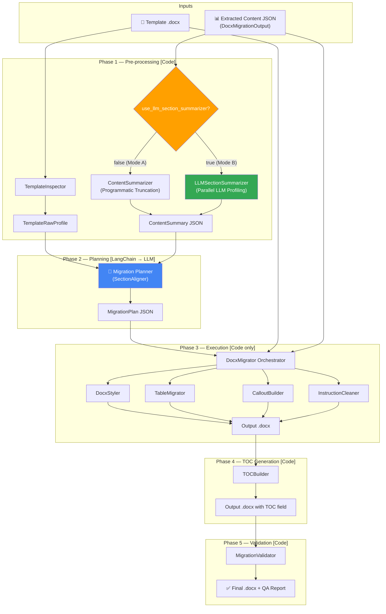

# SOP Content Migration Engine — Final Comprehensive Implementation Plan

> [!IMPORTANT]
> This is the **single authoritative reference** for all migration engine development. It consolidates every previously discussed design decision, schema, component, and example into one document.

---

## Table of Contents

1. [Goal & Key Decisions](#1-goal--key-decisions)
2. [Architecture Overview](#2-architecture-overview)
3. [LangChain Integration & Rate Limiting](#3-langchain-integration--rate-limiting)
4. [Configuration](#4-configuration)
5. [Phase 1 — Pre-processing](#5-phase-1--pre-processing-code)
6. [Phase 2 — LLM Migration Planning](#6-phase-2--llm-migration-planning)
7. [Phase 3 — Programmatic Execution](#7-phase-3--programmatic-docx-execution)
8. [Phase 4 — Table of Contents / Index](#8-phase-4--table-of-contents--index-generation)
9. [Phase 5 — Validation & QA](#9-phase-5--validation--qa-report)
10. [API Endpoints](#10-api-endpoints)
11. [Complete Pydantic Schemas](#11-complete-pydantic-schemas)
12. [LLM Prompt Templates](#12-llm-prompt-templates)
13. [File-by-File Specification](#13-file-by-file-specification)
14. [Concrete Placement Examples](#14-concrete-element-placement-examples)
15. [Development Roadmap](#15-development-roadmap)
16. [Verification Plan](#16-verification-plan)

---

## 1. Goal & Key Decisions

### 1.1 Goal

Take the structured JSON output of our extraction pipeline ([`DocxMigrationOutput`](file:///c:/Users/Bhavya/Desktop/Content%20Extraction/app/schemas/migration.py)) + any target `.docx` template → produce a correctly formatted `.docx` with all content (paragraphs, tables, images, icons, callout boxes, lists) in the right sections, with a functional auto-updating Table of Contents.

### 1.2 Decisions

| Decision | Choice | Rationale |
|---|---|---|
| **LLM Framework** | **LangChain** | `init_chat_model()` handles Gemini / OpenAI / Anthropic via config — zero code changes to switch providers |
| **Content Summarization** | **Dual-mode** (toggle via env var) | **Mode A**: Fast programmatic truncation (120-char previews, no LLM). **Mode B**: LLM semantic profiling (parallel per-section LLM calls for deep understanding) |
| **First Page / Preamble** | **Skip** | Template cover page placeholders (`${vault:...}`) are preserved as-is. Preamble section excluded from content sent to LLM. |
| **Unmatched Sections** | **Always migrated** | If extracted content has a section not present in the template, it's appended at a contextually logical position — no content is ever dropped |
| **Rate Limiting** | **`asyncio.Semaphore` + exponential backoff** | Prevents hitting provider rate limits during parallel section summarization |
| **TOC / Index** | **Word native `TOC` field** + enforced heading styles | Auto-updates when document is opened in Word; no manual TOC construction |
| **Architecture** | Class-based (ABCs, Pydantic, constructor injection) | Follows existing project patterns from [SOP_Migration_Development_Plan.md](file:///c:/Users/Bhavya/Desktop/Content%20Extraction/SOP_Migration_Development_Plan.md) |

---

## 2. Architecture Overview



---

## 3. LangChain Integration & Rate Limiting

### 3.1 Module Structure

```
app/services/llm/
├── __init__.py
├── chain_factory.py              # LangChain model initialization
├── rate_limiter.py               # Async semaphore + exponential backoff
└── prompts/
    ├── __init__.py
    ├── migration_planner.py      # System prompt for Phase 2 global planner
    └── section_summarizer.py     # System prompt for Mode B section profiling
```

### 3.2 `ChainFactory`

#### [NEW] `app/services/llm/chain_factory.py`

```python
"""LangChain model factory — single initialization point."""

from langchain.chat_models import init_chat_model
from app.config.settings import Settings


class ChainFactory:
    """Creates configured LangChain chat models from application settings.

    Provider switching is handled entirely by the model string:
      - "gemini/gemini-2.5-flash"          → Google Gemini
      - "openai/gpt-4o"                    → OpenAI
      - "anthropic/claude-sonnet-4-20250514"        → Anthropic

    API keys are read from environment variables by LangChain natively:
      - GOOGLE_API_KEY, OPENAI_API_KEY, ANTHROPIC_API_KEY
    """

    def __init__(self, settings: Settings):
        self.settings = settings

    def create_planner_model(self):
        """ChatModel for the global migration planner (Phase 2)."""
        return init_chat_model(
            model=self.settings.llm_planner_model,
            temperature=self.settings.llm_temperature,
            max_tokens=self.settings.llm_planner_max_tokens,
        )

    def create_summarizer_model(self):
        """ChatModel for the per-section semantic summarizer (Mode B)."""
        return init_chat_model(
            model=self.settings.llm_summarizer_model,
            temperature=self.settings.llm_temperature,
            max_tokens=self.settings.llm_summarizer_max_tokens,
        )

    def create_structured_planner(self, output_schema):
        """Planner with structured JSON output bound to a Pydantic schema."""
        return self.create_planner_model().with_structured_output(output_schema)

    def create_structured_summarizer(self, output_schema):
        """Summarizer with structured JSON output bound to a Pydantic schema."""
        return self.create_summarizer_model().with_structured_output(output_schema)
```

### 3.3 Rate Limiter — Preventing LLM Rate Limit Errors

#### [NEW] `app/services/llm/rate_limiter.py`

This is critical for Mode B (parallel section summarization). Providers like Gemini (15 RPM free tier), OpenAI (500 RPM tier-1), and Anthropic (50 RPM tier-1) have different limits.

```python
"""Async rate limiter for LLM API calls."""

import asyncio
import time
import random
from loguru import logger


class LLMRateLimiter:
    """Controls concurrent LLM request volume with semaphore + backoff.

    Constructor-injected via Settings:
      - max_concurrent: Maximum simultaneous LLM API calls
      - min_delay_seconds: Minimum pause between consecutive calls
      - max_retries: Retry count on rate-limit (429) or transient errors
      - base_backoff_seconds: Initial backoff wait (doubles each retry)
    """

    def __init__(
        self,
        max_concurrent: int = 3,
        min_delay_seconds: float = 0.5,
        max_retries: int = 5,
        base_backoff_seconds: float = 2.0,
    ):
        self._semaphore = asyncio.Semaphore(max_concurrent)
        self._min_delay = min_delay_seconds
        self._max_retries = max_retries
        self._base_backoff = base_backoff_seconds
        self._last_call_time = 0.0
        self._lock = asyncio.Lock()

    async def execute(self, coro_factory, task_name: str = ""):
        """Execute a coroutine with rate limiting and retry logic.

        Args:
            coro_factory: A zero-argument callable that returns a new coroutine
                          each time it is called (needed for retries).
            task_name: Label for logging.

        Returns:
            The result of the coroutine.

        Raises:
            After max_retries exhausted, re-raises the last exception.
        """
        last_error = None

        for attempt in range(1, self._max_retries + 1):
            async with self._semaphore:
                # Enforce minimum delay between calls globally
                async with self._lock:
                    now = time.monotonic()
                    elapsed = now - self._last_call_time
                    if elapsed < self._min_delay:
                        await asyncio.sleep(self._min_delay - elapsed)
                    self._last_call_time = time.monotonic()

                try:
                    result = await coro_factory()
                    return result

                except Exception as exc:
                    last_error = exc
                    exc_str = str(exc).lower()
                    is_rate_limit = (
                        "429" in exc_str
                        or "rate" in exc_str
                        or "quota" in exc_str
                        or "resource_exhausted" in exc_str
                    )

                    if is_rate_limit and attempt < self._max_retries:
                        backoff = self._base_backoff * (2 ** (attempt - 1))
                        jitter = random.uniform(0, backoff * 0.25)
                        wait = backoff + jitter
                        logger.warning(
                            f"[{task_name}] Rate limited (attempt {attempt}/{self._max_retries}), "
                            f"retrying in {wait:.1f}s: {exc}"
                        )
                        await asyncio.sleep(wait)
                    elif attempt < self._max_retries:
                        # Transient error — shorter backoff
                        wait = self._base_backoff * attempt
                        logger.warning(
                            f"[{task_name}] Error (attempt {attempt}/{self._max_retries}), "
                            f"retrying in {wait:.1f}s: {exc}"
                        )
                        await asyncio.sleep(wait)
                    else:
                        logger.error(
                            f"[{task_name}] All {self._max_retries} attempts exhausted: {exc}"
                        )

        raise last_error
```

**Usage in parallel section summarization** (Mode B):

```python
# In LLMSectionSummarizer
rate_limiter = LLMRateLimiter(
    max_concurrent=settings.llm_max_concurrent,       # e.g., 3
    min_delay_seconds=settings.llm_min_delay_seconds,  # e.g., 0.5
    max_retries=settings.llm_max_retries,              # e.g., 5
    base_backoff_seconds=settings.llm_base_backoff,    # e.g., 2.0
)

tasks = []
for section in sections:
    tasks.append(
        rate_limiter.execute(
            coro_factory=lambda s=section: model.ainvoke([system_msg, make_human_msg(s)]),
            task_name=f"summarize:{section.title}",
        )
    )
profiles = await asyncio.gather(*tasks, return_exceptions=True)
```

With `max_concurrent=3` and `min_delay=0.5s`, a 10-section document dispatches at most 3 simultaneous LLM calls, with a 500ms global cooldown. If a 429 hits, it backs off starting at 2s, then 4s, 8s, 16s, up to 5 retries.

---

## 4. Configuration

#### [MODIFY] [settings.py](file:///c:/Users/Bhavya/Desktop/Content%20Extraction/app/config/settings.py)

Add the following settings to the existing `Settings` class (lines 44–51, before `model_config`):

```python
    # ─── Migration ─────────────────────────────────────────────────────
    migration_output_dir: Path = Path("data/migrated")
    migration_template_dir: Path = Path("data/templates")
    skip_preamble_migration: bool = True       # Don't touch cover page / Section 0

    # ─── LLM (LangChain) ──────────────────────────────────────────────
    # Content summarization mode:
    #   false = Mode A (fast programmatic truncation, zero LLM calls)
    #   true  = Mode B (parallel LLM semantic profiling per section)
    use_llm_section_summarizer: bool = False

    # Model strings (LangChain format: "provider/model-name")
    llm_planner_model: str = "gemini/gemini-2.5-flash"
    llm_summarizer_model: str = "gemini/gemini-2.5-flash"
    llm_temperature: float = 0.1

    # Token limits
    llm_planner_max_tokens: int = 16384        # Migration plans can be large
    llm_summarizer_max_tokens: int = 4096      # Per-section summaries are compact

    # Rate limiting (protects against 429s during parallel summarization)
    llm_max_concurrent: int = 3                # Max simultaneous LLM API calls
    llm_min_delay_seconds: float = 0.5         # Min gap between consecutive calls
    llm_max_retries: int = 5                   # Retry count on rate-limit/transient errors
    llm_base_backoff_seconds: float = 2.0      # Initial exponential backoff wait
```

Also add `migration_output_dir` and `migration_template_dir` to `resolve_paths()` and `ensure_directories()`.

#### `.env` Example

```ini
# ── LLM Provider (set ONE of these) ──────────────────────
GOOGLE_API_KEY=AIza...
# OPENAI_API_KEY=sk-...
# ANTHROPIC_API_KEY=sk-ant-...

# ── Migration Settings ────────────────────────────────────
SOP_USE_LLM_SECTION_SUMMARIZER=false
SOP_LLM_PLANNER_MODEL=gemini/gemini-2.5-flash
SOP_LLM_SUMMARIZER_MODEL=gemini/gemini-2.5-flash
SOP_LLM_MAX_CONCURRENT=3
SOP_LLM_MIN_DELAY_SECONDS=0.5
SOP_LLM_MAX_RETRIES=5
SOP_LLM_BASE_BACKOFF_SECONDS=2.0
```

#### [MODIFY] [requirements.txt](file:///c:/Users/Bhavya/Desktop/Content%20Extraction/requirements.txt)

Append after line 46:

```
# --- LLM (LangChain — Migration Engine) ---
langchain>=0.3.0
langchain-google-genai>=2.0.0
langchain-openai>=0.3.0
langchain-anthropic>=0.3.0
```

---

## 5. Phase 1 — Pre-processing [Code]

### 5.1 `TemplateInspector`

#### [NEW] `app/services/migration/template_inspector.py`

Parses the target `.docx` template into a machine-readable `TemplateRawProfile`. **No LLM** — purely `python-docx` iteration.

**Schemas** (in `app/services/migration/schemas.py`):

```python
class TemplateParagraphInfo(BaseModel):
    """One paragraph from the template document."""
    index: int                        # Position in document body (0-based)
    text: str                         # Full text content
    style_name: str                   # "Heading 1", "Normal", "List Bullet", etc.
    is_blue_instruction: bool         # True if any run has blue font color
    is_bold: bool
    heading_level: int | None = None  # 1, 2, 3 or None for non-headings
    font_color_hex: str | None = None


class TemplateTableInfo(BaseModel):
    """One table from the template document."""
    index: int                        # Table position in document
    num_rows: int
    num_cols: int
    preceding_heading: str | None = None  # Nearest heading above this table
    header_row_text: list[str] = []       # First row cell texts
    has_placeholder_text: bool = False     # Contains ${...}, [Insert ...], <<...>>
    sample_cells: list[str] = []          # Representative cell texts (first 10)


class TemplateRawProfile(BaseModel):
    """Complete machine-readable snapshot of a .docx template."""
    filename: str
    total_paragraphs: int
    total_tables: int
    paragraphs: list[TemplateParagraphInfo]
    tables: list[TemplateTableInfo]
    header_text: str = ""
    footer_text: str = ""
```

**Implementation details**:
- Iterates `doc.paragraphs` — captures `text`, `style.name`, checks `run.font.color.rgb` against known blue values (`0000FF`, `0070C0`, `4472C4`, `2E74B5`, `5B9BD5`)
- Falls back to parsing OXML `w:color` attribute when `python-docx` color API returns `None` (inherited styles)
- Iterates `doc.tables` — captures dimensions, header row, placeholder patterns (`${vault:...}`, `[Insert ...]`, `<<...>>`)
- Extracts header/footer text from `doc.sections[0].header` / `doc.sections[0].footer`
- Locates the nearest `Heading *` paragraph preceding each table to establish `preceding_heading`

### 5.2 Content Summarization — Dual Mode

The summarizer interface is unified. Both modes produce the same output type so the Migration Planner doesn't care which mode was used.

#### 5.2.1 Mode A — Programmatic Truncation (Default)

#### [NEW] `app/services/migration/content_summarizer.py`

Fast, deterministic, zero LLM calls. Iterates the `DocxMigrationOutput` JSON and builds truncated previews:

```python
class ContentElementSummary(BaseModel):
    """Summary of one extracted element."""
    index: int                         # Position within section's elements array
    element_type: str                  # "heading", "paragraph", "table", "image", "list"
    text_preview: str = ""             # First 120 chars (Mode A) or full semantic summary (Mode B)
    level: int | None = None           # Heading level
    num_rows: int | None = None
    num_cols: int | None = None
    has_icons: bool = False
    icon_count: int = 0
    has_icon_in_cells: bool = False
    image_path_basename: str | None = None   # Filename only, not full path
    list_items_count: int | None = None
    page: int = 0
    # Mode B enrichments (populated only when use_llm_section_summarizer=true):
    semantic_role: str | None = None          # "policy_statement", "callout_box", "flowchart", etc.
    callout_candidate_type: str | None = None # "executive_summary", "explanation", etc.


class ContentSectionSummary(BaseModel):
    """Summary of one extracted section."""
    section_number: str | None = None
    title: str
    page_start: int
    page_end: int
    total_elements: int
    element_type_counts: dict[str, int] = {}
    elements: list[ContentElementSummary] = []
    # Mode B enrichments:
    semantic_purpose: str | None = None       # 2-sentence section purpose summary
    taxonomy_category: str | None = None      # "Purpose", "Scope", "Process", etc.
    key_topics: list[str] | None = None       # Domain keywords


class ContentSummary(BaseModel):
    """Unified output format for both Mode A and Mode B summarizers."""
    document_id: str
    document_type: str | None = None
    total_sections: int
    summarizer_mode: str = "programmatic"   # "programmatic" or "llm_semantic"
    sections: list[ContentSectionSummary]


class ContentSummarizer:
    """Mode A — Programmatic truncation summarizer (no LLM calls)."""

    def summarize(
        self,
        extracted: DocxMigrationOutput,
        skip_preamble: bool = True,
    ) -> ContentSummary:
        sections = []
        for sec in extracted.sections:
            if skip_preamble and sec.title.strip().startswith("0 "):
                continue
            sections.append(self._summarize_section(sec))
        return ContentSummary(
            document_id=extracted.document_id,
            document_type=(extracted.metadata.document_type if extracted.metadata else None),
            total_sections=len(sections),
            summarizer_mode="programmatic",
            sections=sections,
        )

    def _summarize_section(self, sec: MigrationSection) -> ContentSectionSummary:
        elements = []
        type_counts: dict[str, int] = {}
        for i, elem in enumerate(sec.elements):
            et = elem.element_type
            type_counts[et] = type_counts.get(et, 0) + 1
            elements.append(ContentElementSummary(
                index=i,
                element_type=et,
                text_preview=(elem.text or "")[:120],
                level=elem.level,
                num_rows=elem.num_rows,
                num_cols=elem.num_cols,
                has_icons=len(elem.icons) > 0,
                icon_count=len(elem.icons),
                has_icon_in_cells=any(c.icon_path for c in elem.cells),
                image_path_basename=(Path(elem.image_path).name if elem.image_path else None),
                list_items_count=(len(elem.items) if elem.items else None),
                page=elem.page,
            ))
        return ContentSectionSummary(
            section_number=sec.section_number,
            title=sec.title,
            page_start=sec.page_start,
            page_end=sec.page_end,
            total_elements=len(sec.elements),
            element_type_counts=type_counts,
            elements=elements,
        )
```

#### 5.2.2 Mode B — LLM Semantic Section Profiling

#### [NEW] `app/services/migration/llm_section_summarizer.py`

Runs a **parallel LLM call per section** (throttled by `LLMRateLimiter`) to generate deep semantic profiles. Enriches the same `ContentSummary` schema with `semantic_purpose`, `taxonomy_category`, `key_topics`, and per-element `semantic_role` / `callout_candidate_type`.

```python
class LLMSectionProfile(BaseModel):
    """Structured output schema for the per-section LLM summarizer."""
    semantic_purpose: str              # 2-3 sentence description of section's intent
    taxonomy_category: str             # Standard SOP taxonomy
    key_topics: list[str]              # Domain keywords for fuzzy matching
    element_descriptors: list[LLMElementDescriptor]


class LLMElementDescriptor(BaseModel):
    """Per-element semantic annotation from the section summarizer LLM."""
    element_index: int
    semantic_role: str                 # "policy_statement", "callout_box", "flowchart_figure",
                                       # "raci_matrix", "instruction_step", "glossary_entry",
                                       # "general_paragraph", "section_heading", "data_table"
    summary: str                       # 1-sentence synopsis
    callout_candidate_type: str | None = None   # Only for callout candidates


class LLMSectionSummarizer:
    """Mode B — Parallel LLM semantic section profiler."""

    def __init__(self, chain_factory: ChainFactory, rate_limiter: LLMRateLimiter):
        self._chain_factory = chain_factory
        self._rate_limiter = rate_limiter

    async def summarize(
        self,
        extracted: DocxMigrationOutput,
        skip_preamble: bool = True,
    ) -> ContentSummary:
        model = self._chain_factory.create_structured_summarizer(LLMSectionProfile)

        # Build tasks for all sections (except preamble)
        section_tasks = []
        source_sections = []
        for sec in extracted.sections:
            if skip_preamble and sec.title.strip().startswith("0 "):
                continue
            source_sections.append(sec)
            section_tasks.append(
                self._rate_limiter.execute(
                    coro_factory=lambda s=sec: self._invoke_summarizer(model, s),
                    task_name=f"summarize:{sec.title[:30]}",
                )
            )

        # Execute all section summarizations in parallel (rate-limited)
        profiles: list[LLMSectionProfile | Exception] = await asyncio.gather(
            *section_tasks, return_exceptions=True
        )

        # Merge LLM profiles into ContentSectionSummary format
        merged_sections = []
        for sec, profile in zip(source_sections, profiles):
            base = ContentSummarizer()._summarize_section(sec)  # get Mode A base
            if isinstance(profile, Exception):
                logger.warning(f"LLM summarization failed for '{sec.title}': {profile}")
                # Fall back to Mode A for this section
            else:
                # Enrich with Mode B semantic data
                base.semantic_purpose = profile.semantic_purpose
                base.taxonomy_category = profile.taxonomy_category
                base.key_topics = profile.key_topics
                for desc in profile.element_descriptors:
                    if desc.element_index < len(base.elements):
                        base.elements[desc.element_index].semantic_role = desc.semantic_role
                        base.elements[desc.element_index].callout_candidate_type = desc.callout_candidate_type
            merged_sections.append(base)

        return ContentSummary(
            document_id=extracted.document_id,
            document_type=(extracted.metadata.document_type if extracted.metadata else None),
            total_sections=len(merged_sections),
            summarizer_mode="llm_semantic",
            sections=merged_sections,
        )

    async def _invoke_summarizer(self, model, section: MigrationSection) -> LLMSectionProfile:
        from langchain_core.messages import SystemMessage, HumanMessage
        from app.services.llm.prompts.section_summarizer import SECTION_SUMMARIZER_SYSTEM_PROMPT

        system_msg = SystemMessage(content=SECTION_SUMMARIZER_SYSTEM_PROMPT)
        # Send the full section JSON (all elements, full text) to the summarizer
        human_msg = HumanMessage(content=section.model_dump_json(indent=2))
        return await model.ainvoke([system_msg, human_msg])
```

**Key: Per-section graceful fallback** — if any single section's LLM call fails after all retries, that section silently falls back to Mode A's truncated summary. The pipeline never crashes.

### 5.3 Summarizer Orchestration

The `DocxMigrator` instantiates the right summarizer based on config:

```python
# In DocxMigrator.__init__
if settings.use_llm_section_summarizer:
    rate_limiter = LLMRateLimiter(
        max_concurrent=settings.llm_max_concurrent,
        min_delay_seconds=settings.llm_min_delay_seconds,
        max_retries=settings.llm_max_retries,
        base_backoff_seconds=settings.llm_base_backoff_seconds,
    )
    self.summarizer = LLMSectionSummarizer(chain_factory, rate_limiter)
else:
    self.summarizer = ContentSummarizer()
```

Both have the same interface: `.summarize(extracted, skip_preamble) -> ContentSummary`.

---

## 6. Phase 2 — LLM Migration Planning

### 6.1 `SectionAligner`

#### [NEW] `app/services/migration/section_aligner.py`

Takes `TemplateRawProfile` + `ContentSummary` (from either mode) and makes a single LLM call to produce the `MigrationPlan`.

```python
class SectionAligner:
    """Orchestrates the LLM planning call — produces MigrationPlan."""

    def __init__(self, chain_factory: ChainFactory, rate_limiter: LLMRateLimiter):
        self._chain_factory = chain_factory
        self._rate_limiter = rate_limiter

    async def create_migration_plan(
        self,
        template_profile: TemplateRawProfile,
        content_summary: ContentSummary,
    ) -> MigrationPlan:
        structured_llm = self._chain_factory.create_structured_planner(MigrationPlan)

        from langchain_core.messages import SystemMessage, HumanMessage
        from app.services.llm.prompts.migration_planner import PLANNER_SYSTEM_PROMPT

        system_msg = SystemMessage(content=PLANNER_SYSTEM_PROMPT)
        human_msg = HumanMessage(content=(
            f"TEMPLATE_PROFILE:\n{template_profile.model_dump_json(indent=2)}\n\n"
            f"CONTENT_SUMMARY:\n{content_summary.model_dump_json(indent=2)}"
        ))

        plan: MigrationPlan = await self._rate_limiter.execute(
            coro_factory=lambda: structured_llm.ainvoke([system_msg, human_msg]),
            task_name="migration_planner",
        )

        return plan
```

### 6.2 `MigrationPlan` Schema (LLM Structured Output)

The LLM returns this exact Pydantic model:

```python
class ElementPlacement(BaseModel):
    """Exact instruction for placing one extracted element in the output .docx."""
    source_section_title: str         # "6 PRINCIPLES FOR DOCUMENT WRITING"
    source_element_index: int         # Index within section's elements array
    source_element_type: str          # "heading", "paragraph", "table", "image", "list"
    target_section_heading: str       # Template section this element goes into
    placement_order: int              # Ordering within target section (0, 1, 2, ...)
    action: str                       # One of:
    #   "insert_heading"       → Native Word heading
    #   "insert_paragraph"     → Normal paragraph with font styling
    #   "insert_list"          → Bulleted or numbered list
    #   "insert_table"         → Build new Word table
    #   "insert_image"         → Embed image file
    #   "insert_callout"       → Styled callout box (single-cell table with shading)
    #   "populate_placeholder" → Fill existing template placeholder table
    #   "skip"                 → Do not include this element

    heading_level: int | None = None
    heading_style: str | None = None              # "Heading 1", "Heading 2", "Heading 3"
    callout_type: str | None = None               # "executive_summary", "explanation", "attention", "key_takeaway"
    callout_background_hex: str | None = None
    callout_border_hex: str | None = None
    target_table_index: int | None = None         # For populate_placeholder
    embed_icons_inline: bool = False
    notes: str = ""


class SectionPlan(BaseModel):
    """Migration instructions for one output section in the .docx."""
    template_section_heading: str
    template_heading_level: int = 1
    template_paragraph_indices_to_delete: list[int] = []
    source_sections_mapped: list[str] = []
    elements: list[ElementPlacement] = []

    has_source_content: bool = True
    fallback_action: str | None = None     # "insert_none", "insert_na", "delete_section"
    fallback_text: str | None = None

    is_unmapped_source: bool = False        # True if this section came from source but has
                                            # no template match — will be inserted at a
                                            # contextual position
    insertion_after_section: str | None = None  # Which template section to insert after


class PlaceholderTablePlan(BaseModel):
    """Instructions for populating or deleting a template placeholder table."""
    table_index: int
    table_purpose: str
    parent_section_heading: str
    action: str                            # "populate" | "delete"
    source_section_title: str | None = None
    source_element_index: int | None = None
    column_mapping: dict[str, str] | None = None
    sort_alphabetically: bool = False
    population_notes: str = ""


class CalloutStyleDef(BaseModel):
    """Dynamic callout style discovered from the template."""
    callout_type: str
    display_name: str
    background_color_hex: str
    left_border_color_hex: str
    icon_description: str | None = None


class MigrationPlan(BaseModel):
    """Complete element-level migration blueprint produced by the LLM."""
    template_name: str
    document_type_detected: str | None = None

    # Typography (discovered from template)
    font_family: str = "Arial"
    font_size_body_pt: float = 10.0
    font_size_heading1_pt: float = 14.0
    font_size_heading2_pt: float = 12.0
    font_size_heading3_pt: float = 11.0

    # Global rules
    preserve_headers_footers: bool = True
    toc_auto_generated: bool = True
    skip_cover_page: bool = True

    # Section-by-section plan (includes both mapped and unmapped-source sections)
    section_plans: list[SectionPlan]
    placeholder_tables: list[PlaceholderTablePlan] = []
    tables_to_delete: list[int] = []
    callout_styles: list[CalloutStyleDef] = []

    # Quality signals
    overall_confidence: float = 0.0
    warnings: list[str] = []
    reasoning_summary: str = ""
```

---

## 7. Phase 3 — Programmatic DOCX Execution

> [!NOTE]
> Phase 3 uses **zero LLM calls**. All operations are deterministic `python-docx` + OXML.

### 7.1 Module Structure

```
app/services/migration/
├── __init__.py                    # Exports DocxMigrator
├── schemas.py                     # ALL Pydantic models (see §11)
├── template_inspector.py          # .docx → TemplateRawProfile
├── content_summarizer.py          # Mode A: Programmatic truncation
├── llm_section_summarizer.py      # Mode B: Parallel LLM profiling
├── section_aligner.py             # LangChain → MigrationPlan
├── docx_migrator.py               # Main orchestrator
├── docx_styler.py                 # Fonts, spacing, images, OXML
├── table_migrator.py              # Build & populate tables
├── callout_builder.py             # Styled callout boxes
├── toc_builder.py                 # Table of Contents field insertion
├── instruction_cleaner.py         # Blue text & scaffolding removal
└── migration_validator.py         # QA report generation
```

### 7.2 `DocxMigrator` — Main Orchestrator

#### [NEW] `app/services/migration/docx_migrator.py`

```python
class MigrationResult(BaseModel):
    """Result envelope returned by DocxMigrator.migrate()."""
    output_path: str
    plan: MigrationPlan
    qa_report: MigrationQAReport


class DocxMigrator:
    """Orchestrates the full 5-phase migration pipeline."""

    def __init__(self, settings: Settings, chain_factory: ChainFactory):
        self.settings = settings
        self.inspector = TemplateInspector()
        self.toc_builder = TOCBuilder()

        # Summarizer: Mode A or Mode B based on settings
        rate_limiter = LLMRateLimiter(
            max_concurrent=settings.llm_max_concurrent,
            min_delay_seconds=settings.llm_min_delay_seconds,
            max_retries=settings.llm_max_retries,
            base_backoff_seconds=settings.llm_base_backoff_seconds,
        )
        if settings.use_llm_section_summarizer:
            self.summarizer = LLMSectionSummarizer(chain_factory, rate_limiter)
        else:
            self.summarizer = ContentSummarizer()

        self.aligner = SectionAligner(chain_factory, rate_limiter)
        self.styler = DocxStyler()
        self.table_migrator = TableMigrator()
        self.callout_builder = CalloutBuilder()
        self.cleaner = InstructionCleaner()
        self.validator = MigrationValidator()

    async def migrate(
        self,
        extracted: DocxMigrationOutput,
        template_path: Path,
        output_path: Path,
    ) -> MigrationResult:

        # ── Phase 1: Pre-process ─────────────────────────────────
        logger.info(f"Phase 1: Inspecting template '{template_path.name}'")
        template_profile = self.inspector.inspect(template_path)

        logger.info(f"Phase 1: Summarizing content (mode={self.settings.use_llm_section_summarizer})")
        content_summary = await self.summarizer.summarize(
            extracted, skip_preamble=self.settings.skip_preamble_migration,
        )

        # ── Phase 2: LLM creates the plan ────────────────────────
        logger.info("Phase 2: Creating migration plan via LLM")
        plan = await self.aligner.create_migration_plan(template_profile, content_summary)
        logger.info(f"Phase 2: Plan created — {len(plan.section_plans)} sections, "
                     f"confidence={plan.overall_confidence:.2f}, warnings={len(plan.warnings)}")

        # ── Phase 3: Execute plan ────────────────────────────────
        logger.info("Phase 3: Building output .docx")
        doc = Document(str(template_path))

        # 3a. Process each section plan (mapped sections first, then unmapped)
        mapped = [sp for sp in plan.section_plans if not sp.is_unmapped_source]
        unmapped = [sp for sp in plan.section_plans if sp.is_unmapped_source]

        for section_plan in mapped:
            self._execute_section_plan(doc, section_plan, extracted, plan)

        for section_plan in unmapped:
            self._insert_unmapped_section(doc, section_plan, extracted, plan)

        # 3b. Populate placeholder tables
        for table_plan in plan.placeholder_tables:
            if table_plan.action == "populate":
                self.table_migrator.populate(doc, table_plan, extracted)

        # 3c. Delete unused template tables (reverse order to preserve indices)
        all_delete_indices = set(plan.tables_to_delete)
        for tp in plan.placeholder_tables:
            if tp.action == "delete":
                all_delete_indices.add(tp.table_index)
        for idx in sorted(all_delete_indices, reverse=True):
            self.table_migrator.delete_table(doc, idx)

        # 3d. Clean up blue instructions + unused scaffolding
        self.cleaner.clean(doc, plan)

        # ── Phase 4: Insert TOC ──────────────────────────────────
        logger.info("Phase 4: Inserting Table of Contents")
        self.toc_builder.insert_toc(doc, plan)

        # 3e. Save
        doc.save(str(output_path))
        logger.info(f"Phase 3-4: Saved to '{output_path}'")

        # ── Phase 5: Validate ────────────────────────────────────
        logger.info("Phase 5: Validating output")
        qa_report = self.validator.validate(output_path, extracted, plan)
        logger.info(f"Phase 5: QA status={qa_report.status}")

        return MigrationResult(output_path=str(output_path), plan=plan, qa_report=qa_report)

    def _execute_section_plan(self, doc, section_plan, extracted, plan):
        """Execute one SectionPlan — replace template section content."""
        if not section_plan.has_source_content:
            if section_plan.fallback_action == "insert_none":
                self._insert_fallback_after_heading(doc, section_plan.template_section_heading, "(None)")
            elif section_plan.fallback_action == "insert_na":
                self._insert_fallback_after_heading(doc, section_plan.template_section_heading, "N/A")
            return

        for placement in sorted(section_plan.elements, key=lambda e: e.placement_order):
            self._execute_element(doc, placement, extracted, plan)

    def _insert_unmapped_section(self, doc, section_plan, extracted, plan):
        """Insert a source section that has no template counterpart."""
        # Find the insertion point: after the section specified in insertion_after_section
        # Then insert heading + all elements
        self.styler.insert_heading(
            doc,
            section_plan.template_section_heading,
            section_plan.template_heading_level,
            style_name=f"Heading {section_plan.template_heading_level}",
            font_family=plan.font_family,
            font_size_pt=getattr(plan, f"font_size_heading{section_plan.template_heading_level}_pt", 14.0),
        )
        for placement in sorted(section_plan.elements, key=lambda e: e.placement_order):
            self._execute_element(doc, placement, extracted, plan)

    def _execute_element(self, doc, placement, extracted, plan):
        """Insert one element into the document based on its action."""
        source_element = self._find_source_element(extracted, placement)
        if source_element is None and placement.action != "skip":
            logger.warning(f"Source element not found: {placement.source_section_title}[{placement.source_element_index}]")
            return

        match placement.action:
            case "insert_heading":
                self.styler.insert_heading(
                    doc, source_element.text,
                    placement.heading_level or source_element.level or 1,
                    style_name=placement.heading_style,
                    font_family=plan.font_family,
                    font_size_pt=self._heading_size(plan, placement.heading_level),
                )

            case "insert_paragraph":
                para = self.styler.insert_paragraph(
                    doc, source_element.text,
                    font_family=plan.font_family,
                    font_size_pt=plan.font_size_body_pt,
                )
                if placement.embed_icons_inline and source_element.icons:
                    for icon_ref in source_element.icons:
                        self.styler.embed_inline_icon(para, icon_ref.path)

            case "insert_list":
                self.styler.insert_list(
                    doc, source_element.items,
                    font_family=plan.font_family,
                    font_size_pt=plan.font_size_body_pt,
                )

            case "insert_table":
                self.table_migrator.insert_table(
                    doc, source_element, font_family=plan.font_family,
                )

            case "insert_image":
                self.styler.insert_image(
                    doc, source_element.image_path,
                    caption=source_element.title,
                )

            case "insert_callout":
                style = self._find_callout_style(plan, placement.callout_type)
                self.callout_builder.build(
                    doc, source_element, style,
                    font_family=plan.font_family,
                )

            case "populate_placeholder" | "skip":
                pass

    def _find_source_element(self, extracted, placement):
        """Look up the actual source element from extracted JSON."""
        for sec in extracted.sections:
            if sec.title == placement.source_section_title:
                if placement.source_element_index < len(sec.elements):
                    return sec.elements[placement.source_element_index]
        return None
```

### 7.3 `DocxStyler`

#### [NEW] `app/services/migration/docx_styler.py`

Typography, paragraph insertion, image embedding, inline icons. All values driven by `MigrationPlan`.

```python
class DocxStyler:
    """Low-level python-docx / OXML element insertion and styling."""

    def insert_heading(self, doc, text, level, style_name=None,
                       font_family="Arial", font_size_pt=14.0):
        heading = doc.add_heading(text, level=level)
        if style_name and style_name in [s.name for s in doc.styles]:
            heading.style = doc.styles[style_name]
        for run in heading.runs:
            run.font.name = font_family
            run.font.size = Pt(font_size_pt)
        return heading

    def insert_paragraph(self, doc, text, font_family="Arial", font_size_pt=10.0):
        para = doc.add_paragraph(text)
        for run in para.runs:
            run.font.name = font_family
            run.font.size = Pt(font_size_pt)
        return para

    def insert_list(self, doc, items, font_family="Arial", font_size_pt=10.0,
                    style="List Bullet"):
        for item_text in items:
            para = doc.add_paragraph(item_text, style=style)
            for run in para.runs:
                run.font.name = font_family
                run.font.size = Pt(font_size_pt)

    def embed_inline_icon(self, paragraph, icon_path, size_pt=14):
        """Embed a small icon image inline within a paragraph."""
        run = paragraph.add_run()
        run.add_picture(str(icon_path), width=Pt(size_pt), height=Pt(size_pt))

    def insert_image(self, doc, image_path, caption=None, max_width_inches=5.5):
        para = doc.add_paragraph()
        para.alignment = WD_ALIGN_PARAGRAPH.CENTER
        run = para.add_run()
        run.add_picture(str(image_path), width=Inches(max_width_inches))
        if caption:
            cap = doc.add_paragraph(caption)
            cap.alignment = WD_ALIGN_PARAGRAPH.CENTER
            for r in cap.runs:
                r.italic = True
```

### 7.4 `CalloutBuilder`

#### [NEW] `app/services/migration/callout_builder.py`

Colors from `MigrationPlan.callout_styles` — never hardcoded:

```python
class CalloutBuilder:
    def build(self, doc, source_element, style: CalloutStyleDef, font_family="Arial"):
        table = doc.add_table(rows=1, cols=1)
        cell = table.cell(0, 0)
        self._set_cell_shading(cell, style.background_color_hex)
        self._set_left_border(cell, style.left_border_color_hex, width_pt=3)
        text = self._extract_text(source_element)
        para = cell.paragraphs[0]
        para.text = text
        for run in para.runs:
            run.font.name = font_family

    def _set_cell_shading(self, cell, hex_color):
        from docx.oxml.ns import qn
        from docx.oxml import OxmlElement
        shading = OxmlElement("w:shd")
        shading.set(qn("w:fill"), hex_color.lstrip("#"))
        shading.set(qn("w:val"), "clear")
        cell._tc.get_or_add_tcPr().append(shading)

    def _set_left_border(self, cell, hex_color, width_pt=3):
        from docx.oxml.ns import qn
        from docx.oxml import OxmlElement
        tc_pr = cell._tc.get_or_add_tcPr()
        borders = OxmlElement("w:tcBorders")
        left = OxmlElement("w:left")
        left.set(qn("w:val"), "single")
        left.set(qn("w:sz"), str(width_pt * 8))  # OXML uses eighth-points
        left.set(qn("w:color"), hex_color.lstrip("#"))
        borders.append(left)
        # Set other borders to nil
        for side in ["top", "right", "bottom"]:
            el = OxmlElement(f"w:{side}")
            el.set(qn("w:val"), "nil")
            borders.append(el)
        tc_pr.append(borders)
```

### 7.5 `TableMigrator`

#### [NEW] `app/services/migration/table_migrator.py`

```python
class TableMigrator:
    def insert_table(self, doc, source_element: MigrationElement, font_family="Arial"):
        """Build a new Word table from extracted table data."""
        table = doc.add_table(rows=source_element.num_rows, cols=source_element.num_cols)
        table.style = "Table Grid"
        for cell_data in source_element.cells:
            cell = table.cell(cell_data.row_index, cell_data.col_index)
            cell.text = cell_data.text
            if cell_data.row_span > 1 or cell_data.col_span > 1:
                self._apply_merge(table, cell_data)
            if cell_data.icon_path:
                self._embed_icon_in_cell(cell, cell_data.icon_path)
            if cell_data.image_path:
                self._embed_image_in_cell(cell, cell_data.image_path)
            if cell_data.is_header:
                self._style_header_cell(cell, font_family)
            for run in cell.paragraphs[0].runs:
                run.font.name = font_family

    def populate(self, doc, plan: PlaceholderTablePlan, extracted: DocxMigrationOutput):
        """Fill an existing template placeholder table with extracted data."""
        ...

    def delete_table(self, doc, table_index: int):
        """Remove a table from the document by index."""
        if table_index < len(doc.tables):
            tbl = doc.tables[table_index]
            tbl._element.getparent().remove(tbl._element)
```

### 7.6 `InstructionCleaner`

#### [NEW] `app/services/migration/instruction_cleaner.py`

```python
class InstructionCleaner:
    """Removes all template scaffolding: blue instructions, unused sections."""

    BLUE_HEX_VALUES = {"0000FF", "0070C0", "4472C4", "2E74B5", "5B9BD5"}

    def clean(self, doc, plan: MigrationPlan):
        # 1. Collect paragraph indices to delete from all section plans
        indices_to_delete = set()
        for sp in plan.section_plans:
            indices_to_delete.update(sp.template_paragraph_indices_to_delete)

        # 2. Safety net: scan for any remaining blue runs
        for i, para in enumerate(doc.paragraphs):
            if self._has_blue_runs(para):
                indices_to_delete.add(i)

        # 3. Delete in reverse order
        for i in sorted(indices_to_delete, reverse=True):
            if i < len(doc.paragraphs):
                p = doc.paragraphs[i]
                p._element.getparent().remove(p._element)

        # 4. Delete sections marked for deletion
        for sp in plan.section_plans:
            if not sp.has_source_content and sp.fallback_action == "delete_section":
                self._delete_section_by_heading(doc, sp.template_section_heading)

    def _has_blue_runs(self, para) -> bool:
        for run in para.runs:
            color = run.font.color.rgb
            if color and str(color).upper() in self.BLUE_HEX_VALUES:
                return True
            # Fallback: check OXML
            rPr = run._element.find('{http://schemas.openxmlformats.org/wordprocessingml/2006/main}rPr')
            if rPr is not None:
                color_el = rPr.find('{http://schemas.openxmlformats.org/wordprocessingml/2006/main}color')
                if color_el is not None:
                    val = color_el.get('{http://schemas.openxmlformats.org/wordprocessingml/2006/main}val', '').upper()
                    if val in self.BLUE_HEX_VALUES:
                        return True
        return False
```

---

## 8. Phase 4 — Table of Contents / Index Generation

### 8.1 How Word TOC Works

Word's Table of Contents is a **field code** (`TOC \o "1-3"`) that auto-updates when the document is opened or when the user presses `Ctrl+A` → `F9`. It scans all paragraphs with `Heading 1`, `Heading 2`, `Heading 3` styles and builds the index automatically.

**Our responsibility**: Ensure every heading inserted by the migration engine uses a **native Word heading style** (`Heading 1`, `Heading 2`, `Heading 3`), and insert the `TOC` field at the correct position in the document.

### 8.2 `TOCBuilder`

#### [NEW] `app/services/migration/toc_builder.py`

```python
"""Inserts a Word-native Table of Contents field into the migrated document."""

from docx import Document
from docx.oxml.ns import qn
from docx.oxml import OxmlElement
from loguru import logger


class TOCBuilder:
    """Inserts a TOC field that Word auto-populates from heading styles."""

    def insert_toc(self, doc: Document, plan=None):
        """Insert a TOC field after the cover page / preamble section.

        Strategy:
        1. Find the paragraph with heading text "TABLE OF CONTENTS" (or similar)
           in the template. If found, insert the TOC field immediately after it.
        2. If not found, insert a new "TABLE OF CONTENTS" heading after the first
           page break or after the preamble section, then add the TOC field.
        3. The TOC field is an OXML `w:fldSimple` or `w:fldChar` sequence that
           Word reads and expands into the actual table of contents on open.
        """
        toc_heading_idx = self._find_toc_heading(doc)

        if toc_heading_idx is not None:
            # Insert TOC field right after the existing TOC heading
            insert_after = doc.paragraphs[toc_heading_idx]._element
        else:
            # Create a new TOC heading
            toc_para = doc.add_paragraph("TABLE OF CONTENTS")
            toc_para.style = doc.styles["Heading 1"]
            insert_after = toc_para._element

        # Create the TOC field paragraph
        toc_field_para = self._create_toc_field_paragraph(doc)

        # Insert after the heading
        insert_after.addnext(toc_field_para)

        logger.info("TOC field inserted — will auto-update when opened in Word")

    def _find_toc_heading(self, doc: Document) -> int | None:
        """Find the paragraph index of the TOC heading."""
        for i, para in enumerate(doc.paragraphs):
            text = para.text.strip().upper()
            if text in ("TABLE OF CONTENTS", "TABLE OF CONTENT", "CONTENTS", "INDEX"):
                return i
        return None

    def _create_toc_field_paragraph(self, doc: Document):
        """Create a paragraph element containing a TOC field code.

        This inserts:
          <w:p>
            <w:r>
              <w:fldChar w:fldCharType="begin"/>
            </w:r>
            <w:r>
              <w:instrText>TOC \\o "1-3" \\h \\z \\u</w:instrText>
            </w:r>
            <w:r>
              <w:fldChar w:fldCharType="separate"/>
            </w:r>
            <w:r>
              <w:t>Right-click to update this Table of Contents</w:t>
            </w:r>
            <w:r>
              <w:fldChar w:fldCharType="end"/>
            </w:r>
          </w:p>

        Field switches:
          \\o "1-3"  — Include headings levels 1 through 3
          \\h        — Make entries hyperlinks
          \\z        — Hide tab leaders in Web Layout view
          \\u        — Use applied paragraph outline level
        """
        paragraph = OxmlElement("w:p")

        # Begin field character
        run_begin = OxmlElement("w:r")
        fld_begin = OxmlElement("w:fldChar")
        fld_begin.set(qn("w:fldCharType"), "begin")
        run_begin.append(fld_begin)
        paragraph.append(run_begin)

        # Instruction text
        run_instr = OxmlElement("w:r")
        instr_text = OxmlElement("w:instrText")
        instr_text.set(qn("xml:space"), "preserve")
        instr_text.text = ' TOC \\o "1-3" \\h \\z \\u '
        run_instr.append(instr_text)
        paragraph.append(run_instr)

        # Separator
        run_sep = OxmlElement("w:r")
        fld_sep = OxmlElement("w:fldChar")
        fld_sep.set(qn("w:fldCharType"), "separate")
        run_sep.append(fld_sep)
        paragraph.append(run_sep)

        # Placeholder text (shown before user updates the field)
        run_text = OxmlElement("w:r")
        text_el = OxmlElement("w:t")
        text_el.text = "Right-click to update this Table of Contents"
        run_text.append(text_el)
        paragraph.append(run_text)

        # End field character
        run_end = OxmlElement("w:r")
        fld_end = OxmlElement("w:fldChar")
        fld_end.set(qn("w:fldCharType"), "end")
        run_end.append(fld_end)
        paragraph.append(run_end)

        return paragraph

    def verify_heading_styles(self, doc: Document) -> list[str]:
        """Post-build check: return list of headings NOT using native Word styles.

        These headings will NOT appear in the TOC. The validator surfaces them
        in the QA report so the developer can fix the insertion code.
        """
        issues = []
        for i, para in enumerate(doc.paragraphs):
            if para.style and para.style.name and para.style.name.startswith("Heading"):
                continue
            # Check if text looks like a heading but lacks the style
            text = para.text.strip()
            if text and len(text) < 100:
                import re
                if re.match(r"^\d+(\.\d+)*\s+[A-Z]", text):
                    issues.append(
                        f"Paragraph[{i}] '{text[:60]}' looks like a heading but uses "
                        f"style '{para.style.name}' — will NOT appear in TOC"
                    )
        return issues
```

### 8.3 How Headings Get the Right Style

Every heading insertion in `DocxStyler.insert_heading()` uses `doc.add_heading(text, level=N)` which automatically applies `Heading N` style. For maximum safety, we also explicitly set `heading.style = doc.styles["Heading N"]`.

The TOC field (`TOC \o "1-3"`) captures Heading 1, 2, and 3. When the user opens the `.docx` in Word and updates fields (`Ctrl+A` → `F9`), the TOC auto-populates with all section titles and page numbers.

---

## 9. Phase 5 — Validation & QA Report

#### [NEW] `app/services/migration/migration_validator.py`

```python
class MigrationQAReport(BaseModel):
    """Post-migration quality assurance report for human review."""
    status: str                         # "pass" | "pass_with_warnings" | "needs_review"

    # Content coverage
    total_source_sections: int          # Extracted sections (excl. preamble)
    total_source_elements: int
    total_placed_elements: int          # Elements with action != "skip"
    total_skipped_elements: int
    content_coverage_pct: float

    # Section mapping
    sections_mapped: int
    sections_unmapped_from_source: int  # Source sections with no template match
    sections_with_no_content: list[str] # Template sections that got fallback text
    sections_deleted: list[str]

    # Quality checks
    blue_text_remaining: int            # Should be 0
    heading_style_issues: list[str]     # Headings that won't appear in TOC
    low_confidence_warnings: list[str]  # From plan.warnings
    validation_errors: list[str]        # Hard errors
    recommendations: list[str]          # Actionable items

    # LLM usage
    summarizer_mode: str                # "programmatic" | "llm_semantic"
    llm_calls_made: int
    llm_total_tokens: int


class MigrationValidator:
    def validate(self, output_path, extracted, plan) -> MigrationQAReport:
        doc = Document(str(output_path))

        # Count remaining blue text
        blue_count = sum(1 for p in doc.paragraphs if self._has_blue(p))

        # Verify heading styles for TOC
        toc_builder = TOCBuilder()
        heading_issues = toc_builder.verify_heading_styles(doc)

        # Content coverage
        total_source = sum(
            len(s.elements) for s in extracted.sections
            if not s.title.strip().startswith("0 ")
        )
        placed = sum(
            len([e for e in sp.elements if e.action != "skip"])
            for sp in plan.section_plans
        )
        skipped = sum(
            len([e for e in sp.elements if e.action == "skip"])
            for sp in plan.section_plans
        )

        # Determine status
        if blue_count > 0 or heading_issues:
            status = "needs_review"
        elif plan.warnings:
            status = "pass_with_warnings"
        else:
            status = "pass"

        return MigrationQAReport(
            status=status,
            total_source_sections=len([s for s in extracted.sections if not s.title.strip().startswith("0 ")]),
            total_source_elements=total_source,
            total_placed_elements=placed,
            total_skipped_elements=skipped,
            content_coverage_pct=(placed / total_source * 100) if total_source else 100.0,
            sections_mapped=len([sp for sp in plan.section_plans if not sp.is_unmapped_source and sp.has_source_content]),
            sections_unmapped_from_source=len([sp for sp in plan.section_plans if sp.is_unmapped_source]),
            sections_with_no_content=[sp.template_section_heading for sp in plan.section_plans if not sp.has_source_content and sp.fallback_action != "delete_section"],
            sections_deleted=[sp.template_section_heading for sp in plan.section_plans if sp.fallback_action == "delete_section"],
            blue_text_remaining=blue_count,
            heading_style_issues=heading_issues,
            low_confidence_warnings=plan.warnings,
            validation_errors=[],
            recommendations=[],
            summarizer_mode="llm_semantic" if any(sp.source_sections_mapped for sp in plan.section_plans) else "programmatic",
            llm_calls_made=0,  # tracked during execution
            llm_total_tokens=0,
        )
```

---

## 10. API Endpoints

#### [NEW] `app/api/migration.py`

| Endpoint | Method | Description |
|---|---|---|
| `POST /documents/migrate` | POST | Accepts `document_id` + template `.docx` upload. Kicks off async migration job. Returns `job_id`. |
| `GET /documents/{id}/migration-plan` | GET | Returns the LLM-generated `MigrationPlan` JSON for inspection. |
| `GET /documents/{id}/migration-status` | GET | Returns job status + `MigrationQAReport`. |
| `GET /documents/{id}/download-docx` | GET | Streams the final migrated `.docx` file. |

#### [MODIFY] [main.py](file:///c:/Users/Bhavya/Desktop/Content%20Extraction/app/main.py)

Add to the lifespan function:

```python
from app.services.llm.chain_factory import ChainFactory

# In lifespan():
chain_factory = ChainFactory(settings)
application.state.chain_factory = chain_factory
```

Register the new router:

```python
from app.api import migration
app.include_router(migration.router)
```

---

## 11. Complete Pydantic Schemas

All schemas live in one file for easy reference:

#### [NEW] `app/services/migration/schemas.py`

Contains:
- `TemplateParagraphInfo`, `TemplateTableInfo`, `TemplateRawProfile` — Template inspection output
- `ContentElementSummary`, `ContentSectionSummary`, `ContentSummary` — Unified summarizer output
- `LLMElementDescriptor`, `LLMSectionProfile` — Mode B LLM summarizer structured output
- `ElementPlacement`, `SectionPlan`, `PlaceholderTablePlan`, `CalloutStyleDef`, `MigrationPlan` — LLM planner structured output
- `MigrationQAReport`, `MigrationResult` — Validation and result envelopes

See sections 5.1, 5.2, and 6.2 of this document for the complete field definitions.

---

## 12. LLM Prompt Templates

### 12.1 Migration Planner Prompt

#### [NEW] `app/services/llm/prompts/migration_planner.py`

```python
PLANNER_SYSTEM_PROMPT = """You are a document migration planning engine. You receive two JSON objects:

1. TEMPLATE_PROFILE: The structure of a target .docx template — its headings,
   blue instruction text (tells authors what to write), placeholder tables,
   and formatting cues.

2. CONTENT_SUMMARY: A condensed view of extracted document content — section
   titles, element types, text previews, and optional semantic annotations.

Produce a MigrationPlan that tells a programmatic engine exactly how to
populate the template with the extracted content.

CRITICAL RULES:
1. SECTION MAPPING: Map each content section to the best-matching template
   section. Use heading text, section numbers, semantic purpose, and taxonomy
   category (if available) for matching.

2. UNMAPPED SOURCE SECTIONS: If a content section has NO match in the template,
   set is_unmapped_source=true and specify insertion_after_section (the template
   section heading after which this section should be inserted). Place domain-
   specific content before closing sections (Associated Documents, References,
   Document History). NEVER DROP content.

3. UNMAPPED TEMPLATE SECTIONS: If a template section has no matching content,
   set has_source_content=false and choose a fallback_action:
   - "insert_none" → insert "(None)" text
   - "insert_na" → insert "N/A" text
   - "delete_section" → remove the section entirely (only for optional sections)

4. ELEMENT ACTIONS: For each content element, assign exactly one action:
   - "insert_heading" → heading with native Word style
   - "insert_paragraph" → normal paragraph
   - "insert_list" → bulleted/numbered list
   - "insert_table" → build new Word table from cell data
   - "insert_image" → embed image file at this position
   - "insert_callout" → styled callout box (specify callout_type + colors)
   - "populate_placeholder" → fill existing template placeholder table
   - "skip" → do not include (e.g., extraction artifacts, duplicate headings)

5. CALLOUT DETECTION: Tables with 1 row and 2-4 columns that appear near
   instructional/educational text about "Executive Summary", "Explanation",
   "Attention", or "Key Takeaway" should be rendered as callout boxes, not
   plain tables. Specify callout_type and colors.

6. ICONS: Set embed_icons_inline=true for elements that have inline icons.
   Icons inside table cells are handled automatically — no action needed.

7. PLACEMENT ORDER: Assign sequential placement_order values (0, 1, 2, ...)
   within each section to preserve reading order.

8. BLUE INSTRUCTIONS: Identify template paragraph indices containing blue
   instruction text and list them in template_paragraph_indices_to_delete.

9. PLACEHOLDER TABLES: For each template table, determine whether to
   "populate" it (map source data) or "delete" it (unused).

10. COVER PAGE: The cover page / preamble (Section 0) has been excluded.
    Do NOT plan any first-page content. Set skip_cover_page=true.

11. TYPOGRAPHY: Extract the template's font family and size from style
    inspection. Default to Arial 10pt if unclear.

12. CONFIDENCE: Set overall_confidence (0.0-1.0) and add specific warnings
    for any uncertain mappings.

Output valid JSON matching the MigrationPlan schema exactly."""
```

### 12.2 Section Summarizer Prompt (Mode B)

#### [NEW] `app/services/llm/prompts/section_summarizer.py`

```python
SECTION_SUMMARIZER_SYSTEM_PROMPT = """You are a pharmaceutical and enterprise SOP document analysis specialist.
You receive the full JSON of one extracted document section containing all its elements
(headings, paragraphs, lists, tables, images, icons).

Analyze this section and produce a structured semantic profile:

1. SEMANTIC PURPOSE: Write a concise 2-sentence summary of what this section
   accomplishes — its regulatory, operational, or instructional intent.

2. TAXONOMY CATEGORY: Classify into ONE of these standard SOP categories:
   - "Purpose & Scope"
   - "Applicability"
   - "Definitions & Abbreviations"
   - "Prerequisites & Implementation"
   - "Roles & Responsibilities"
   - "Process & Procedure"
   - "Technical Guidelines"
   - "Associated Documents"
   - "References"
   - "Document History"
   - "Domain-Specific Guidance" (for custom/non-standard sections)

3. KEY TOPICS: List 3-8 domain keywords that summarize the section's content.

4. ELEMENT DESCRIPTORS: For each element by index, classify its functional role:
   - "section_heading" — a heading defining a section/subsection
   - "general_paragraph" — standard body text
   - "policy_statement" — a rule, requirement, or mandatory instruction
   - "instruction_step" — a numbered procedural step
   - "data_table" — a table containing structured data (definitions, roles, etc.)
   - "callout_box" — a styled informational/educational callout (1x2 or 1x4 table
     near "Executive Summary", "Explanation", "Attention", "Key Takeaway" context)
   - "flowchart_figure" — an image depicting a process flow or diagram
   - "illustrative_image" — a non-flowchart image or screenshot
   - "glossary_entry" — a definition or abbreviation table
   - "raci_matrix" — a responsibility assignment matrix
   - "reference_list" — a list of document references
   - "general_list" — a bulleted or numbered list

   If an element is a callout candidate, also set callout_candidate_type to one of:
   "executive_summary", "explanation", "attention", "key_takeaway".

Output valid JSON matching the LLMSectionProfile schema."""
```

---

## 13. File-by-File Specification

### New Files (27)

| # | Path | Purpose |
|---|---|---|
| 1 | `app/services/llm/__init__.py` | Package init |
| 2 | `app/services/llm/chain_factory.py` | LangChain model initialization (§3.2) |
| 3 | `app/services/llm/rate_limiter.py` | Async semaphore + exponential backoff (§3.3) |
| 4 | `app/services/llm/prompts/__init__.py` | Package init |
| 5 | `app/services/llm/prompts/migration_planner.py` | Planner system prompt (§12.1) |
| 6 | `app/services/llm/prompts/section_summarizer.py` | Mode B summarizer system prompt (§12.2) |
| 7 | `app/services/migration/schemas.py` | ALL Pydantic models (§11) |
| 8 | `app/services/migration/template_inspector.py` | `.docx` → `TemplateRawProfile` (§5.1) |
| 9 | `app/services/migration/content_summarizer.py` | Mode A programmatic summarizer (§5.2.1) |
| 10 | `app/services/migration/llm_section_summarizer.py` | Mode B parallel LLM summarizer (§5.2.2) |
| 11 | `app/services/migration/section_aligner.py` | LangChain → `MigrationPlan` (§6.1) |
| 12 | `app/services/migration/docx_migrator.py` | Main orchestrator (§7.2) |
| 13 | `app/services/migration/docx_styler.py` | Fonts, paragraphs, images, OXML (§7.3) |
| 14 | `app/services/migration/callout_builder.py` | Styled callout boxes (§7.4) |
| 15 | `app/services/migration/table_migrator.py` | Build & populate tables (§7.5) |
| 16 | `app/services/migration/toc_builder.py` | TOC field insertion + heading verification (§8.2) |
| 17 | `app/services/migration/instruction_cleaner.py` | Blue text & scaffolding removal (§7.6) |
| 18 | `app/services/migration/migration_validator.py` | QA report generation (§9) |
| 19 | `app/api/migration.py` | FastAPI migration endpoints (§10) |
| 20 | `tests/test_template_inspector.py` | Unit tests |
| 21 | `tests/test_content_summarizer.py` | Unit tests |
| 22 | `tests/test_llm_section_summarizer.py` | Unit tests (mocked LLM) |
| 23 | `tests/test_section_aligner.py` | Integration tests (mocked LLM) |
| 24 | `tests/test_docx_styler.py` | Unit tests |
| 25 | `tests/test_table_migrator.py` | Unit tests |
| 26 | `tests/test_callout_builder.py` | Unit tests |
| 27 | `tests/test_e2e_migration.py` | End-to-end integration test |

### Modified Files (4)

| # | Path | Changes |
|---|---|---|
| 1 | [settings.py](file:///c:/Users/Bhavya/Desktop/Content%20Extraction/app/config/settings.py) | Add LLM, migration, and rate-limiting settings (§4) |
| 2 | [requirements.txt](file:///c:/Users/Bhavya/Desktop/Content%20Extraction/requirements.txt) | Add `langchain`, `langchain-google-genai`, `langchain-openai`, `langchain-anthropic` (§4) |
| 3 | [main.py](file:///c:/Users/Bhavya/Desktop/Content%20Extraction/app/main.py) | Initialize `ChainFactory` in lifespan, register migration router (§10) |
| 4 | [migration/__init__.py](file:///c:/Users/Bhavya/Desktop/Content%20Extraction/app/services/migration/__init__.py) | Export `DocxMigrator` |

---

## 14. Concrete Element Placement Examples

### Inline Icons on Paragraphs

**Source**: Section 2, element[2] has `icons: [{path: "page3_vec3.png"}]`

**Plan**: `{"action": "insert_paragraph", "embed_icons_inline": true, "placement_order": 2}`

**Engine**: Creates paragraph → embeds icon as 14pt `InlineShape` → adds text run.

### Infographic Callout Tables

**Source**: Section 6.5.2, element[45] is a 1×4 table after "Executive Summary" description.

**Plan**: `{"action": "insert_callout", "callout_type": "executive_summary", "callout_background_hex": "#D9E1F2", "callout_border_hex": "#2F5597"}`

**Engine**: `CalloutBuilder` renders a shaded single-cell table with left accent border.

### Flow Chart Images

**Source**: Section 6.5.3, element[56] is `page10_img1.png`.

**Plan**: `{"action": "insert_image", "placement_order": 18}`

**Engine**: `DocxStyler.insert_image()` embeds centered, scaled image with optional caption.

### Icons Inside Table Cells

**Source**: Table cell has `icon_path: "page4_vec0.png"`.

**Engine**: `TableMigrator.insert_table()` reads `cell_data.icon_path` → calls `_embed_icon_in_cell()`. No LLM needed — handled programmatically from the extracted data.

### Unmapped Source Section

**Source**: Section "6.4 USING AI IN CONTENT CREATION" — template has no AI chapter.

**Plan**: `{"is_unmapped_source": true, "insertion_after_section": "6 PROCESS", "template_heading_level": 2}`

**Engine**: `_insert_unmapped_section()` adds a `Heading 2` + all child elements after Chapter 6. Appears in TOC automatically.

---

## 15. Development Roadmap

| Step | Phase | Deliverables | Dependencies |
|---|---|---|---|
| **1** | **Schemas & LangChain Setup** | `schemas.py`, `chain_factory.py`, `rate_limiter.py`, `settings.py` updates, `requirements.txt` updates, `.env` template | None |
| **2** | **Template Inspection** | `TemplateInspector` + unit tests | Step 1 schemas |
| **3** | **Content Summarizers (both modes)** | `ContentSummarizer` (Mode A), `LLMSectionSummarizer` (Mode B) + unit tests | Steps 1, 2 |
| **4** | **LLM Migration Planner** | Prompt templates, `SectionAligner`, integration test with real template | Steps 1–3 |
| **5** | **DocxStyler + CalloutBuilder + TableMigrator** | Typography, image insertion, callout boxes, table build/populate + unit tests | Step 1 schemas |
| **6** | **TOCBuilder** | TOC field insertion, heading style verification + unit tests | Step 5 (heading insertion) |
| **7** | **Orchestrator + Cleaner + Validator** | `DocxMigrator`, `InstructionCleaner`, `MigrationValidator`, `MigrationQAReport`, end-to-end pipeline | Steps 2–6 |
| **8** | **API Layer** | FastAPI endpoints, `main.py` updates, async job integration, e2e test with real data | Step 7 |

---

## 16. Verification Plan

### Automated Tests

```bash
# Unit tests (no LLM required)
pytest tests/test_template_inspector.py -v
pytest tests/test_content_summarizer.py -v
pytest tests/test_docx_styler.py -v
pytest tests/test_table_migrator.py -v
pytest tests/test_callout_builder.py -v

# Unit tests with mocked LLM
pytest tests/test_llm_section_summarizer.py -v
pytest tests/test_section_aligner.py -v

# End-to-end integration (requires LLM API key)
pytest tests/test_e2e_migration.py -v
```

### Manual Verification Checklist

| # | Check | Pass Criteria |
|---|---|---|
| 1 | Open `.docx` in Word | No corruption warnings |
| 2 | Cover page | Placeholders untouched, not overwritten |
| 3 | Table of Contents | Right-click → "Update Field" → TOC populates with all sections and correct page numbers |
| 4 | Heading styles | All section headings use native `Heading 1`/`2`/`3` styles |
| 5 | Callout boxes | Correct background colors and left accent borders for all 4 types |
| 6 | Images | Centered, properly scaled, at correct reading-order positions |
| 7 | Inline icons | Embedded inside paragraph text, not floating or detached |
| 8 | Table cell icons | Icons embedded inside their respective cells |
| 9 | Blue text | Zero blue instructional text remaining |
| 10 | Unmapped sections | Present in document at logical position, appearing in TOC |
| 11 | Arial typography | All text uses Arial font |
| 12 | Mode toggle | Switching `SOP_USE_LLM_SECTION_SUMMARIZER=true/false` produces valid output in both modes |
| 13 | Rate limiting | With `SOP_LLM_MAX_CONCURRENT=1` and a 20-section document, no 429 errors |
| 14 | Different template | Run with a structurally different template → valid output with correct mapping |
| 15 | QA Report | `MigrationQAReport.status` is "pass" and `blue_text_remaining` is 0 |
