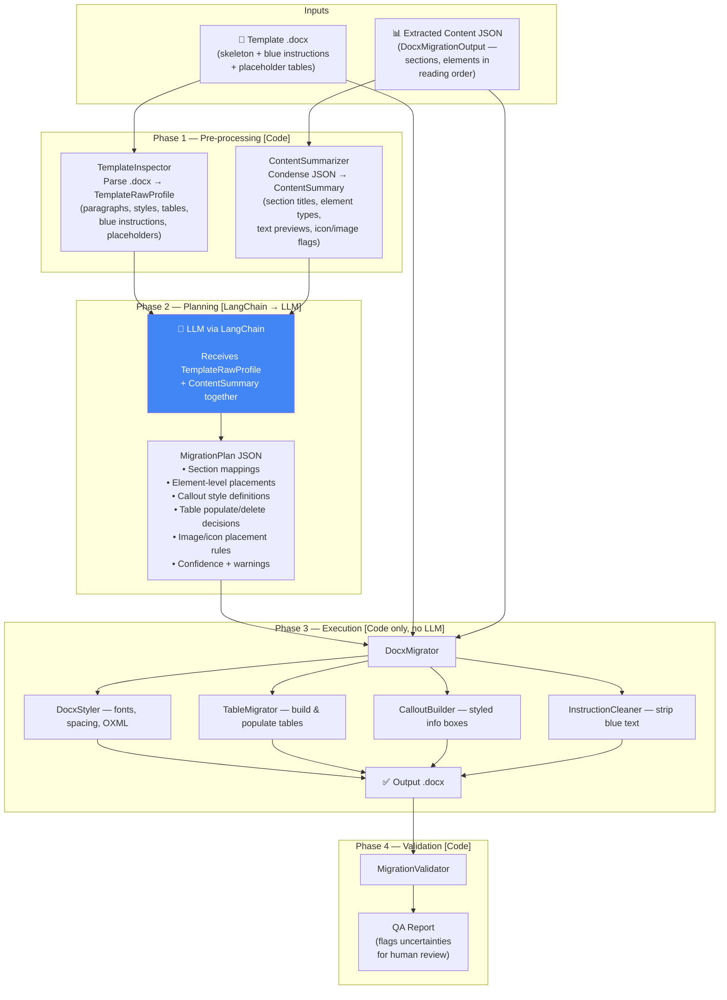

# SOP Content Migration Engine — Final Implementation Plan

---

## 1. Goal

Build a **template-agnostic** migration engine that takes:

1. **Extracted content JSON** — output of our existing extraction pipeline ([`DocxMigrationOutput`](file:///c:/Users/Bhavya/Desktop/Content%20Extraction/app/schemas/migration.py))
2. **Any target `.docx` template** — variable structure, variable rules, variable instructions

…and produces a correctly formatted `.docx` file with all content (paragraphs, tables, images, icons, callout boxes, lists) placed in the right sections at the right positions.

### Key Decisions

| Decision | Choice |
|---|---|
| **LLM Integration** | **LangChain** — switch providers (Gemini, OpenAI, Anthropic) via `.env` config with zero code changes |
| **First Page / Preamble** | **Skip migration** — the template's cover page placeholders (`${vault:...}`) are sufficient and will be populated by the target system, not our engine |
| **Execution Model** | **Hybrid** — LLM plans, code executes, QA report flags uncertainties for human review |
| **Architecture** | Class-based, following existing project patterns (ABCs, Pydantic models, constructor injection) |

---

## 2. Architecture Overview



### Why 3 phases?

| Phase | Actor | Purpose |
|---|---|---|
| **Phase 1** | Code | Extract machine-readable structure from both inputs — fast, deterministic |
| **Phase 2** | LLM (via LangChain) | Understand template rules, map source sections to target slots, classify element rendering (callout vs table vs image) — requires reasoning |
| **Phase 3** | Code | Build the `.docx` deterministically from the plan — fast, auditable, no LLM variance |

---

## 3. LangChain Integration Layer

### 3.1 Module Structure

```
app/services/llm/
├── __init__.py
├── chain_factory.py          # Creates LangChain ChatModel from settings
└── prompts/
    ├── __init__.py
    ├── template_analysis.py  # System + human prompt templates for migration planning
    └── output_schemas.py     # Pydantic schemas for structured LLM output
```

> [!NOTE]
> No custom provider classes needed. LangChain's `init_chat_model()` handles Gemini / OpenAI / Anthropic via a single `model` string. Switching providers is just changing an env var.

### 3.2 `ChainFactory` — LangChain Setup

#### [NEW] `app/services/llm/chain_factory.py`

```python
"""LangChain model factory — single point of LLM initialization."""

from langchain.chat_models import init_chat_model
from app.config.settings import Settings


class ChainFactory:
    """Creates configured LangChain chat models from application settings."""

    def __init__(self, settings: Settings):
        self.settings = settings

    def create_model(self):
        """Return a LangChain ChatModel configured from settings.

        Provider switching is handled entirely by the `model` string:
          - "gemini/gemini-2.5-flash"   → Google Gemini
          - "openai/gpt-4o"             → OpenAI
          - "anthropic/claude-sonnet-4-20250514"  → Anthropic

        API keys are read from environment variables by LangChain:
          - GOOGLE_API_KEY, OPENAI_API_KEY, ANTHROPIC_API_KEY
        """
        return init_chat_model(
            model=self.settings.llm_model,
            temperature=self.settings.llm_temperature,
            max_tokens=self.settings.llm_max_tokens,
        )

    def create_structured_model(self, output_schema):
        """Return a ChatModel with structured (JSON) output bound to a Pydantic schema."""
        base = self.create_model()
        return base.with_structured_output(output_schema)
```

### 3.3 Configuration

#### [MODIFY] [settings.py](file:///c:/Users/Bhavya/Desktop/Content%20Extraction/app/config/settings.py)

Add to the existing `Settings` class:

```python
    # --- LLM (LangChain) ---
    llm_model: str = "gemini/gemini-2.5-flash"   # LangChain model string
    llm_temperature: float = 0.1                  # Low for deterministic plans
    llm_max_tokens: int = 16384                   # Migration plans can be large

    # --- Migration ---
    migration_output_dir: Path = Path("data/migrated")
    migration_template_dir: Path = Path("data/templates")
    skip_preamble_migration: bool = True          # Don't migrate first page content
```

### 3.4 Dependencies

#### [MODIFY] [requirements.txt](file:///c:/Users/Bhavya/Desktop/Content%20Extraction/requirements.txt)

```
# --- LLM (LangChain — Migration) ---
langchain>=0.3.0
langchain-google-genai>=2.0.0
langchain-openai>=0.3.0
langchain-anthropic>=0.3.0
```

---

## 4. Phase 1 — Programmatic Pre-processing

### 4.1 `TemplateInspector` — Parse Template Structure

#### [NEW] `app/services/migration/template_inspector.py`

Opens the `.docx` template and extracts a machine-readable profile of **every paragraph, table, and header/footer**.

```python
class TemplateParagraphInfo(BaseModel):
    """One paragraph from the template document."""
    index: int                        # Position in document body
    text: str                         # Full text content
    style_name: str                   # "Heading 1", "Normal", "List Bullet", etc.
    is_blue_instruction: bool         # True if any run has blue font color
    is_bold: bool
    heading_level: int | None         # 1, 2, 3 or None for non-headings
    font_color_hex: str | None        # Hex color of first run's font


class TemplateTableInfo(BaseModel):
    """One table from the template document."""
    index: int                        # Table position in document body
    num_rows: int
    num_cols: int
    preceding_heading: str | None     # Nearest heading above this table
    header_row_text: list[str]        # First row cell texts
    has_placeholder_text: bool        # Contains ${...}, [Insert ...], <<...>>
    sample_cells: list[str]           # Representative cell texts (first 10)


class TemplateRawProfile(BaseModel):
    """Complete machine-readable snapshot of a .docx template."""
    filename: str
    total_paragraphs: int
    total_tables: int
    paragraphs: list[TemplateParagraphInfo]
    tables: list[TemplateTableInfo]
    header_text: str
    footer_text: str


class TemplateInspector:
    """Parses a .docx template into a TemplateRawProfile."""

    BLUE_COLORS = {"0000FF", "0070C0", "4472C4", "2E74B5", "5B9BD5"}

    def inspect(self, template_path: Path) -> TemplateRawProfile:
        """Open template and extract structural profile."""
        ...

    def _is_blue_font(self, run) -> bool:
        """Check if a run's font color is blue (instruction text)."""
        ...

    def _get_preceding_heading(self, paragraphs, table_position) -> str | None:
        """Find the nearest heading above a table's position."""
        ...
```

**Key implementation details**:
- Iterates `doc.paragraphs` — captures `text`, `style.name`, run font colors
- Identifies blue instruction text by checking `run.font.color.rgb` against known blue hex values AND by checking the underlying XML `w:color` element
- Iterates `doc.tables` — captures dimensions, header row text, checks for `${vault:...}` patterns
- Extracts header/footer text from `doc.sections[0].header` / `doc.sections[0].footer`

### 4.2 `ContentSummarizer` — Condense Extracted JSON

#### [NEW] `app/services/migration/content_summarizer.py`

Condenses the full `DocxMigrationOutput` into a compact summary suitable for the LLM prompt. We send element-level detail so the LLM can make correct placement decisions.

```python
class ContentElementSummary(BaseModel):
    """Summary of one extracted element."""
    index: int                    # Position within section's elements array
    element_type: str             # "heading", "paragraph", "table", "image", "list"
    text_preview: str             # First 120 chars of text
    level: int | None = None      # Heading level
    num_rows: int | None = None   # For tables
    num_cols: int | None = None
    has_icons: bool = False
    icon_count: int = 0
    has_icon_in_cells: bool = False  # For tables with icons inside cells
    image_path: str | None = None
    list_items_count: int | None = None
    page: int = 0


class ContentSectionSummary(BaseModel):
    """Summary of one extracted section."""
    section_number: str | None
    title: str
    page_start: int
    page_end: int
    total_elements: int
    element_type_counts: dict[str, int]  # {"paragraph": 12, "table": 3, ...}
    elements: list[ContentElementSummary]


class ContentSummary(BaseModel):
    """Condensed view of the full extracted content for LLM context."""
    document_id: str
    document_type: str | None
    total_sections: int
    sections: list[ContentSectionSummary]


class ContentSummarizer:
    """Builds a ContentSummary from DocxMigrationOutput."""

    def summarize(
        self,
        extracted: DocxMigrationOutput,
        skip_preamble: bool = True,
    ) -> ContentSummary:
        """Build summary, optionally skipping Section 0 (PREAMBLE)."""
        sections = []
        for sec in extracted.sections:
            if skip_preamble and sec.title.strip().startswith("0 "):
                continue  # Skip first page / preamble content
            sections.append(self._summarize_section(sec))

        return ContentSummary(
            document_id=extracted.document_id,
            document_type=extracted.metadata.document_type,
            total_sections=len(sections),
            sections=sections,
        )
    ...
```

> [!IMPORTANT]
> **Preamble skip**: When `skip_preamble=True` (default), the `"0 PREAMBLE"` section is excluded from the content summary sent to the LLM. The template's cover page placeholders remain untouched in the output `.docx`.

---

## 5. Phase 2 — LLM Migration Planning

### 5.1 LLM Prompt Design

#### [NEW] `app/services/llm/prompts/template_analysis.py`

The LLM receives **both** the `TemplateRawProfile` and the `ContentSummary` in a single call and returns a `MigrationPlan`.

**System Prompt** (condensed):
```
You are a document migration planning engine. You receive two JSON objects:

1. TEMPLATE_PROFILE: The structure of a target .docx template — its headings,
   blue instruction text (which tells authors what to write), placeholder
   tables, and formatting cues.

2. CONTENT_SUMMARY: A condensed view of extracted document content — section
   titles, element types (paragraph, heading, table, image, list), text
   previews, and flags for inline icons and images.

Your task: Produce a MigrationPlan that tells a programmatic engine exactly
how to populate the template with the extracted content.

RULES:
- Map each content section to the best-matching template section by comparing
  headings and instruction context.
- For each content element, assign a placement action:
    "insert_heading"        → Insert as Word heading with native style
    "insert_paragraph"      → Insert as normal paragraph
    "insert_list"           → Insert as bulleted/numbered list
    "insert_table"          → Build a new Word table
    "insert_image"          → Embed image file at this position
    "insert_callout"        → Render as styled callout box (shaded single-cell table)
    "populate_placeholder"  → Fill an existing template placeholder table
    "skip"                  → Do not include this element
- For callout boxes, determine the callout type from context (executive_summary,
  explanation, attention, key_takeaway) and specify the background and border colors.
- Identify which template paragraphs (blue instructions) must be deleted.
- Identify which template placeholder tables should be populated vs deleted.
- Preserve reading order: assign sequential placement_order values.
- Flag anything uncertain in the warnings array.
- The preamble / cover page section has been excluded — do NOT plan any first-page content.

Output must be valid JSON matching the MigrationPlan schema exactly.
```

**Human Prompt**:
```
TEMPLATE_PROFILE:
{template_profile_json}

CONTENT_SUMMARY:
{content_summary_json}
```

### 5.2 `MigrationPlan` Schema — LLM Structured Output

#### [NEW] `app/services/migration/schemas.py`

All Pydantic models that define the LLM's structured output and the migration engine's internal contracts.

```python
# ── Element-Level Placement ────────────────────────────────────────────

class ElementPlacement(BaseModel):
    """Exact instruction for placing one extracted element in the output .docx."""
    source_section_title: str         # e.g. "6 PRINCIPLES FOR DOCUMENT WRITING"
    source_element_index: int         # Index within that section's elements array
    source_element_type: str          # "heading", "paragraph", "table", "image", "list"

    target_section_heading: str       # Template section this goes into

    placement_order: int              # Ordering within target section (0, 1, 2, ...)

    action: str                       # One of the 8 actions listed above

    # Conditional fields depending on action:
    heading_level: int | None = None              # For insert_heading
    heading_style: str | None = None              # "Heading 1", "Heading 2", etc.

    callout_type: str | None = None               # For insert_callout
    callout_background_hex: str | None = None     # e.g. "#D9E1F2"
    callout_border_hex: str | None = None         # e.g. "#2F5597"

    target_table_index: int | None = None         # For populate_placeholder

    embed_icons_inline: bool = False              # Insert icon images inline with text

    notes: str = ""                               # LLM reasoning


# ── Section-Level Plan ─────────────────────────────────────────────────

class SectionPlan(BaseModel):
    """Migration instructions for one template section."""
    template_section_heading: str
    template_heading_level: int = 1
    template_paragraph_indices_to_delete: list[int] = []   # Blue instruction indices
    source_sections_mapped: list[str] = []                 # Which extracted sections map here
    elements: list[ElementPlacement] = []                  # Ordered elements to insert

    # Fallback if no source content maps to this section
    has_source_content: bool = True
    fallback_action: str | None = None       # "insert_none", "insert_na", "delete_section"
    fallback_text: str | None = None


# ── Placeholder Table Plan ─────────────────────────────────────────────

class PlaceholderTablePlan(BaseModel):
    """Instructions for populating or deleting a template placeholder table."""
    table_index: int                  # Index in template's table list
    table_purpose: str                # LLM description: "Definitions table"
    parent_section_heading: str       # Which section this table belongs to
    action: str                       # "populate" | "delete"
    source_section_title: str | None = None   # Where to pull data from
    source_element_index: int | None = None   # Which element in that section
    column_mapping: dict[str, str] | None = None  # template col → source col
    sort_alphabetically: bool = False
    population_notes: str = ""


# ── Callout Style Definition ──────────────────────────────────────────

class CalloutStyleDef(BaseModel):
    """Dynamic callout style discovered from the template."""
    callout_type: str                 # "executive_summary", "explanation", etc.
    display_name: str                 # "Executive Summary / Introduction"
    background_color_hex: str         # "#D9E1F2"
    left_border_color_hex: str        # "#2F5597"
    icon_description: str | None = None


# ── Top-Level Migration Plan ──────────────────────────────────────────

class MigrationPlan(BaseModel):
    """Complete element-level migration blueprint produced by the LLM."""
    template_name: str
    document_type_detected: str | None = None    # "SOP", "Guidance", etc.

    # Typography (discovered from template)
    font_family: str = "Arial"
    font_size_body_pt: float = 10.0
    font_size_heading1_pt: float = 14.0
    font_size_heading2_pt: float = 12.0
    font_size_heading3_pt: float = 11.0

    # Global rules
    preserve_headers_footers: bool = True
    toc_auto_generated: bool = True
    skip_cover_page: bool = True                 # Always true — don't touch page 1

    # Section-by-section plan
    section_plans: list[SectionPlan]

    # Placeholder table instructions
    placeholder_tables: list[PlaceholderTablePlan] = []

    # Template tables to delete entirely (by index)
    tables_to_delete: list[int] = []

    # Callout styles (dynamic, from template)
    callout_styles: list[CalloutStyleDef] = []

    # Quality signals
    overall_confidence: float = 0.0
    warnings: list[str] = []
    reasoning_summary: str = ""
```

### 5.3 LangChain Invocation in `SectionAligner`

#### [NEW] `app/services/migration/section_aligner.py`

```python
class SectionAligner:
    """Orchestrates the LLM call that produces the MigrationPlan."""

    def __init__(self, chain_factory: ChainFactory):
        self.chain_factory = chain_factory

    async def create_migration_plan(
        self,
        template_profile: TemplateRawProfile,
        content_summary: ContentSummary,
    ) -> MigrationPlan:
        """Send both profiles to LLM, receive a structured MigrationPlan."""

        # Create a structured-output model bound to MigrationPlan schema
        structured_llm = self.chain_factory.create_structured_model(MigrationPlan)

        # Build the prompt
        system_msg = SystemMessage(content=SYSTEM_PROMPT)
        human_msg = HumanMessage(content=(
            f"TEMPLATE_PROFILE:\n{template_profile.model_dump_json(indent=2)}\n\n"
            f"CONTENT_SUMMARY:\n{content_summary.model_dump_json(indent=2)}"
        ))

        # Invoke LangChain — provider is determined by settings
        plan: MigrationPlan = await structured_llm.ainvoke([system_msg, human_msg])

        return plan
```

---

## 6. Phase 3 — Programmatic Execution

> [!NOTE]
> Phase 3 uses **zero LLM calls**. Everything is deterministic `python-docx` + OXML manipulation driven by the `MigrationPlan`.

### 6.1 Module Structure

```
app/services/migration/
├── __init__.py
├── schemas.py                 # MigrationPlan, ElementPlacement, SectionPlan, etc.
├── template_inspector.py      # .docx → TemplateRawProfile
├── content_summarizer.py      # DocxMigrationOutput → ContentSummary
├── section_aligner.py         # LangChain → MigrationPlan
├── docx_migrator.py           # Main orchestrator
├── docx_styler.py             # OXML: fonts, spacing, borders, shading
├── table_migrator.py          # Build & populate Word tables
├── callout_builder.py         # Styled callout boxes
├── instruction_cleaner.py     # Remove blue instructions + unused scaffolding
└── migration_validator.py     # Post-migration QA report
```

---

### 6.2 `DocxMigrator` — Main Orchestrator

#### [NEW] `app/services/migration/docx_migrator.py`

```python
class DocxMigrator:
    """Orchestrates the full migration pipeline.

    Phase 1: TemplateInspector + ContentSummarizer  (code)
    Phase 2: SectionAligner → MigrationPlan         (LangChain → LLM)
    Phase 3: Build output .docx from plan            (code)
    Phase 4: MigrationValidator → QA report          (code)
    """

    def __init__(self, settings: Settings, chain_factory: ChainFactory):
        self.settings = settings
        self.inspector = TemplateInspector()
        self.summarizer = ContentSummarizer()
        self.aligner = SectionAligner(chain_factory)
        self.styler = DocxStyler()
        self.table_migrator = TableMigrator()
        self.callout_builder = CalloutBuilder()
        self.cleaner = InstructionCleaner()
        self.validator = MigrationValidator()

    async def migrate(
        self,
        extracted: DocxMigrationOutput,
        template_path: Path,
        output_path: Path,
    ) -> MigrationResult:

        # ── Phase 1: Pre-process ─────────────────────────────────
        template_profile = self.inspector.inspect(template_path)
        content_summary = self.summarizer.summarize(
            extracted,
            skip_preamble=self.settings.skip_preamble_migration,
        )

        # ── Phase 2: LLM creates the plan ────────────────────────
        plan = await self.aligner.create_migration_plan(
            template_profile, content_summary
        )

        # ── Phase 3: Execute plan ────────────────────────────────
        doc = Document(str(template_path))

        # 3a. Process each section plan
        for section_plan in plan.section_plans:
            self._execute_section_plan(doc, section_plan, extracted, plan)

        # 3b. Populate placeholder tables
        for table_plan in plan.placeholder_tables:
            if table_plan.action == "populate":
                self.table_migrator.populate(doc, table_plan, extracted)
            elif table_plan.action == "delete":
                self.table_migrator.delete_table(doc, table_plan.table_index)

        # 3c. Delete unused template tables
        for idx in sorted(plan.tables_to_delete, reverse=True):
            self.table_migrator.delete_table(doc, idx)

        # 3d. Clean up blue instructions + unused scaffolding
        self.cleaner.clean(doc, plan)

        # 3e. Save
        doc.save(str(output_path))

        # ── Phase 4: Validate ────────────────────────────────────
        qa_report = self.validator.validate(output_path, extracted, plan)

        return MigrationResult(
            output_path=str(output_path),
            plan=plan,
            qa_report=qa_report,
        )

    def _execute_section_plan(self, doc, section_plan, extracted, plan):
        """Execute one SectionPlan — insert all elements in order."""

        # Delete blue instruction paragraphs in this section
        # (handled later by InstructionCleaner in bulk for safety)

        if not section_plan.has_source_content:
            # Insert fallback text if section has no content
            if section_plan.fallback_action == "insert_none":
                self._insert_after_heading(doc, section_plan, "(None)")
            elif section_plan.fallback_action == "insert_na":
                self._insert_after_heading(doc, section_plan, "N/A")
            # "delete_section" → handled by InstructionCleaner
            return

        # Insert elements in placement_order sequence
        for placement in sorted(section_plan.elements, key=lambda e: e.placement_order):
            self._execute_element(doc, placement, extracted, plan)

    def _execute_element(self, doc, placement, extracted, plan):
        """Insert one element into the document based on its action."""

        # Look up the actual source element from extracted JSON
        source_element = self._find_source_element(extracted, placement)
        if source_element is None and placement.action != "skip":
            return

        match placement.action:
            case "insert_heading":
                self.styler.insert_heading(
                    doc, source_element.text, placement.heading_level,
                    style_name=placement.heading_style,
                    font_family=plan.font_family,
                )

            case "insert_paragraph":
                para = self.styler.insert_paragraph(
                    doc, source_element.text,
                    font_family=plan.font_family,
                    font_size_pt=plan.font_size_body_pt,
                )
                if placement.embed_icons_inline and source_element.icons:
                    for icon_ref in source_element.icons:
                        self.styler.embed_inline_icon(para, icon_ref.path)

            case "insert_list":
                self.styler.insert_list(
                    doc, source_element.items,
                    font_family=plan.font_family,
                    font_size_pt=plan.font_size_body_pt,
                )

            case "insert_table":
                self.table_migrator.insert_table(
                    doc, source_element,
                    font_family=plan.font_family,
                )

            case "insert_image":
                self.styler.insert_image(
                    doc, source_element.image_path,
                    caption=source_element.title,
                )

            case "insert_callout":
                style = self._find_callout_style(plan, placement.callout_type)
                self.callout_builder.build(
                    doc, source_element, style,
                    font_family=plan.font_family,
                )

            case "populate_placeholder":
                # Handled separately via placeholder_tables plans
                pass

            case "skip":
                pass
```

---

### 6.3 `DocxStyler` — Typography & Element Insertion

#### [NEW] `app/services/migration/docx_styler.py`

All styling values come from the `MigrationPlan` — nothing is hardcoded:

```python
class DocxStyler:
    """Low-level python-docx / OXML element insertion and styling."""

    def insert_heading(self, doc, text, level, style_name=None, font_family="Arial"):
        """Insert a native Word heading with the correct style."""
        heading = doc.add_heading(text, level=level)
        if style_name:
            heading.style = doc.styles[style_name]
        for run in heading.runs:
            run.font.name = font_family
        return heading

    def insert_paragraph(self, doc, text, font_family="Arial", font_size_pt=10.0):
        """Insert a paragraph with consistent font styling."""
        para = doc.add_paragraph(text)
        for run in para.runs:
            run.font.name = font_family
            run.font.size = Pt(font_size_pt)
        return para

    def insert_list(self, doc, items, font_family="Arial", font_size_pt=10.0):
        """Insert a bulleted list."""
        for item_text in items:
            para = doc.add_paragraph(item_text, style="List Bullet")
            for run in para.runs:
                run.font.name = font_family
                run.font.size = Pt(font_size_pt)

    def embed_inline_icon(self, paragraph, icon_path, size_pt=14):
        """Embed an icon image inline at the start of a paragraph."""
        run = paragraph.insert_before_run()  # or add via OXML
        run.add_picture(icon_path, width=Pt(size_pt), height=Pt(size_pt))

    def insert_image(self, doc, image_path, caption=None, max_width_inches=5.5):
        """Insert a centered image with optional caption below."""
        para = doc.add_paragraph()
        para.alignment = WD_ALIGN_PARAGRAPH.CENTER
        run = para.add_run()
        run.add_picture(image_path, width=Inches(max_width_inches))
        if caption:
            cap_para = doc.add_paragraph(caption)
            cap_para.alignment = WD_ALIGN_PARAGRAPH.CENTER
            cap_para.style = doc.styles["Caption"]  # or "Normal" italic
```

---

### 6.4 `CalloutBuilder` — Styled Information Boxes

#### [NEW] `app/services/migration/callout_builder.py`

Builds callout boxes using colors from the `MigrationPlan` — **not hardcoded**:

```python
class CalloutBuilder:
    """Builds styled callout boxes as single-cell Word tables with OXML shading."""

    def build(self, doc, source_element, style: CalloutStyleDef, font_family="Arial"):
        """Create a callout box: single-cell table with background fill + left border."""

        table = doc.add_table(rows=1, cols=1)
        cell = table.cell(0, 0)

        # Set background fill via OXML
        self._set_cell_shading(cell, style.background_color_hex)

        # Set thick left border, thin/nil other borders
        self._set_cell_borders(cell, left_color=style.left_border_color_hex, left_width_pt=3)

        # Add content to cell
        # Extract text from the source element (could be table cells or paragraph)
        text = self._extract_callout_text(source_element)
        para = cell.paragraphs[0]
        para.text = text
        for run in para.runs:
            run.font.name = font_family

    def _set_cell_shading(self, cell, hex_color):
        """Apply background shading to a table cell via OXML w:shd element."""
        from docx.oxml.ns import qn
        shading = OxmlElement("w:shd")
        shading.set(qn("w:fill"), hex_color.lstrip("#"))
        shading.set(qn("w:val"), "clear")
        cell._tc.get_or_add_tcPr().append(shading)

    def _set_cell_borders(self, cell, left_color, left_width_pt=3):
        """Set thick left border and nil other borders via OXML."""
        ...
```

---

### 6.5 `TableMigrator` — Table Population & Construction

#### [NEW] `app/services/migration/table_migrator.py`

Handles both **building new tables** from extracted content and **populating existing placeholder tables** in the template:

```python
class TableMigrator:
    """Builds and populates Word tables."""

    def insert_table(self, doc, source_element: MigrationElement, font_family="Arial"):
        """Build a brand-new Word table from extracted table data."""
        table = doc.add_table(
            rows=source_element.num_rows,
            cols=source_element.num_cols,
        )
        table.style = "Table Grid"

        for cell_data in source_element.cells:
            cell = table.cell(cell_data.row_index, cell_data.col_index)
            cell.text = cell_data.text

            # Handle merged cells
            if cell_data.row_span > 1 or cell_data.col_span > 1:
                self._apply_merge(table, cell_data)

            # Embed icon inside cell if present
            if cell_data.icon_path:
                self._embed_icon_in_cell(cell, cell_data.icon_path)

            # Embed image inside cell if present
            if cell_data.image_path:
                self._embed_image_in_cell(cell, cell_data.image_path)

            # Header row styling
            if cell_data.is_header:
                self._style_header_cell(cell, font_family)

    def populate(self, doc, plan: PlaceholderTablePlan, extracted: DocxMigrationOutput):
        """Fill an existing template placeholder table with extracted data."""
        template_table = doc.tables[plan.table_index]
        source_element = self._find_source_table(extracted, plan)

        if source_element is None:
            return

        # Get data rows from source (exclude header if template already has one)
        data_rows = self._get_data_rows(source_element)

        # Sort alphabetically if required
        if plan.sort_alphabetically:
            data_rows.sort(key=lambda r: r[0].lower())

        # Add rows to template table
        for row_data in data_rows:
            row = template_table.add_row()
            for i, cell_text in enumerate(row_data):
                if i < len(row.cells):
                    row.cells[i].text = cell_text

    def delete_table(self, doc, table_index: int):
        """Remove a table from the document by index."""
        table = doc.tables[table_index]
        table._element.getparent().remove(table._element)
```

---

### 6.6 `InstructionCleaner` — Blue Text & Scaffolding Removal

#### [NEW] `app/services/migration/instruction_cleaner.py`

Driven entirely by the `MigrationPlan`:

```python
class InstructionCleaner:
    """Removes all template scaffolding from the output document."""

    def clean(self, doc: Document, plan: MigrationPlan):
        """Remove blue instructions and delete empty/unused sections."""

        # 1. Collect all paragraph indices to delete (from all section plans)
        indices_to_delete = set()
        for sp in plan.section_plans:
            indices_to_delete.update(sp.template_paragraph_indices_to_delete)

        # 2. Also scan for any remaining blue-colored runs (safety net)
        for i, para in enumerate(doc.paragraphs):
            if self._has_blue_runs(para):
                indices_to_delete.add(i)

        # 3. Delete paragraphs (reverse order to preserve indices)
        for i in sorted(indices_to_delete, reverse=True):
            if i < len(doc.paragraphs):
                para = doc.paragraphs[i]
                para._element.getparent().remove(para._element)

        # 4. Delete sections marked for deletion
        for sp in plan.section_plans:
            if sp.fallback_action == "delete_section":
                self._delete_section(doc, sp.template_section_heading)
```

---

### 6.7 `MigrationValidator` — QA Report

#### [NEW] `app/services/migration/migration_validator.py`

```python
class MigrationQAReport(BaseModel):
    """Post-migration quality report for human review."""
    status: str                            # "pass" | "pass_with_warnings" | "needs_review"

    total_source_elements: int             # From extracted JSON (excl. preamble)
    total_placed_elements: int             # Elements with action != "skip"
    total_skipped_elements: int
    content_coverage_pct: float            # placed / source * 100

    sections_with_no_content: list[str]    # Template sections that got fallback text
    sections_deleted: list[str]            # Template sections removed entirely

    low_confidence_notes: list[str]        # Plan warnings + low-confidence items
    blue_text_remaining: int               # Should be 0 after cleanup
    validation_errors: list[str]           # Hard errors (broken XML, etc.)
    recommendations: list[str]            # Actionable items for reviewer


class MigrationValidator:
    """Validates the migrated .docx and produces a QA report."""

    def validate(
        self, output_path: Path, extracted: DocxMigrationOutput, plan: MigrationPlan,
    ) -> MigrationQAReport:
        ...
```

---

## 7. Concrete Element Placement Examples

### How the LLM plan ensures correct placement of images, icons, and tables:

#### Inline Icons on Paragraphs

Source JSON has icons attached to paragraphs:
```json
{"element_type": "paragraph", "text": "This Guidance is applicable...",
 "icons": [{"icon_id": "...", "path": "page3_vec3.png"}]}
```

LLM produces:
```json
{"action": "insert_paragraph", "embed_icons_inline": true, "placement_order": 2}
```

Engine: creates paragraph → embeds icon inline at start → adds text.

#### Infographic Callout Tables

Source JSON has 1×4 tables interleaved with callout descriptions:
```
element[45]: table (1×4) after "Executive Summary" description
element[47]: table (1×4) after "Explanation" description
```

LLM recognizes the pattern from template instructions and produces:
```json
{"action": "insert_callout", "callout_type": "executive_summary",
 "callout_background_hex": "#D9E1F2", "callout_border_hex": "#2F5597"}
```

Engine: `CalloutBuilder` renders a shaded box with dynamic colors from the plan.

#### Flow Chart Images

```
element[56]: image (page10_img1.png)
element[58]: image (page10_img2.png)
```

LLM produces:
```json
{"action": "insert_image", "placement_order": 18}
{"action": "insert_image", "placement_order": 19}
```

Engine: embeds both images centered, in the correct reading order within their section.

#### Icons Inside Table Cells

Source JSON table cell has `"icon_path": "page4_vec0.png"`.

The `TableMigrator.insert_table()` reads `cell_data.icon_path` and calls `_embed_icon_in_cell()` — this doesn't need the LLM, it's handled programmatically from the extracted data.

---

## 8. File Change Summary

### New Files

| File | Purpose |
|---|---|
| `app/services/llm/__init__.py` | LLM package |
| `app/services/llm/chain_factory.py` | LangChain model factory |
| `app/services/llm/prompts/__init__.py` | Prompts package |
| `app/services/llm/prompts/template_analysis.py` | System/human prompts for migration planning |
| `app/services/llm/prompts/output_schemas.py` | Re-exports Pydantic schemas for LLM structured output |
| `app/services/migration/schemas.py` | `MigrationPlan`, `ElementPlacement`, `SectionPlan`, `MigrationQAReport`, etc. |
| `app/services/migration/template_inspector.py` | `.docx` → `TemplateRawProfile` |
| `app/services/migration/content_summarizer.py` | `DocxMigrationOutput` → `ContentSummary` |
| `app/services/migration/section_aligner.py` | LangChain call → `MigrationPlan` |
| `app/services/migration/docx_migrator.py` | Main orchestrator |
| `app/services/migration/docx_styler.py` | Font, spacing, image, OXML manipulation |
| `app/services/migration/table_migrator.py` | Build & populate Word tables |
| `app/services/migration/callout_builder.py` | Styled callout boxes |
| `app/services/migration/instruction_cleaner.py` | Blue text + scaffolding removal |
| `app/services/migration/migration_validator.py` | Post-migration QA report |
| `app/api/migration.py` | FastAPI migration endpoints |
| `tests/test_template_inspector.py` | Unit tests |
| `tests/test_content_summarizer.py` | Unit tests |
| `tests/test_docx_styler.py` | Unit tests |
| `tests/test_table_migrator.py` | Unit tests |
| `tests/test_callout_builder.py` | Unit tests |
| `tests/test_instruction_cleaner.py` | Unit tests |
| `tests/test_e2e_migration.py` | End-to-end integration test |

### Modified Files

| File | Change |
|---|---|
| [settings.py](file:///c:/Users/Bhavya/Desktop/Content%20Extraction/app/config/settings.py) | Add `llm_model`, `llm_temperature`, `llm_max_tokens`, `migration_output_dir`, `migration_template_dir`, `skip_preamble_migration` |
| [requirements.txt](file:///c:/Users/Bhavya/Desktop/Content%20Extraction/requirements.txt) | Add `langchain`, `langchain-google-genai`, `langchain-openai`, `langchain-anthropic` |
| [main.py](file:///c:/Users/Bhavya/Desktop/Content%20Extraction/app/main.py) | Register migration API router, initialize `ChainFactory` in lifespan |
| [migration/__init__.py](file:///c:/Users/Bhavya/Desktop/Content%20Extraction/app/services/migration/__init__.py) | Export `DocxMigrator` |

---

## 9. API Endpoints

#### [NEW] `app/api/migration.py`

| Endpoint | Method | Description |
|---|---|---|
| `POST /documents/migrate` | POST | Upload extracted JSON + template `.docx` → returns migration job ID |
| `GET /documents/{id}/migration-plan` | GET | Returns the LLM-generated `MigrationPlan` JSON for review |
| `GET /documents/{id}/migration-status` | GET | Returns job status + `MigrationQAReport` |
| `GET /documents/{id}/download-docx` | GET | Streams the final migrated `.docx` file |

---

## 10. Development Roadmap

| Step | Phase | Deliverables | Est. Effort |
|---|---|---|---|
| **1** | **Schemas & LangChain Setup** | `schemas.py`, `chain_factory.py`, `settings.py` updates, `requirements.txt` updates | Small |
| **2** | **Template Inspection** | `TemplateInspector` + `ContentSummarizer` + unit tests | Medium |
| **3** | **LLM Planning** | Prompt engineering, `SectionAligner`, structured output binding, integration test with real template | Medium |
| **4** | **DocxStyler + CalloutBuilder** | Typography, image insertion, callout boxes + unit tests | Medium |
| **5** | **TableMigrator** | Build tables, populate placeholders, merge cells, icons in cells + unit tests | Medium |
| **6** | **Orchestrator + Cleaner** | `DocxMigrator`, `InstructionCleaner`, end-to-end pipeline | Large |
| **7** | **Validation + API** | `MigrationValidator`, QA report, FastAPI endpoints, e2e test with real data | Medium |

---

## 11. Verification Plan

### Automated Tests
```bash
# Unit tests
pytest tests/test_template_inspector.py -v
pytest tests/test_content_summarizer.py -v
pytest tests/test_docx_styler.py -v
pytest tests/test_table_migrator.py -v
pytest tests/test_callout_builder.py -v
pytest tests/test_instruction_cleaner.py -v

# Integration (requires LLM API key)
pytest tests/test_e2e_migration.py -v
```

### Manual Verification
1. Open generated `.docx` in Microsoft Word
2. Confirm cover page placeholders are **untouched** (not overwritten)
3. Confirm TOC auto-updates from native heading styles
4. Confirm callout boxes have correct background colors and left borders
5. Confirm images appear at correct positions relative to surrounding text
6. Confirm inline icons appear inside their paragraphs, not floating
7. Confirm icons inside table cells are embedded correctly
8. Confirm zero blue instructional text remains
9. Review `MigrationQAReport` for any warnings or low-confidence items
10. Test with **2+ different templates** to verify template-agnostic behavior
